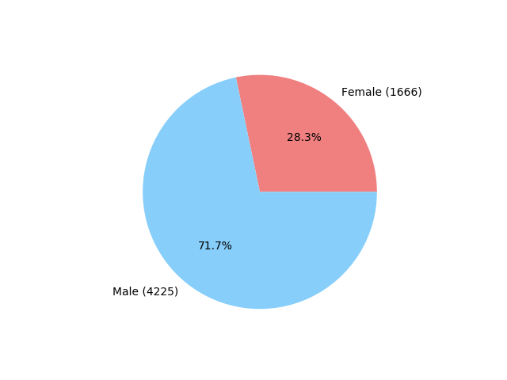
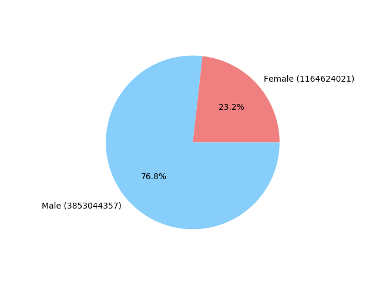
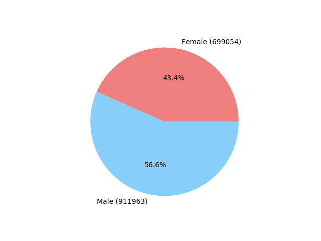
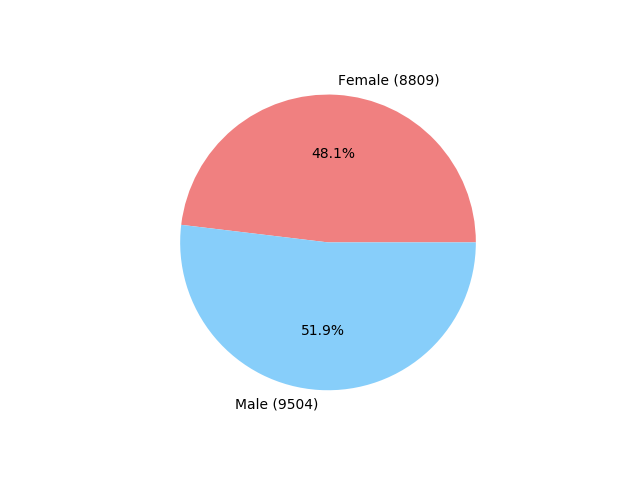

# report

## task

> Применение `MapReduce` для анализа большого количества данных

- Из тем, связанных с [Big Data](https://en.wikipedia.org/wiki/Big_data) меня заинтересовал метод [MapReduce](https://en.wikipedia.org/wiki/MapReduce).
- Также захотелось попробовать решения альтернативные популярному [Apache Hadoop](https://en.wikipedia.org/wiki/Apache_Hadoop).
- Так я решил использовать MapReduce в [mongoDB](https://docs.mongodb.com/manual/core/map-reduce).

## steps

### virtualenv

Для начала работы я создал виртуальное окружение для `python` чтобы не засорять пакетами систему. Как это сделать можно почитать по [ссылке](https://docs.python-guide.org/dev/virtualenvs/#lower-level-virtualenv).

> workon bsuir

### dataset

- check out datasets on [kaggle](https://www.kaggle.com/datasets) -> [Black Friday (538k)](https://www.kaggle.com/mehdidag/black-friday)
- `pip install kaggle`
- `kaggle datasets download -d mehdidag/black-friday -p data --unzip`

### store csv dataset in mongoDB

- `pip install pandas`
- `pip install pymongo`

```python
# init.py

import os
import json
import pandas as pd
from pymongo import MongoClient

FILE_PATH = os.path.join(os.path.dirname(__file__), 'data/BlackFriday.csv')

def connect():
    client = MongoClient()
    db=client['black-friday']
    collection = db['orders']
    return collection

if __name__ == "__main__":
    # read dataset
    data = pd.read_csv(FILE_PATH)
    data_json = json.loads(data.to_json(orient='records'))

    # save to mongo
    orders = connect()
    orders.remove()
    orders.insert(data_json)
    print(f'Successfully insert {len(data)} documents.')
```

### run MapReduce

- mongoDB принимает `map` и `reduce` как JavaScript функции.
- Например вот так можно посчитать общее число покупок в зависимости от пола клиента:

```js
function mapper() {
  emit(this.Gender, {
    purchase: this.Purchase,
    id: this.User_ID,
    count: 1
  });
}
```

- **warning**: `reducer` должен быть композируемым, те `values` может быть предыдущим результатом выполнения редюсера для этого ключа и значения надо смержить

```js
function reducer(_, values) {
  var idsDict = {};

  function red(acc, item) {
    acc.purchase += item.purchase;
    acc.count += item.count;
    // Gotcha: http://bit.ly/2Sohea7
    if (item.id) {
      idsDict[item.id] = true;
    } else {
      idsDict = Object.assign(idsDict, item.idsDict);
    }
    return acc;
  }
  var result = values.reduce(red, { count: 0, purchase: 0 });
  result.idsDict = idsDict;
  return result;
}
```

### result

#### users



#### total purchases



#### average purchase by user



#### average purchase by order



#### output

```py
> Purchase by Gender:
>> Female:
        unique users:   1666
        total purchase: 1164624021
        avg by order:   8809
        avg by user:    699054
>> Male:
        unique users:   4225
        total purchase: 3853044357
        avg by order:   9504
        avg by user:    911963
> Elapsed Time: 25.77 s
```

### conclusion

- mongoDB предоставляет удобный интерфейс для выполнения `MapReduce` подсчётов.
- JavaScript функции предоставляют гибкость и возможность писать кастомные обработчики для достижения нужного результата.
