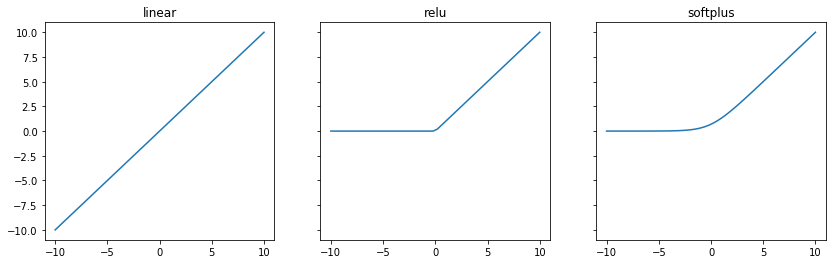
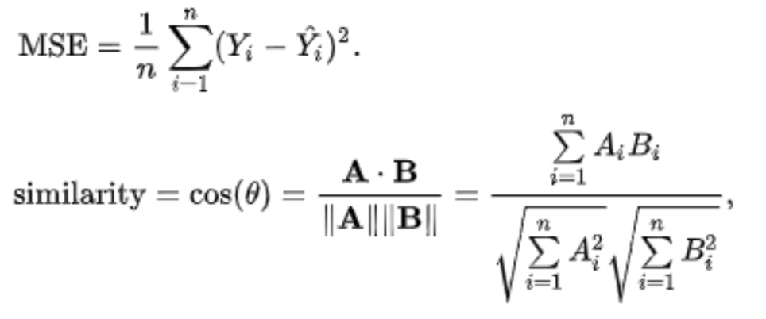

# data mining lab2

> Тема: знакомство с программными средствами машинного обучения нейронных сетей.

> Цель: знакомство с программным инструментарием `tensorflow` / `keras`

### setup python

> Я использую `python` на `macOS` через менеджер версий `pyenv` (https://github.com/pyenv/pyenv) вместе с виртуальным окружением `pyenv-virtualenv` (https://github.com/pyenv/pyenv-virtualenv). `pyenv` можно установить через `Homebrew` (https://brew.sh)

```bash
$ brew update
$ brew install pyenv

$ pyenv install 3.7.0 # install python

$ pyenv virtualenv 3.7.0 bsuir # create virtualenv
$ pyenv activate bsuir

$ pip install tensorflow
$ pip install keras
```


```python
import tensorflow as tf
import keras

print(tf.__name__, tf.__version__)
print(keras.__name__, keras.__version__)
```

    tensorflow 2.0.0
    keras 2.3.1


### run example


```python
from examples.cifar10_cnn import cifar_cnn

cifar_cnn()
```

    Downloading data from https://www.cs.toronto.edu/~kriz/cifar-10-python.tar.gz
    170500096/170498071 [==============================] - 106s 1us/step
    x_train shape: (50000, 32, 32, 3)
    50000 train samples
    10000 test samples
    Using real-time data augmentation.
    Epoch 1/10
    1563/1563 [==============================] - 148s 95ms/step - loss: 1.8741 - accuracy: 0.3115 - val_loss: 1.5718 - val_accuracy: 0.4263
    Epoch 2/10
    1563/1563 [==============================] - 149s 95ms/step - loss: 1.5826 - accuracy: 0.4223 - val_loss: 1.4233 - val_accuracy: 0.4854
    Epoch 3/10
    1563/1563 [==============================] - 145s 93ms/step - loss: 1.4652 - accuracy: 0.4695 - val_loss: 1.3458 - val_accuracy: 0.5117
    Epoch 4/10
    1563/1563 [==============================] - 149s 95ms/step - loss: 1.3846 - accuracy: 0.5017 - val_loss: 1.2471 - val_accuracy: 0.5506
    Epoch 5/10
    1563/1563 [==============================] - 147s 94ms/step - loss: 1.3238 - accuracy: 0.5250 - val_loss: 1.1992 - val_accuracy: 0.5716
    Epoch 6/10
    1563/1563 [==============================] - 146s 94ms/step - loss: 1.2646 - accuracy: 0.5473 - val_loss: 1.1589 - val_accuracy: 0.5891
    Epoch 7/10
    1563/1563 [==============================] - 148s 95ms/step - loss: 1.2121 - accuracy: 0.5662 - val_loss: 1.0726 - val_accuracy: 0.6161
    Epoch 8/10
    1563/1563 [==============================] - 148s 95ms/step - loss: 1.1742 - accuracy: 0.5834 - val_loss: 1.1625 - val_accuracy: 0.5939
    Epoch 9/10
    1563/1563 [==============================] - 148s 95ms/step - loss: 1.1359 - accuracy: 0.5968 - val_loss: 0.9714 - val_accuracy: 0.6555
    Epoch 10/10
    1563/1563 [==============================] - 147s 94ms/step - loss: 1.1020 - accuracy: 0.6107 - val_loss: 1.0064 - val_accuracy: 0.6453
    Saved trained model at /Users/drapegnik/projects/bsuir/data-mining/lab2/saved_models/keras_cifar10_trained_model.h5
    10000/10000 [==============================] - 4s 381us/step
    Test loss: 1.0064063249588013
    Test accuracy: 0.6452999711036682


### q&a

#### 1. Как задать модель нейронной сети. Какие есть интерфейсы и их параметры? Как задать весовые коэффициенты нейронной сети?


```python
import numpy as np
from keras.models import Model
from keras.layers import Input, Dense, Conv1D, SimpleRNN

W = np.random.rand(2, 2)
b = np.random.rand(2)

visible = Input(shape=(2,))
hidden = Dense(units=2, weights=[W, b])(visible) # layer with weights

model = Model(inputs=visible, outputs=hidden)
```

#### 2. Как задать полносвязный слой нейронной сети?


```python
Dense(units=32)
```


    <keras.layers.core.Dense at 0x14936f490>


#### 3. Как задать свёрточный слой нейронной сети?


```python
Conv1D(kernel_size=200, filters=20)
```


    <keras.layers.convolutional.Conv1D at 0x14943f2d0>


#### 4. Какие есть средства для работы с рекуррентными нейросетями?


```python
SimpleRNN(units=32)
```


    <keras.layers.recurrent.SimpleRNN at 0x1496d3450>


#### 5. Как задать функцию активации нейронной сети и какие поддерживаются в `keras`?


```python
from inspect import getmembers, isfunction

Dense(64, activation='tanh')

print('Activation Functions:')
[name for name, obj in getmembers(tf.keras.activations) if isfunction(obj) and name != 'deserialize']
```

    Activation Functions:


    ['elu',
     'exponential',
     'get',
     'hard_sigmoid',
     'linear',
     'relu',
     'selu',
     'serialize',
     'sigmoid',
     'softmax',
     'softplus',
     'softsign',
     'tanh']


#### 6. Чем отличается `linear` от `ReLU`, `softplus`?


```python
import matplotlib.pyplot as plt
from tensorflow.keras.activations import linear, relu, softplus

x = np.linspace(-10, 10)
fig, ax = plt.subplots(1, 3, sharey=True, figsize=(14, 4))

for i, f in enumerate([linear, relu, softplus]):
    ax[i].plot(x, f(x))
    ax[i].set_title(f.__name__)

plt.show()
```





#### 7. Как задать функцию ошибки / потерь нейронной сети? Как задать метод обучения нейронной сети?


```python
model.compile(loss='mean_squared_error', optimizer='sgd')
```

#### 8. Чем отличается `mean_squared_error` от `cosinus_proxmity`, по каким формулам они вычисляются?



> Евклидово расстояние против косиносувого

#### 9. Чем отличается `SGD` от `rprop`, `Adadelta`, `Adam`; `nesterov` от `momentum`?

Stochastic gradient descent optimizer.

Includes support for momentum, learning rate decay, and Nesterov momentum.

`Rprop`, `Adadelta`, `Adam` - это методы оптимизации `SGD` c адаптивным шагом обучения. Они адаптирует скорость обучения к параметрам, выполняя небольшие обновления.


```python
keras.optimizers.SGD(learning_rate=0.01, momentum=0.0, nesterov=False)
keras.optimizers.Adadelta(learning_rate=1.0, rho=0.95)
keras.optimizers.Adam(learning_rate=0.001, beta_1=0.9, beta_2=0.999, amsgrad=False)
```


    <keras.optimizers.Adam at 0x14a7d3090>


#### 10. Как указать обучающую выборку?


```python
train_data = np.random.random((2, 2))

model.fit(train_data, epochs=10)
```

### Список Источников

1. Оф. сайт `Python`. — Электронный ресурс. — Режим доступа: https://www.python.org/ — Дата доступа: 20.11.2019.
2. Документация пакетного менеджера `pyenv` — Электронный ресурс. — Режим доступа: https://github.com/pyenv/pyenv/ — Дата доступа: 20.11.2019.
3. Оф. сайт `PIP`. — Электронный ресурс. — Режим доступа: https://pypi.org/project/pip/ — Дата доступа: 20.11.2019.
4. Документация виртуальной среды `pyenv-virtualenv`. — Электронный ресурс. — Режим доступа: https://github.com/pyenv/pyenv-virtualenv — Дата доступа: 20.11.2019.
5. Пример глубокого обучения с помощью библиотеки `Keras`. — Электронный ресурс. — Режим доступа: https://keras.io/ — Дата доступа: 20.11.2019.
6. Документация библиотеки для построения графиков `Matplotlib`. — Электронный ресурс. — Режим доступа: https://matplotlib.org/ — Дата доступа: 20.11.2019.
