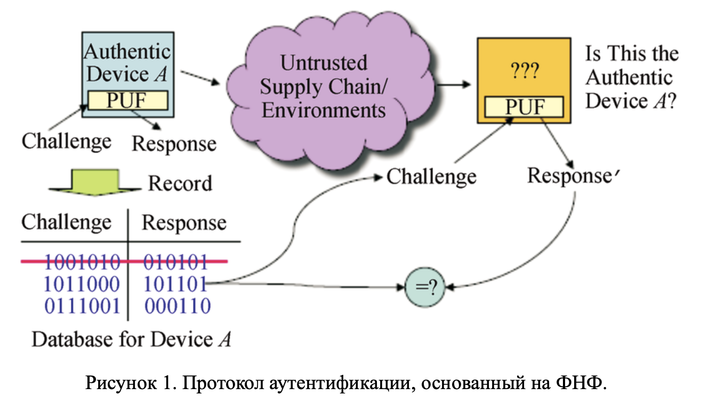

# lab11
> Реализация криптографических атак с помощью машинного обучения на физически неклонируемые функции

- _Физически неклонируемые функции_ (ФНФ) часто используются в качестве криптографических примитивов при реализации протоколов аутентификации.
- Рассмотрим простейший из них, основанный на на запросах и ответах (_challenge response_). Схема данного типа протокола приведена на рис. 1.

В данном случае устройство `А`, содержащее реализацию ФНФ, может быть аутентифицировано с помощью набора запросов (_challenge_) и проверки ответов на них (_response_). При этом использованные пары запрос-ответ удаляются из базы данных устройства.

Более подробно о физически неклонируемых функциях можно прочесть:
- [Физически неклонируемые функции: защита электроники от нелегального копирования](https://habr.com/post/343386/)
- [Alexander Ivaniuk, Проектирование встраиваемых цифровых устройств и систем, (глава 5, раздел 4)](https://www.researchgate.net/profile/Alexander_Ivaniuk/publication/322077869_Proektirovanie_vstraivaemyh_cifrovyh_ustrojstv_i_sistem/links/5a43724caca272d2945a0464/Proektirovanie-vstraivaemyh-cifrovyh-ustrojstv-i-sistem.pdf)

## tasks

1. Изучите классическую работу У. Рурмаира о криптографических атаках с помощью машинного обучения на ФНФ. [U. Ruhrmair et al., “Modeling attacks on physical unclonable functions,” in Proc. ACM Conf. on Comp. and Comm. Secur. (CCS’10), Oct. 2010, pp. 237–249.](https://eprint.iacr.org/2010/251.pdf)
2. Сформулируйте задачу в терминах машинного обучения.
3. Обучите модель, которая могла бы предсказывать ответы по запросам, которых нет в обучающей выборке.
4. Применить как минимум 3 различных алгоритма (например, метод опорных векторов, логистическая регрессия и градиентный бустинг).
5. Какая метрика наиболее подходит для оценки качества алгоритма?
6. Какой наибольшей доли правильных ответов (`Accuracy`) удалось достичь?
7. Какой размер обучающей выборки необходим, чтобы достигнуть доли правильных ответов минимум 0.95?
8. Как зависит доля правильных ответов от `N`?
9. Ответы на вопросы представьте в виде графиков.
10. Развернутые ответы на вопросы оформите в виде отчета.

### results

[solution](/ml/lab11/lab11.ipynb) + [report](/ml/lab11/lab11.md)
