# Машинное Обучение
Отчет по лабораторным работам студента 858342 группы Пажитных Ивана Павловича

# lab1
> Линейная регрессия


- Набор данных `ex1data1.txt` представляет собой текстовый файл, содержащий информацию о населении городов (первое число в строке) и прибыли ресторана, достигнутой в этом городе (второе число в строке). Отрицательное значение прибыли означает, что в данном городе ресторан терпит убытки.

- Набор данных `ex1data2.txt` представляет собой текстовый файл, содержащий информацию о площади дома в квадратных футах (первое число в строке), количестве комнат в доме (второе число в строке) и стоимости дома (третье число).

## tasks

1. Загрузите набор данных `ex1data1.txt` из текстового файла.
2. Постройте график зависимости прибыли ресторана от населения города, в котором он расположен.
3. Реализуйте функцию потерь `J(θ)` для набора данных `ex1data1.txt`.
4. Реализуйте функцию градиентного спуска для выбора параметров модели. Постройте полученную модель (функцию) совместно с графиком из пункта 2.
5. Постройте трехмерный график зависимости функции потерь от параметров модели (`θ_0` и `θ_1`) как в виде поверхности, так и в виде изолиний (_contour plot_).
6. Загрузите набор данных `ex1data2.txt` из текстового файла.
7. Произведите нормализацию признаков. Повлияло ли это на скорость сходимости градиентного спуска? Ответ дайте в виде графика.
8. Реализуйте функции потерь `J(θ)` и градиентного спуска для случая многомерной линейной регрессии с использованием векторизации.
9. Покажите, что векторизация дает прирост производительности.
10. Попробуйте изменить параметр `ɑ` (коэффициент обучения). Как при этом изменяется график функции потерь в зависимости от числа итераций градиентного спуск? Результат изобразите в качестве графика.
11. Постройте модель, используя аналитическое решение, которое может быть получено методом наименьших квадратов. Сравните результаты данной модели с моделью, полученной с помощью градиентного спуска.
12. Ответы на вопросы представьте в виде отчета.

### results

```python
import numpy as np
import pandas as pd
import matplotlib.pyplot as plt

pd.set_option('display.max_rows', 10)
```

### 1. read ex1 data


```python
data1 = np.genfromtxt('data/ex1data1.txt', delimiter=',')
rest = pd.DataFrame(data1, columns=['Population', 'Income'])
rest
```


<div>
<style scoped>
    .dataframe tbody tr th:only-of-type {
        vertical-align: middle;
    }

    .dataframe tbody tr th {
        vertical-align: top;
    }

    .dataframe thead th {
        text-align: right;
    }
</style>
<table border="1" class="dataframe">
  <thead>
    <tr style="text-align: right;">
      <th></th>
      <th>Population</th>
      <th>Income</th>
    </tr>
  </thead>
  <tbody>
    <tr>
      <th>0</th>
      <td>6.1101</td>
      <td>17.59200</td>
    </tr>
    <tr>
      <th>1</th>
      <td>5.5277</td>
      <td>9.13020</td>
    </tr>
    <tr>
      <th>2</th>
      <td>8.5186</td>
      <td>13.66200</td>
    </tr>
    <tr>
      <th>3</th>
      <td>7.0032</td>
      <td>11.85400</td>
    </tr>
    <tr>
      <th>4</th>
      <td>5.8598</td>
      <td>6.82330</td>
    </tr>
    <tr>
      <th>...</th>
      <td>...</td>
      <td>...</td>
    </tr>
    <tr>
      <th>92</th>
      <td>5.8707</td>
      <td>7.20290</td>
    </tr>
    <tr>
      <th>93</th>
      <td>5.3054</td>
      <td>1.98690</td>
    </tr>
    <tr>
      <th>94</th>
      <td>8.2934</td>
      <td>0.14454</td>
    </tr>
    <tr>
      <th>95</th>
      <td>13.3940</td>
      <td>9.05510</td>
    </tr>
    <tr>
      <th>96</th>
      <td>5.4369</td>
      <td>0.61705</td>
    </tr>
  </tbody>
</table>
<p>97 rows × 2 columns</p>
</div>


### 2. plot data


```python
def get_plot():
    plt.figure(figsize=(10, 6))
    plt.grid(True)
    plt.ylabel('Income, $10.000')
    plt.xlabel('Population of City, 10.000')
    plt.plot(rest['Population'], rest['Income'], 'rx', markersize=10, label='Training Data')
    return plt

plot = get_plot()
plot.show()
```


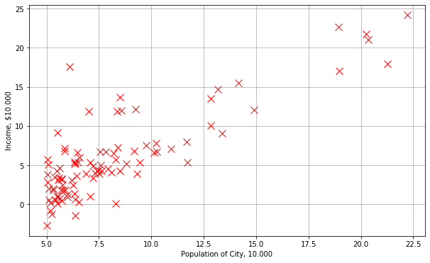


### 3. cost function J(θ)


```python
# Linear hypothesis function
def h(X, theta):
    return np.dot(X, theta)

# J = compute_cost(X, y, theta)
# computes the cost of using theta as the parameter for linear regression to fit the data points in X and y
def compute_cost(X, y, theta):
    m = y.size
    loss = h(X, theta) - y
    return np.sum(np.square(loss)) / (2. * m)
```


```python
(_, n) = rest.shape
theta = np.zeros((1, n)).T

X1 = rest[['Population']]
X1.insert(0, 'theta_0', 1)
y1 = rest[['Income']]

J = compute_cost(X1, y1, theta)
print(f'theta:\t{theta.ravel()}\nJ:\t{float(J)}')
```

    theta:	[0. 0.]
    J:	32.072733877455676


### 4. gradient descent


```python
# Performs gradient descent to learn theta
def gradient_descent(X, y, theta, alpha=0.01, iterations=1500):
    m = y.size
    J_history = []
    XT = X.T

    for i in range(iterations):
        loss = h(X, theta) - y
        gradient = np.dot(XT, loss) / m
        theta -= alpha * gradient
        J_history.append(compute_cost(X, y, theta))
    return theta, J_history

theta, j_history = gradient_descent(X1, y1, theta)
print(f'computed theta: {theta.ravel()}')
```

    computed theta: [-3.63029144  1.16636235]


```python
sample_population = [3, 11, 15, 16, 18.5]
predicted_income = [np.dot([1, x], theta).sum() for x in sample_population]
pd.DataFrame(zip(sample_population, predicted_income), columns=['Sample Population', 'Predicted Income'])
```


<div>
<style scoped>
    .dataframe tbody tr th:only-of-type {
        vertical-align: middle;
    }

    .dataframe tbody tr th {
        vertical-align: top;
    }

    .dataframe thead th {
        text-align: right;
    }
</style>
<table border="1" class="dataframe">
  <thead>
    <tr style="text-align: right;">
      <th></th>
      <th>Sample Population</th>
      <th>Predicted Income</th>
    </tr>
  </thead>
  <tbody>
    <tr>
      <th>0</th>
      <td>3.0</td>
      <td>-0.316625</td>
    </tr>
    <tr>
      <th>1</th>
      <td>11.0</td>
      <td>9.227581</td>
    </tr>
    <tr>
      <th>2</th>
      <td>15.0</td>
      <td>13.999684</td>
    </tr>
    <tr>
      <th>3</th>
      <td>16.0</td>
      <td>15.192709</td>
    </tr>
    <tr>
      <th>4</th>
      <td>18.5</td>
      <td>18.175274</td>
    </tr>
  </tbody>
</table>
</div>


```python
h_values = [np.dot(x, theta).sum() for x in X1.to_numpy()]

plot = get_plot()
plot.plot(rest['Population'], h_values, 'b-', label='Hypothesis')
plot.legend()
plot.show()
```


###  5. visualizing J(θ)


```python
# grid coordinates for plotting
xvals = np.linspace(-10, 10, 50)
yvals = np.linspace(-1, 4, 50)
xx, yy = np.meshgrid(xvals, yvals, indexing='xy')
Z = np.zeros((xvals.size, yvals.size))

# calculate Z-values (Cost) based on grid of coefficients
for (i, j), v in np.ndenumerate(Z):
    Z[i, j] = compute_cost(X1, y1, theta=[[xx[i, j]], [yy[i, j]]])
```


```python
from mpl_toolkits.mplot3d import axes3d

fig = plt.figure(figsize=(15, 6))
ax1 = fig.add_subplot(1, 2, 1)
ax2 = fig.add_subplot(1, 2, 2, projection='3d')

# left plot
CS = ax1.contour(xx, yy, Z, np.logspace(-2, 3, 20), cmap=plt.cm.jet)
ax1.scatter(*theta, c='r')

# right plot
ax2.plot_surface(xx, yy, Z, rstride=1, cstride=1, alpha=0.6, cmap=plt.cm.jet)
ax2.set_zlabel('Cost')
ax2.set_zlim(Z.min(), Z.max())
ax2.view_init(elev=15, azim=230)

# settings common to both plots
for ax in fig.axes:
    ax.set_xlabel(r'$\theta_0$', fontsize=17)
    ax.set_ylabel(r'$\theta_1$', fontsize=17)
```


### 6. read ex2 data


```python
data2 = np.genfromtxt('data/ex1data2.txt', delimiter=',')
houses = pd.DataFrame(data2, columns=['Area', 'Bedrooms', 'Price'])
houses
```


<div>
<style scoped>
    .dataframe tbody tr th:only-of-type {
        vertical-align: middle;
    }

    .dataframe tbody tr th {
        vertical-align: top;
    }

    .dataframe thead th {
        text-align: right;
    }
</style>
<table border="1" class="dataframe">
  <thead>
    <tr style="text-align: right;">
      <th></th>
      <th>Area</th>
      <th>Bedrooms</th>
      <th>Price</th>
    </tr>
  </thead>
  <tbody>
    <tr>
      <th>0</th>
      <td>2104.0</td>
      <td>3.0</td>
      <td>399900.0</td>
    </tr>
    <tr>
      <th>1</th>
      <td>1600.0</td>
      <td>3.0</td>
      <td>329900.0</td>
    </tr>
    <tr>
      <th>2</th>
      <td>2400.0</td>
      <td>3.0</td>
      <td>369000.0</td>
    </tr>
    <tr>
      <th>3</th>
      <td>1416.0</td>
      <td>2.0</td>
      <td>232000.0</td>
    </tr>
    <tr>
      <th>4</th>
      <td>3000.0</td>
      <td>4.0</td>
      <td>539900.0</td>
    </tr>
    <tr>
      <th>...</th>
      <td>...</td>
      <td>...</td>
      <td>...</td>
    </tr>
    <tr>
      <th>42</th>
      <td>2567.0</td>
      <td>4.0</td>
      <td>314000.0</td>
    </tr>
    <tr>
      <th>43</th>
      <td>1200.0</td>
      <td>3.0</td>
      <td>299000.0</td>
    </tr>
    <tr>
      <th>44</th>
      <td>852.0</td>
      <td>2.0</td>
      <td>179900.0</td>
    </tr>
    <tr>
      <th>45</th>
      <td>1852.0</td>
      <td>4.0</td>
      <td>299900.0</td>
    </tr>
    <tr>
      <th>46</th>
      <td>1203.0</td>
      <td>3.0</td>
      <td>239500.0</td>
    </tr>
  </tbody>
</table>
<p>47 rows × 3 columns</p>
</div>


### 7. features normalization


```python
# Normalizes the features in X:
#   returns a normalized version of X where
#   the mean value of each feature is 0 and the standard deviation is 1
def feature_normalization(X):
    mu = X.mean(axis=0)
    sigma = X.std(axis=0)
    return (X - mu) / sigma, mu, sigma
```


```python
X2 = houses[['Area', 'Bedrooms']]
X2_norm, mu, sigma = feature_normalization(X2)
X2_norm.describe()
```


<div>
<style scoped>
    .dataframe tbody tr th:only-of-type {
        vertical-align: middle;
    }

    .dataframe tbody tr th {
        vertical-align: top;
    }

    .dataframe thead th {
        text-align: right;
    }
</style>
<table border="1" class="dataframe">
  <thead>
    <tr style="text-align: right;">
      <th></th>
      <th>Area</th>
      <th>Bedrooms</th>
    </tr>
  </thead>
  <tbody>
    <tr>
      <th>count</th>
      <td>4.700000e+01</td>
      <td>4.700000e+01</td>
    </tr>
    <tr>
      <th>mean</th>
      <td>3.779483e-17</td>
      <td>2.185013e-16</td>
    </tr>
    <tr>
      <th>std</th>
      <td>1.000000e+00</td>
      <td>1.000000e+00</td>
    </tr>
    <tr>
      <th>min</th>
      <td>-1.445423e+00</td>
      <td>-2.851859e+00</td>
    </tr>
    <tr>
      <th>25%</th>
      <td>-7.155897e-01</td>
      <td>-2.236752e-01</td>
    </tr>
    <tr>
      <th>50%</th>
      <td>-1.417900e-01</td>
      <td>-2.236752e-01</td>
    </tr>
    <tr>
      <th>75%</th>
      <td>3.376348e-01</td>
      <td>1.090417e+00</td>
    </tr>
    <tr>
      <th>max</th>
      <td>3.117292e+00</td>
      <td>2.404508e+00</td>
    </tr>
  </tbody>
</table>
</div>


```python
y2 = houses[['Price']]
_, n2 = houses.shape

X2.insert(0, 'theta_0', 1)
X2_norm.insert(0, 'theta_0', 1)
```


```python
t1 = np.zeros((1, n2)).T
t2 = np.zeros((1, n2)).T
(theta1, j_history) = gradient_descent(X2, y2, t1, 0.00000001, 50)
(theta2, j_norm_history) = gradient_descent(X2_norm, y2, t2, 0.1, 50)
print(f'theta1:\t{theta1.ravel()}\ntheta2:\t{theta2.ravel()}')
```

    theta1:	[6.96485826e-02 1.49853133e+02 2.24735775e-01]
    theta2:	[ 3.38658249e+05  1.04127516e+05 -1.72205334e+02]


```python
p1 = plt.plot(range(len(j_history)), j_history, color='black')
p2 = plt.plot(range(len(j_norm_history)), j_norm_history, color='red')
plt.legend((p1[0], p2[0]), ('raw', 'normalized'))
plt.show()
```


### 8. multi gradient descent with vectorizing


```python
alpha = 0.01
iterations = 400


(theta_mul, _) = gradient_descent(X2_norm, y2, np.zeros((1, n2)).T, alpha, iterations)
print(f'theta_mul:\t{theta_mul.ravel()}')
```

    theta_mul:	[334302.06399328 100087.11600585   3673.54845093]


### 9. execution time


```python
from timeit import default_timer

iterations = 1000
alpha = 0.02

start = default_timer()
(theta_timer, _) = gradient_descent(X2_norm.to_numpy(), y2.to_numpy(), np.zeros((1, n2)).T, alpha, iterations)
end = default_timer()
print(f'theta_timer:\t{theta_timer.ravel()}\ttime:{end - start}')
```

    theta_timer:	[340412.65900156 110620.78816241  -6639.21215439]	time:0.02559936400211882


### 10. ɑ varying plot


```python
def draw_alphas(iterations):
    alphas = np.linspace(0.1, 0.001, num=7)
    plots = []
    for alpha in alphas:
        (theta, j_hist) = gradient_descent(X2_norm.to_numpy(), y2.to_numpy(), np.zeros((1, n2)).T, alpha, iterations)
        p = plt.plot(range(len(j_hist)), j_hist)
        plots.append(p[0])

    plt.title(f'iterations: {iterations}')
    plt.legend(plots, [f'Alpha: {a:.3f}' for a in alphas])
    plt.show()
```


```python
draw_alphas(30)
draw_alphas(60)
draw_alphas(100)
```


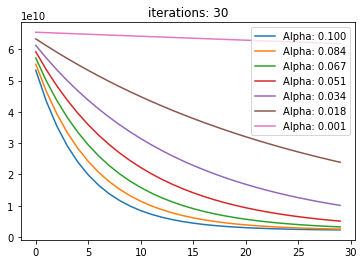


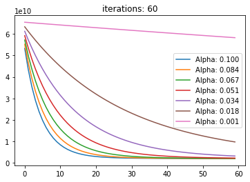


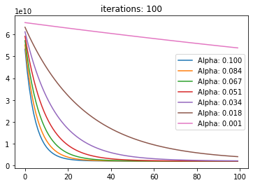


### 11. least squares


```python
# computes the closed-form solution to linear regression using the normal equations
def normal_eqn(X, y):
    XX = np.asmatrix(X)
    XT = XX.T
    return np.array([float(el) for el in ((XT @ XX).I @ XT) @ y])
```


```python
theta_sq = normal_eqn(X2.to_numpy(), y2.to_numpy())
print(f'theta_sq:\t{theta_sq.ravel()}\ntheta_gd:\t{theta_mul.ravel()}')
```

    theta_sq:	[89597.9095428    139.21067402 -8738.01911233]
    theta_gd:	[334302.06399328 100087.11600585   3673.54845093]


```python
AREA = 1890
ROOMS = 4

price_sq = np.array([1, AREA, ROOMS]) @ theta_sq.T
price_gd = (np.array([1, (AREA - mu[0]) / sigma[0], (ROOMS - mu[1]) / sigma[1]]) @ theta_mul)[0]
print(f'price_sq:\t{price_sq}\nprice_gd:\t{price_gd}')
```

    price_sq:	317754.00698679825
    price_gd:	324368.29504053446


### 12. conclusion

В лабараторной работе были рассмотрены случаи линейной и многомерной регресии с помощью методов **градиентного спуска** [#4] а также аналититеского метода **наименьших квадратов** [#11].

В работе использовался язык программирования **Python**, интерактиваня среда разработки **Jupyter** а также библиотеки `numpy`, `pandas` и `matplotlib`

- Как видно из графика [#7] нормализация увеличивает скорость сходимости градиентного спуска.
- В пункте #10 показана зависимость скорости сходимости от параметра ɑ и количества итераций.
- В пункте #11 метод градиентного спуска сравнивается с методом наименьших квадратов.

# lab2
> Логистическая регрессия. Многоклассовая классификация

- Набор данных `ex2data1.txt` представляет собой текстовый файл, содержащий информацию об оценке студента по первому экзамену (первое число в строке), оценке по второму экзамену (второе число в строке) и поступлении в университет (0 - не поступил, 1 - поступил).

- Набор данных `ex2data2.txt` представляет собой текстовый файл, содержащий информацию о результате первого теста (первое число в строке) и результате второго теста (второе число в строке) изделий и результате прохождения контроля (0 - контроль не пройден, 1 - контроль пройден).

- Набор данных `ex2data3.mat` представляет собой файл формата `*.mat` (т.е. сохраненного из _Matlab_). Набор содержит 5000 изображений 20x20 в оттенках серого. Каждый пиксель представляет собой значение яркости (вещественное число). Каждое изображение сохранено в виде вектора из 400 элементов. В результате загрузки набора данных должна быть получена матрица 5000x400. Далее расположены метки классов изображений от 1 до 9 (соответствуют цифрам от 1 до 9), а также 10 (соответствует цифре 0).

## tasks

1. Загрузите данные `ex2data1.txt` из текстового файла.
2. Постройте график, где по осям откладываются оценки по предметам, а точки обозначаются двумя разными маркерами в зависимости от того, поступил ли данный студент в университет или нет.
3. Реализуйте функции потерь `J(θ)` и градиентного спуска для логистической регрессии с использованием векторизации.
4. Реализуйте другие методы (как минимум 2) оптимизации для реализованной функции стоимости (например: _Метод Нелдера-Мида_, _Алгоритм Бройдена-Флетчера-Гольдфарба-Шанно_, генетические методы и тп). Разрешается использовать библиотечные реализации методов оптимизации (например, из библиотеки `scipy`).
5. Реализуйте функцию предсказания вероятности поступления студента в зависимости от значений оценок по экзаменам.
6. Постройте разделяющую прямую, полученную в результате обучения модели. Совместите прямую с графиком из пункта 2.
7. Загрузите данные `ex2data2.txt` из текстового файла.
8. Постройте график, где по осям откладываются результаты тестов, а точки обозначаются двумя разными маркерами в зависимости от того, прошло ли изделие контроль или нет.
9. Постройте все возможные комбинации признаков `x1` (результат первого теста) и `x2` (результат второго теста), в которых степень полинома не превышает 6, т.е. 1, `x_1`, `x_2`, `x_1^2`, `x_1x_2`, `x_2^2`, ..., `x_1x_2^5`, `x_2^6` (всего 28 комбинаций).
10. Реализуйте L2-регуляризацию для логистической регрессии и обучите ее на расширенном наборе признаков методом градиентного спуска.
11. Реализуйте другие методы оптимизации.
12. Реализуйте функцию предсказания вероятности прохождения контроля изделием в зависимости от результатов тестов.
13. Постройте разделяющую кривую, полученную в результате обучения модели. Совместите прямую с графиком из пункта 7.
14. Попробуйте различные значения параметра регуляризации `λ`. Как выбор данного значения влияет на вид разделяющей кривой? Ответ дайте в виде графиков.
15. Загрузите данные `ex2data3.mat` из файла.
16. Визуализируйте несколько случайных изображений из набора данных. Визуализация должна содержать каждую цифру как минимум один раз.
17. Реализуйте бинарный классификатор с помощью логистической регрессии с использованием векторизации (функции потерь и градиентного спуска).
18. Добавьте L2-регуляризацию к модели.
19. Реализуйте многоклассовую классификацию по методу “один против всех”.
20. Реализуйте функцию предсказания класса по изображению с использованием обученных классификаторов.
21. Процент правильных классификаций на обучающей выборке должен составлять около 95%.
22. Ответы на вопросы представьте в виде отчета.

### results

```python
import numpy as np
import pandas as pd
import matplotlib.pyplot as plt
import scipy.optimize as opt

pd.set_option('display.max_rows', 10)
```

### 1. read ex1 data


```python
data1 = pd.DataFrame(np.genfromtxt('data/ex2data1.txt', delimiter=','), columns=['Grade1', 'Grade2', 'Accepted'])
data1
```


<div>
<style scoped>
    .dataframe tbody tr th:only-of-type {
        vertical-align: middle;
    }

    .dataframe tbody tr th {
        vertical-align: top;
    }

    .dataframe thead th {
        text-align: right;
    }
</style>
<table border="1" class="dataframe">
  <thead>
    <tr style="text-align: right;">
      <th></th>
      <th>Grade1</th>
      <th>Grade2</th>
      <th>Accepted</th>
    </tr>
  </thead>
  <tbody>
    <tr>
      <th>0</th>
      <td>34.623660</td>
      <td>78.024693</td>
      <td>0.0</td>
    </tr>
    <tr>
      <th>1</th>
      <td>30.286711</td>
      <td>43.894998</td>
      <td>0.0</td>
    </tr>
    <tr>
      <th>2</th>
      <td>35.847409</td>
      <td>72.902198</td>
      <td>0.0</td>
    </tr>
    <tr>
      <th>3</th>
      <td>60.182599</td>
      <td>86.308552</td>
      <td>1.0</td>
    </tr>
    <tr>
      <th>4</th>
      <td>79.032736</td>
      <td>75.344376</td>
      <td>1.0</td>
    </tr>
    <tr>
      <th>...</th>
      <td>...</td>
      <td>...</td>
      <td>...</td>
    </tr>
    <tr>
      <th>95</th>
      <td>83.489163</td>
      <td>48.380286</td>
      <td>1.0</td>
    </tr>
    <tr>
      <th>96</th>
      <td>42.261701</td>
      <td>87.103851</td>
      <td>1.0</td>
    </tr>
    <tr>
      <th>97</th>
      <td>99.315009</td>
      <td>68.775409</td>
      <td>1.0</td>
    </tr>
    <tr>
      <th>98</th>
      <td>55.340018</td>
      <td>64.931938</td>
      <td>1.0</td>
    </tr>
    <tr>
      <th>99</th>
      <td>74.775893</td>
      <td>89.529813</td>
      <td>1.0</td>
    </tr>
  </tbody>
</table>
<p>100 rows × 3 columns</p>
</div>


### 2. plot data


```python
def get_plot(data, x_label = 'Grade1', y_label = 'Grade2'):
    plt.figure()
    ax = data.loc[data.Accepted == 1].plot(x=x_label, y=y_label, style=['gx'], label='Accepted')
    ay = data.loc[data.Accepted == 0].plot(x=x_label, y=y_label, style=['rx'], label='Not Accepted', ax=ax)
    ax.set_xlabel(x_label)
    ax.set_ylabel(y_label)
    plt.legend()
    return plt, ax

def plot_data(data, label_x='Grade1', label_y='Grade2', axes=None):
    pos = data.loc[data.Accepted == 1]
    neg = data.loc[data.Accepted == 0]

    if axes == None:
        axes = plt.gca()

    axes.scatter(pos[label_x], pos[label_y], marker='x', c='g', s=30, label='Accepted')
    axes.scatter(neg[label_x], neg[label_y], c='r', s=30, label='Not Accepted')
    axes.set_xlabel(label_x)
    axes.set_ylabel(label_y)
    axes.legend(frameon= True, fancybox = True)

plot_data(data1)
```


### 3. cost function J(θ) + gradient descent


```python
def sigmoid(X):
    return 1 / (1 + np.exp(-X))

def cost_function(theta, X, y):
    m = y.size
    h = sigmoid(X @ theta)
    J = (-1 / m) * ((y.T @ np.log(h)) + ((1 - y).T @ np.log(1 - h)))
    error = h - y
    gd = (1 / m) * (X.T @ error)
    return J, gd
```


```python
m, n = data1.shape
initial_theta = np.zeros(n)

X = data1[['Grade1', 'Grade2']]
X.insert(0, 'theta_0', 1)
y = data1['Accepted']

cost, gd = cost_function(initial_theta, X, y)
print(f'Cost with initial_theta:\t{cost}')
print(f'Gradient with initial_theta:\t{gd.ravel()}')
```

    Cost with initial_theta:	0.6931471805599452
    Gradient with initial_theta:	[ -0.1        -12.00921659 -11.26284221]


### 4. optimize cost


```python
def optimize_cost(theta, X, y):
    cost, _ = cost_function(theta, X, y)
    return cost

def optimize_gradient(theta, X, y):
    _, gd = cost_function(theta, X, y)
    return gd

def optimize(func, gradient, X, y, method):
    initial_theta = np.zeros(n)

    result = opt.minimize(fun=func, x0=initial_theta, args=(X, y), method=method, jac=gradient)
    theta = result.x
    cost = func(theta, X, y)

    print(f'theta:\t{theta.ravel()}\ncost:\t{cost}')
    return result
```

#### Nelder-Mead


```python
result = optimize(optimize_cost, optimize_gradient, X, y, 'Nelder-Mead')
result
```

    theta:	[-25.16130062   0.20623142   0.20147143]
    cost:	0.2034977015902151


     final_simplex: (array([[-25.16130062,   0.20623142,   0.20147143],
           [-25.16135807,   0.20623176,   0.20147199],
           [-25.1613519 ,   0.20623203,   0.20147171],
           [-25.16137971,   0.20623202,   0.20147188]]), array([0.2034977, 0.2034977, 0.2034977, 0.2034977]))
               fun: 0.2034977015902151
           message: 'Optimization terminated successfully.'
              nfev: 287
               nit: 157
            status: 0
           success: True
                 x: array([-25.16130062,   0.20623142,   0.20147143])


#### Broyden-Fletcher-Goldfarb-Shanno


```python
result = optimize(optimize_cost, optimize_gradient, X, y, 'BFGS')
result
```

    theta:	[-25.16133284   0.2062317    0.2014716 ]
    cost:	0.20349770158944375


    /Users/drapegnik/.pyenv/versions/3.7.4/envs/bsuir/lib/python3.7/site-packages/ipykernel_launcher.py:7: RuntimeWarning: divide by zero encountered in log
      import sys


          fun: 0.20349770158944375
     hess_inv: array([[ 3.31474479e+03, -2.63892205e+01, -2.70237122e+01],
           [-2.63892205e+01,  2.23869433e-01,  2.02682332e-01],
           [-2.70237122e+01,  2.02682332e-01,  2.35335117e-01]])
          jac: theta_0   -9.524768e-09
    Grade1    -9.319213e-07
    Grade2    -2.826089e-07
    dtype: float64
      message: 'Optimization terminated successfully.'
         nfev: 31
          nit: 23
         njev: 31
       status: 0
      success: True
            x: array([-25.16133284,   0.2062317 ,   0.2014716 ])


### 5. predict function


```python
def predict(theta, X):
    predict = sigmoid(np.dot(X, theta))
    return predict > 0.5

theta = result.x
sample = np.array([1, 57, 79])
probability = sigmoid(sample @ theta)
print(f'With Grades {sample[1:]}, probability of acceptance is: {probability}')
```

    With Grades [57 79], probability of acceptance is: 0.924848961903417


```python
def get_accuracy(theta, X, y):
    p = predict(theta, X)
    return y[p == y].size / y.size * 100
print(f'Train Accuracy: {get_accuracy(theta, X, y)}%')
```

    Train Accuracy: 89.0%


### 6. decision surface


```python
plot, ax = get_plot(data1)
slope = -(theta[1] / theta[2])
intercept = -(theta[0] / theta[2])

xs = np.array(ax.get_xlim())
ys = intercept + (slope * xs)

plot.plot(xs, ys);
plot.show()
```


    <Figure size 432x288 with 0 Axes>


### 7. read ex2 data


```python
data2 = pd.DataFrame(np.genfromtxt('data/ex2data2.txt', delimiter=','), columns=['Test1', 'Test2', 'Accepted'])
data2
```


<div>
<style scoped>
    .dataframe tbody tr th:only-of-type {
        vertical-align: middle;
    }

    .dataframe tbody tr th {
        vertical-align: top;
    }

    .dataframe thead th {
        text-align: right;
    }
</style>
<table border="1" class="dataframe">
  <thead>
    <tr style="text-align: right;">
      <th></th>
      <th>Test1</th>
      <th>Test2</th>
      <th>Accepted</th>
    </tr>
  </thead>
  <tbody>
    <tr>
      <th>0</th>
      <td>0.051267</td>
      <td>0.699560</td>
      <td>1.0</td>
    </tr>
    <tr>
      <th>1</th>
      <td>-0.092742</td>
      <td>0.684940</td>
      <td>1.0</td>
    </tr>
    <tr>
      <th>2</th>
      <td>-0.213710</td>
      <td>0.692250</td>
      <td>1.0</td>
    </tr>
    <tr>
      <th>3</th>
      <td>-0.375000</td>
      <td>0.502190</td>
      <td>1.0</td>
    </tr>
    <tr>
      <th>4</th>
      <td>-0.513250</td>
      <td>0.465640</td>
      <td>1.0</td>
    </tr>
    <tr>
      <th>...</th>
      <td>...</td>
      <td>...</td>
      <td>...</td>
    </tr>
    <tr>
      <th>113</th>
      <td>-0.720620</td>
      <td>0.538740</td>
      <td>0.0</td>
    </tr>
    <tr>
      <th>114</th>
      <td>-0.593890</td>
      <td>0.494880</td>
      <td>0.0</td>
    </tr>
    <tr>
      <th>115</th>
      <td>-0.484450</td>
      <td>0.999270</td>
      <td>0.0</td>
    </tr>
    <tr>
      <th>116</th>
      <td>-0.006336</td>
      <td>0.999270</td>
      <td>0.0</td>
    </tr>
    <tr>
      <th>117</th>
      <td>0.632650</td>
      <td>-0.030612</td>
      <td>0.0</td>
    </tr>
  </tbody>
</table>
<p>118 rows × 3 columns</p>
</div>


### 8. plot data


```python
plot_data(data2, 'Test1', 'Test2')
```


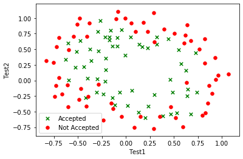


### 9. map features


```python
def map_feature(x1, x2, degree=6):
    '''
    Maps the two input features to quadratic features.
    Returns features array:
        x1, x2, x1**2, x2**2, x1*x2, x1*x2**2...
    '''
    x1.shape = (x1.size, 1)
    x2.shape = (x2.size, 1)
    result = np.ones(shape=(x1[:, 0].size, 1))
    m, n = result.shape

    for i in range(1, degree + 1):
        for j in range(i + 1):
            r = (x1 ** (i - j)) * (x2 ** j)
            result = np.append(result, r, axis=1)

    return result

x1 = np.array(data2['Test1'])
x2 = np.array(data2['Test2'])
mapped = map_feature(x1, x2)
mapped.shape
```


    (118, 28)


### 10. l2 regularization with gradient descent


```python
def cost_function_reg(theta, X, y, l=1):
    h = sigmoid(X.dot(theta))
    thetaR = theta[1:, 0]

    J = (-1.0 / m) * ((y.T @ np.log(h)) + ((1 - y.T) @ np.log(1.0 - h))) + (l / (2.0 * m)) * (thetaR.T @ thetaR)

    y.shape = h.shape
    delta = h - y
    sumdelta = delta.T @ X[:, 1]
    grad1 = (1.0 / m) * sumdelta

    XR = X[:, 1:X.shape[1]]
    sumdelta = delta.T @ XR

    grad = (1.0 / m) * (sumdelta + l * thetaR)

    out = np.zeros(shape=(grad.shape[0], grad.shape[1] + 1))

    out[:, 0] = grad1
    out[:, 1:] = grad

    return J.flatten(), out.T.flatten()

def gradient_reg(theta, X, y, l=1, alpha=0.2, num_iters=400):
    m = y.size
    j_history = []
    for i in range(0, num_iters):
        cost, grad = cost_function_reg(theta, X, y, l)
        grad.shape = theta.shape
        theta -= alpha * grad
        j_history.append(cost)

    return theta, j_history
```


```python
m, n = data2.shape

y = np.array(data2['Accepted'])
y.shape = (m, 1)
initial_theta = np.zeros(shape=(mapped.shape[1], 1))

cost, _ = cost_function_reg(initial_theta, mapped, y)
print(f'Initial Cost:\t{cost}')

gd_theta, _ = gradient_reg(initial_theta, mapped, y)
```

    Initial Cost:	[0.69314718]


### 11. other regularization functions


```python
def reshape_decorator(return_type):
    def reshape_theta(theta, X, y):
        theta.shape = (mapped.shape[1], 1)
        cost, grad = cost_function_reg(theta, X, y)
        theta.shape = (mapped.shape[1],)
        return cost if return_type == 'cost' else grad
    return reshape_theta

result = opt.minimize(
    fun=reshape_decorator('cost'),
    x0=initial_theta,
    args=(mapped, y),
    method='BFGS',
    jac=reshape_decorator('gd')
)
bfgs_theta = result.x
bfgs_theta.shape = (mapped.shape[1], 1)
```

### 12. predict function


```python
print(f'GD Train Accuracy: {get_accuracy(gd_theta, mapped, y)}%')
print(f'BFGS Train Accuracy: {get_accuracy(bfgs_theta, mapped, y)}%')
```

    GD Train Accuracy: 80.50847457627118%
    BFGS Train Accuracy: 82.20338983050848%


### 13-14. decision surface + different  λ


```python
def get_contour(theta):
    u = np.linspace(-1, 1.5)
    v = np.linspace(-1, 1.5)
    z = np.zeros(shape=(len(u), len(v)))
    for i in range(len(u)):
        for j in range(len(v)):
            z[i, j] = map_feature(np.array(u[i]), np.array(v[j])).dot(np.array(theta))
    return u, v, z.T
```


```python
LAMBDAS = [0, 1, 5, 50]
fig, axes = plt.subplots(2, 2, sharey = True, figsize=(12, 10))

for i, reg_lambda in enumerate(LAMBDAS):
    initial_theta = np.zeros(shape=(mapped.shape[1], 1))
    theta, _ = gradient_reg(initial_theta, mapped, y, reg_lambda, 0.2, 1000)    
    accuracy = np.round(get_accuracy(theta, mapped, y), decimals=2)

    plot_data(data2, 'Test1', 'Test2', axes.flatten()[i])
    u, v, z = get_contour(theta)

    axes.flatten()[i].contour(u, v, z, colors='b', linewidths=1);       
    axes.flatten()[i].set_title(f'Train accuracy {accuracy}% with Lambda={reg_lambda}')
```


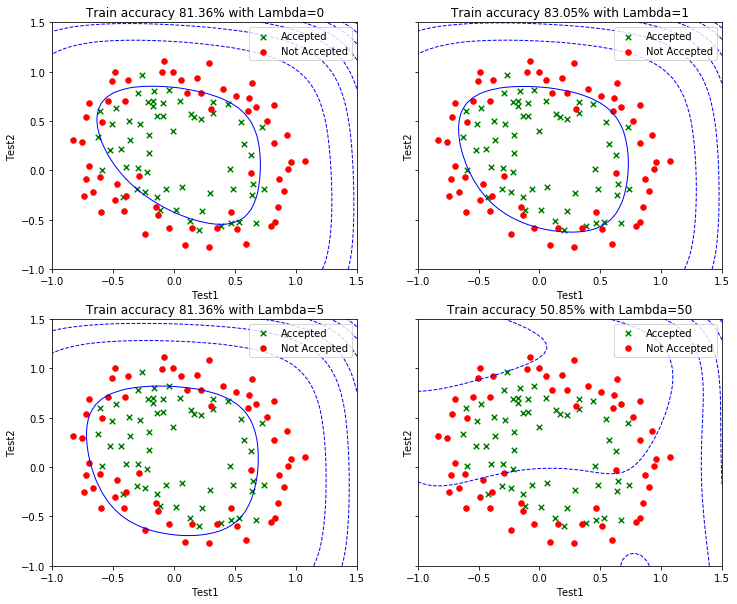


### 15. read ex3 data


```python
import scipy.io

data3 = scipy.io.loadmat('data/ex2data3.mat')
x = np.array(data3['X'])
y = np.squeeze(data3['y'])
np.place(y, y == 10, 0)
n = x.shape[1]
m = x.shape[0]
labels_count = 10
```

### 16. visualize data


```python
import matplotlib.image as mpimg

X = np.ones(shape=(x.shape[0], x.shape[1] + 1))
X[:, 1:] = x

sample = np.random.choice(X.shape[0], 20)
plt.imshow(X[sample,1:].reshape(-1, 20).T, cmap='binary')
plt.axis('off');
```


### 17-18. vectorizing logistic regression + L2

### 19. one-vs-all classification


```python
classifiers = np.zeros(shape=(labels_count, n + 1))
for i in range(0, labels_count):
    label = (y == i).astype(int)
    initial_theta = np.zeros(shape=(X.shape[1], 1))
    theta, costs = gradient_reg(initial_theta, X, label, 0.4, 2.8, 10000)
    classifiers[i, :] = np.squeeze(theta)
```

### 20. predict function


```python
def predict_class(input, classifiers):
    class_probs = sigmoid(input @ classifiers.transpose())
    if len(class_probs.shape) == 1:
        class_probs.shape = (1, class_probs.shape[0])
    predictions = class_probs.argmax(axis=1)
    return predictions
```

### 21. training accuracy


```python
predictions = predict_class(X, classifiers)
accuracy = 100 * np.mean(predictions == y)
print(f'Training accuracy: {accuracy}')
```

    Training accuracy: 94.74000000000001


### 22. conclusion

В данной лабораторной работе рассмотрена модель логистической регрессии.
Реализована `L2`-регуляризация, реализован бинарный классификатор с помощью логистической регрессии, который использовался для реализации многоклассового классификатора по методу "один против всех".

В пункте #14 показана зависимость результатов от параметра регуляризации `λ`: переобучение или недообучение выборки.

# lab3
> Переобучение и регуляризация

- Набор данных `ex3data1.mat` представляет собой файл формата `*.mat` (т.е. сохраненного из _Matlab_)
- Набор содержит две переменные `X` (изменения уровня воды) и `y` (объем воды, вытекающий из дамбы).
- По переменной `X` необходимо предсказать `y`.
- Данные разделены на три выборки:
    - обучающая выборка (`X`, `y`), по которой определяются параметры модели;
    - валидационная выборка (`Xval`, `yval`), на которой настраивается коэффициент регуляризации;
    - контрольная выборка (`Xtest`, `ytest`), на которой оценивается качество построенной модели.

## tasks

1. Загрузите данные `ex3data1.mat` из файла.
2. Постройте график, где по осям откладываются `X` и `y` из обучающей выборки.
3. Реализуйте функцию стоимости потерь для линейной регрессии с `L2`-регуляризацией.
4. Реализуйте функцию градиентного спуска для линейной регрессии с `L2`-регуляризацией.
5. Постройте модель линейной регрессии с коэффициентом регуляризации `0` и постройте график полученной функции совместно с графиком из пункта 2. Почему регуляризация в данном случае не сработает?
6. Постройте график процесса обучения (_learning curves_) для обучающей и валидационной выборки. По оси абсцисс откладывается число элементов из обучающей выборки, а по оси ординат - ошибка (значение функции потерь) для обучающей выборки (первая кривая) и валидационной выборки (вторая кривая). Какой вывод можно сделать по построенному графику?
7. Реализуйте функцию добавления `p-1` новых признаков в обучающую выборку (`X^2`, `X^3`, `X^4`, ..., `X^p`).
8. Поскольку в данной задаче будет использован полином высокой степени, то необходимо перед обучением произвести нормализацию признаков.
9. Обучите модель с коэффициентом регуляризации `0` и `p=8`.
10. Постройте график модели, совмещенный с обучающей выборкой, а также график процесса обучения. Какой вывод можно сделать в данном случае?
11. Постройте графики из пункта 10 для моделей с коэффициентами регуляризации `1` и `100`. Какие выводы можно сделать?
12. С помощью валидационной выборки подберите коэффиент регуляризации, который позволяет достичь наименьшей ошибки. Процесс подбора отразите с помощью графика (графиков).
13. Вычислите ошибку (потерю) на контрольной выборке.
14. Ответы на вопросы представьте в виде отчета.

### results

```python
import numpy as np
import pandas as pd
import matplotlib.pyplot as plt
import scipy.io
```

### 1. read data


```python
data = scipy.io.loadmat('data/ex3data1.mat')
x = np.array(data['X'])
y = np.squeeze(data['y'])
X = np.insert(x, 0, 1, axis=1)
```

### 2. plot data


```python
plt.figure()
plt.scatter(x.flatten(), y)
plt.xlabel('x')
plt.ylabel('y')
plt.show()
```


### 3. cost function + L2 regularization


```python
def compute_cost_reg(X, y, theta, l=1):
    m = y.size
    h = X.dot(theta)
    error = h - y
    cost = np.sum(error ** 2) / (2 * m) + (l / (2 * m)) * np.sum(np.square(theta))
    return cost, error

def get_init_theta(_X=X):
    return np.zeros(_X.shape[1])
```


```python
cost, _ = compute_cost_reg(X, y, get_init_theta())
print(f'Initial Cost:\t{cost}')
```

    Initial Cost:	140.95412088055392


### 4. gradient descent + L2 regularization


```python
def gradient_descent_reg(X, y, theta, l=1, alpha=0.0022, num_iters=1000):
    m = y.size
    j_history = []
    XT = X.T
    for i in range(0, num_iters):
        cost, error = compute_cost_reg(X, y, theta, l)
        gradient = (XT.dot(error) + l * theta) / m
        theta -= alpha * gradient
        j_history.append(cost)

    return theta, j_history
```


```python
theta, costs = gradient_descent_reg(X, y, get_init_theta())
print(f'Cost:\t{costs[-1]}\ntheta:\t{theta}')
```

    Cost:	29.695375543493448
    theta:	[10.86601315  0.35442522]


### 5. linear regression with λ=0

> При λ=0 регуляризация не производится


```python
theta, _ = gradient_descent_reg(X, y, get_init_theta(), l=0)
h = X.dot(theta)

plt.figure()
plt.scatter(x.flatten(), y, label='Dataset')
plt.plot(x.flatten(), h, label='H(x)', c='red')
plt.xlabel('x')
plt.ylabel('y')
plt.legend()
plt.show()
```


### 6. learning curves


```python
def train(x_train, x_val, y_train, y_val):
    X = np.insert(x_train, 0, 1, axis=1)

    theta, train_costs = gradient_descent_reg(X, y_train, get_init_theta(), l=0, alpha=0.0005)

    X_val = np.insert(x_val, 0, 1, axis=1)
    val_cost = compute_cost_reg(X_val, y_val, theta, l=0)

    return train_costs[-1], val_cost[0]


def plot_learning_curves(x_train, x_val, y_train, y_val):
    m, n = x_train.shape

    train_costs = []
    val_costs = []
    for size in range(4 , m):
        idx = range(0, size)
        t, v = train(x_train[idx,:], x_val[idx,:], y_train[idx], y_val[idx])
        train_costs.append(t)
        val_costs.append(v)

    plt.figure(figsize=(8, 5))
    plt.plot(train_costs, 'b', label='Train Data')
    plt.plot(val_costs, 'r', label='Validation Data')
    plt.xlabel('Number of training examples')
    plt.ylabel('Error')
    plt.legend()
    plt.show()
```


```python
x_val = data['Xval']
y_val = np.squeeze(data['yval'])
plot_learning_curves(x, x_val, y, y_val)
```


> Из графиков видно что с увеличением размера выборки результат обучения становится точнее

### 7. map features


```python
def map_features(x, p):
    result = x
    for i in range(2, p + 1):
        r = x ** i
        result = np.append(result, r, axis=1)
    return result
```

### 8. norimilize features


```python
def normilize_features(X):
    norm = (X - X.mean(axis=0)) / X.std(axis=0)
    mu = X.mean(axis=0)
    sigma = X.std(axis=0)
    return norm, mu, sigma
```

### 9. train with λ=0 and p=8


```python
X = map_features(x, 8)
X_norm, mu, sigma = normilize_features(X)
X_norm = np.insert(X_norm, 0, 1, axis=1)
theta, costs = gradient_descent_reg(X_norm, y, get_init_theta(X_norm), l=0, alpha=0.3)
print(f'Cost:\t{costs[-1]}\ntheta:\t{theta}')
```

    Cost:	0.25271483023922614
    theta:	[11.21758933 12.28233889 11.38602789  3.36072468 -2.91092977 -2.33533198
     -2.43006402 -2.58595693 -1.41584622]


### 10. plot train


```python
h = X_norm.dot(theta)
new_x, new_h = zip(*sorted(zip(x.flatten(), h)))

fig, axs = plt.subplots(1, 2, sharey = True, figsize=(16, 6))

axs[0].set_title('Train Data & H(x)')
axs[0].scatter(x.flatten(), y, label='Dataset')
axs[0].plot(new_x, new_h, 'r-', label='H(x)')
axs[0].set_xlabel('X')
axs[0].set_ylabel('Y')
axs[0].legend()

axs[1].set_title('Lerning Curve')
axs[1].plot(costs)
axs[1].set_xlabel('Iterations')
axs[1].set_ylabel('Cost')

plt.show()
```


> Увеличив количество входных признаков мы получили более "гибкую" гипотезу с помощью полиномиальной функции, которая хорошо соответсвует обучающей выборке

### 11. plot train with λ=1 & λ=100


```python
theta1, costs1 = gradient_descent_reg(X_norm, y, get_init_theta(X_norm), l=1, alpha=0.1, num_iters=400)
theta100, costs100 = gradient_descent_reg(X_norm, y, get_init_theta(X_norm), l=100, alpha=0.1, num_iters=400)
```


```python
h1 = X_norm.dot(theta1)
new_x1, new_h1 = zip(*sorted(zip(x.flatten(), h1)))

h100 = X_norm.dot(theta100)
new_x100, new_h100 = zip(*sorted(zip(x.flatten(), h100)))

fig, axs = plt.subplots(1, 2, sharey = True, figsize=(16, 6))

axs[0].set_title('Train Data & H(x)')
axs[0].scatter(x.flatten(), y, label='Dataset')
axs[0].plot(new_x1, new_h1, 'r-', label='λ=1')
axs[0].plot(new_x100, new_h100, 'g-', label='λ=100')
axs[0].set_xlabel('X')
axs[0].set_ylabel('Y')
axs[0].legend()

axs[1].set_title('Lerning Curve')
axs[1].plot(costs1, 'r-', label='λ=1')
axs[1].plot(costs100, 'g-', label='λ=100')
axs[1].set_xlabel('Iterations')
axs[1].set_ylabel('Costs')
axs[1].legend()
```


    <matplotlib.legend.Legend at 0x1184c1f90>


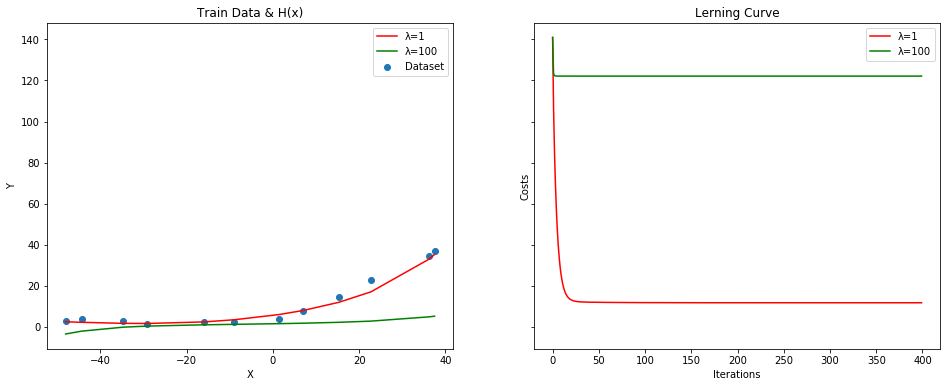


> λ=1 позволяет избежать переобучения, а большие значения λ приводят к недообучению

### 12. optimal λ search


```python
def get_X(_x):
    _X = map_features(_x, 8)
    _X, _, _ = normilize_features(_X)
    _X = np.insert(_X, 0, 1, axis=1)
    return _X

def optimize_lambda(x_train, x_val, y_train, y_val):
    X_train = get_X(x_train)
    X_val = get_X(x_val)

    l_vals = np.linspace(0, 4, 50)
    l_costs = np.empty(shape=(0))
    for l in l_vals:
        theta, costs = gradient_descent_reg(X_train, y_train, get_init_theta(X_train), l=l, alpha=0.2, num_iters=1000)
        c = compute_cost_reg(X_val, y_val, theta, l=0)
        l_costs = np.append(l_costs, c[0])

    plt.figure()
    plt.plot(l_vals, l_costs)
    plt.xlabel('Lambda')
    plt.ylabel('Cost')
    plt.show()

    idx = l_costs.argmin()
    return l_vals[idx]
```


```python
optimal_l = optimize_lambda(x, x_val, y, y_val)
print(f'Optimal lambda for validation set:\t{optimal_l}')
```


    Optimal lambda for validation set:	0.4897959183673469


### 13. test error


```python
x_test = np.array(data['Xtest'])
y_test = np.squeeze(data['ytest'])

X_test = get_X(x_test)
X_train = get_X(x)

theta, _ = gradient_descent_reg(X_train, y, get_init_theta(X_train), l=optimal_l, alpha=0.3, num_iters=1000)
test_cost = compute_cost_reg(X_test, y_test, theta, l=optimal_l)
print(f'Cost on test set: {test_cost[0]}')
```

    Cost on test set: 11.585832169340758


### 14. conclusions

В данной работе был рассмотрен процесс переобучения модели, а также показано влияние на обучение регуляризацией с помощью коэффициента λ


# lab4
> Нейронные сети

- Набор данных `ex4data1.mat` (такой же, как в `lab2`) представляет собой файл формата `*.mat` (т.е. сохраненного из _Matlab_).
- Набор содержит `5000` изображений `20x20` в оттенках серого.
- Каждый пиксель представляет собой значение яркости (вещественное число).
- Каждое изображение сохранено в виде вектора из 400 элементов.
- В результате загрузки набора данных должна быть получена матрица `5000x400`.
- Далее расположены метки классов изображений от 1 до 9 (соответствуют цифрам от 1 до 9), а также 10 (соответствует цифре 0).

## tasks
1. Загрузите данные `ex4data1.mat` из файла.
2. Загрузите веса нейронной сети из файла `ex4weights.mat`, который содержит две матрицы `Θ(1) (25, 401)` и `Θ(2) (10, 26)`. Какова структура полученной нейронной сети?
3. Реализуйте функцию прямого распространения с сигмоидом в качестве функции активации.
4. Вычислите процент правильных классификаций на обучающей выборке. Сравните полученный результат с логистической регрессией.
5. Перекодируйте исходные метки классов по схеме `one-hot`.
6. Реализуйте функцию стоимости для данной нейронной сети.
7. Добавьте L2-регуляризацию в функцию стоимости.
8. Реализуйте функцию вычисления производной для функции активации.
9. Инициализируйте веса небольшими случайными числами.
10. Реализуйте алгоритм обратного распространения ошибки для данной конфигурации сети.
11. Для того, чтобы удостоверится в правильности вычисленных значений градиентов используйте метод проверки градиента с параметром `ε=10^-4`.
12. Добавьте L2-регуляризацию в процесс вычисления градиентов.
13. Проверьте полученные значения градиента.
14. Обучите нейронную сеть с использованием градиентного спуска или других более эффективных методов оптимизации.
15. Вычислите процент правильных классификаций на обучающей выборке.
16. Визуализируйте скрытый слой обученной сети.
17. Подберите параметр регуляризации. Как меняются изображения на скрытом слое в зависимости от данного параметра?
18. Ответы на вопросы представьте в виде отчета.

### results

```python
import numpy as np
import pandas as pd

import scipy.optimize as opt
import scipy.io

import matplotlib.pyplot as plt
import matplotlib.image as mpimg
```

### 1. read data


```python
data = scipy.io.loadmat('data/ex4data1.mat')

x = np.array(data['X'])
y = np.squeeze(data['y'])

np.place(y, y == 10, 0)
m, n = x.shape

num_labels = 10
input_layer_size = 400
hidden_layer_size = 25

print(f'x shape: {x.shape}\ny size:\t{y.size}')
```

    x shape: (5000, 400)
    y size:	5000


```python
subplots = 64
draw_seed = np.random.randint(low=0, high=m, size=subplots)
draw_rows = x[draw_seed]
fig, ax = plt.subplots(8, 8, figsize=(8, 8))
for i, axi in enumerate(ax.flat):
    data = np.reshape(draw_rows[i], (20, 20), order='F')
    axi.imshow(data, cmap='binary')
    axi.set(xticks=[], yticks=[])

plt.show()
```


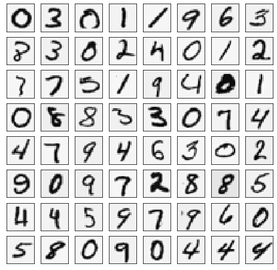


### 2. read weights


```python
weights = scipy.io.loadmat('data/ex4weights.mat')
theta1, theta2 = weights['Theta1'], weights['Theta2']
theta2 = np.roll(theta2, 1, axis=0)

print(f'Θ1 shape:\t{theta1.shape}\nΘ2 shape:\t{theta2.shape}')
```

    Θ1 shape:	(25, 401)
    Θ2 shape:	(10, 26)


> (input layer `400` nodes) -> (hidden layer `25` nodes) -> (output layer `10` nodes)

### 3. forward propagation + sigmoid


```python
def sigmoid(X):
    return 1 / (1 + np.exp(-X))

def predict(X, theta1, theta2):
    m = X.shape[0]
    X = np.hstack((np.ones((m, 1)), X))
    a1 = sigmoid(X.dot(theta1.T))
    a1 = np.hstack((np.ones((m, 1)), a1))  # hidden layer
    a2 = sigmoid(a1.dot(theta2.T))  # output layer
    return np.argmax(a2, axis=1)
```

### 4. train accuracy


```python
LOG_REG_ACCURACY = 94.74000000000001

def get_accuracy(theta1, theta2):
    p = predict(x, theta1, theta2)
    return np.mean(p == y) * 100

accuracy = get_accuracy(theta1, theta2)
print(f'Training accuracy: {accuracy}%')
print(f'On {accuracy - LOG_REG_ACCURACY:.2f}% better than logistic regression')
```

    Training accuracy: 97.52%
    On 2.78% better than logistic regression


### 5. one hot encoding


```python
y_matrix = np.eye(num_labels)[y]
```

### 6. cost function


```python
a1 = np.hstack([np.ones((m, 1)), x])

a2 = sigmoid(a1.dot(theta1.T))
a2 = np.hstack([np.ones((a2.shape[0], 1)), a2])

a3 = sigmoid(a2.dot(theta2.T))

def calc_cost(h, y_matrix, m):
    return (-1 / m) * np.sum((np.log(h) * y_matrix) + np.log(1 - h) * (1 - y_matrix))

print(f'Cost:\t{calc_cost(a3, y_matrix, m)}')
```

    Cost:	0.2876291651613189


### 7. cost L2-regularization


```python
def get_reg_term(theta1, theta2, m, lambda_=1):
    return (lambda_ / (2 * m)) * (np.sum(np.square(theta1[:, 1:])) + np.sum(np.square(theta2[:, 1:])))
print(f'Regularized Cost:\t{cost + get_reg_term(theta1, theta2, m)}')
```

    Regularized Cost:	0.38376985909092365


### 8. sigmoid gradient


```python
def sigmoid_gradient(X):
    sigm = 1 / (1 + np.exp(-X))
    return sigm * (1 - sigm)

sigmoid_gradient(0), sigmoid_gradient(100)
```


    (0.25, 0.0)


> should be (0.25, 0)

### 9. random weights initialization


```python
def init_weights_rand(l_in, l_out, epsilon=0.12):
    return np.random.rand(l_out, 1 + l_in) * 2 * epsilon - epsilon

initial_theta1 = init_weights_rand(input_layer_size, hidden_layer_size)
initial_theta2 = init_weights_rand(hidden_layer_size, num_labels)
initial_theta1.shape, initial_theta2.shape
```


    ((25, 401), (10, 26))


### 10. backward propagation


```python
def get_thetas(nn_params, input_layer_size, hidden_layer_size, num_labels):
    theta1 = np.reshape(
        nn_params[:hidden_layer_size * (input_layer_size + 1)],
        (hidden_layer_size, (input_layer_size + 1))
    )
    theta2 = np.reshape(
        nn_params[(hidden_layer_size * (input_layer_size + 1)):],
        (num_labels, (hidden_layer_size + 1))
    )
    return theta1, theta2


def nn_cost_function(nn_params, input_layer_size, hidden_layer_size, num_labels, X, y, lambda_=0.0):
    theta1, theta2 = get_thetas(nn_params, input_layer_size, hidden_layer_size, num_labels)
    m = y.size

    # forward propagation
    a1 = np.hstack([np.ones((m, 1)), X])
    a2 = sigmoid(a1.dot(theta1.T))
    a2 = np.hstack([np.ones((a2.shape[0], 1)), a2])
    a3 = sigmoid(a2.dot(theta2.T))

    # cost calculation
    y_matrix = y.reshape(-1)
    y_matrix = np.eye(num_labels)[y_matrix]
    J = calc_cost(a3, y_matrix, m) + get_reg_term(theta1, theta2, m, lambda_)

    # back propogation
    delta_3 = a3 - y_matrix
    delta_2 = delta_3.dot(theta2)[:, 1:] * sigmoid_gradient(a1.dot(theta1.T))
    delta1 = delta_2.T.dot(a1)
    delta2 = delta_3.T.dot(a2)

    # gradient regularization
    theta1_grad = (1 / m) * delta1
    theta1_grad[:, 1:] = theta1_grad[:, 1:] + (lambda_ / m) * theta1[:, 1:]
    theta2_grad = (1 / m) * delta2
    theta2_grad[:, 1:] = theta2_grad[:, 1:] + (lambda_ / m) * theta2[:, 1:]
    grad = np.concatenate([theta1_grad.ravel(), theta2_grad.ravel()])

    return J, grad
```

### 11. test gradient with `ε=10^-4`


```python
def compute_numerical_gradient(J, theta, e=1e-4):
    numgrad = np.zeros(theta.shape)
    perturb = np.diag(e * np.ones(theta.shape))
    for i in range(theta.size):
        cost1, _ = J(theta - perturb[:, i])
        cost2, _ = J(theta + perturb[:, i])
        numgrad[i] = (cost2 - cost1) / (2 * e)
    return numgrad
```


```python
def test_nn_gradients(lambda_=0.0):
    input_layer_size = 3
    hidden_layer_size = 5
    num_labels = 3
    m = 5

    # generate test data
    theta1 = init_weights_rand(hidden_layer_size - 1, input_layer_size + 1)
    theta2 = init_weights_rand(num_labels - 1, hidden_layer_size + 1)
    X = init_weights_rand(m - 1, input_layer_size)
    X = X.reshape(m, num_labels)
    y = np.arange(1, 1 + m) % num_labels

    # unroll parameters
    nn_params = np.concatenate([theta1.ravel(), theta2.ravel()])
    cost_func = lambda p: nn_cost_function(p, input_layer_size, hidden_layer_size, num_labels, X, y, lambda_)

    cost, grad = cost_func(nn_params)
    numgrad = compute_numerical_gradient(cost_func, nn_params)

    print('Numerical Gradient:\n', numgrad[:5].ravel())
    print('Analytical Gradient:\n', grad[:5].ravel())
    diff = np.linalg.norm(numgrad - grad) / np.linalg.norm(numgrad + grad)
    print('\nDiff:\t', diff)

test_nn_gradients()
```

    Numerical Gradient:
     [ 0.01002531 -0.00033635 -0.00030924 -0.00070671 -0.00024677]
    Analytical Gradient:
     [ 0.01002531 -0.00033635 -0.00030924 -0.00070671 -0.00024677]

    Diff:	 4.539882294782546e-11


> Numerical Gradient and Analytical Gradient should be very similar

> With `e=1e-4` diff should be less than `1e-9`

### 12-13. test gradient with L2-regularization


```python
test_nn_gradients(lambda_=1.0)
```

    Numerical Gradient:
     [0.00627576 0.02235517 0.01705989 0.00180273 0.00468988]
    Analytical Gradient:
     [0.00627576 0.02235517 0.01705989 0.00180273 0.00468988]

    Diff:	 3.122096112171884e-11


### 14. train with gradient descent


```python
def nn_gradient_descent(nn_params, cost_func, alpha, num_iters):
    j_history = []
    for i in range(0, num_iters):
        cost, grad = cost_func(nn_params)
        nn_params -= alpha * grad
        j_history.append(cost)

    return nn_params, j_history
```


```python
initial_theta1 = init_weights_rand(input_layer_size, hidden_layer_size)
initial_theta2 = init_weights_rand(hidden_layer_size, num_labels)
initial_nn_params = np.concatenate([initial_theta1.ravel(), initial_theta2.ravel()])

cost_func = lambda p: nn_cost_function(p, input_layer_size, hidden_layer_size, num_labels, x, y, lambda_=1.0)
nn_params, costs = nn_gradient_descent(initial_nn_params, cost_func, alpha=0.5, num_iters=1000)

print(f'Gradient Descent Cost:\t{costs[-1]}')
```

    Gradient Descent Cost:	0.5742122654294397


### 15. train accuracy


```python
theta1, theta2 = get_thetas(nn_params, input_layer_size, hidden_layer_size, num_labels)
print(f'Training accuracy: {get_accuracy(theta1, theta2)}%')
```

    Training accuracy: 93.4%


### 16. visualize hidden layer


```python
def visualize_data(input, display_rows=5, display_cols=5):
    subplots = display_rows * display_cols
    fig, ax = plt.subplots(display_rows, display_cols, figsize=(10, 10))

    for i, axi in enumerate(ax.flat):
        data = np.reshape(input[i], (20, 20), order='F')
        axi.imshow(data, cmap='binary')
        axi.set(xticks=[], yticks=[])

    plt.show()
```


```python
visualize_data(theta1[:, 1:])
```


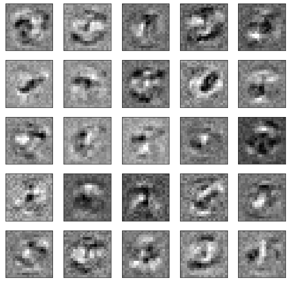


### 17. optimize lambda


```python
def test_lambda(lambda_):
    initial_theta1 = init_weights_rand(input_layer_size, hidden_layer_size)
    initial_theta2 = init_weights_rand(hidden_layer_size, num_labels)
    initial_nn_params = np.concatenate([initial_theta1.ravel(), initial_theta2.ravel()])

    cost_func = lambda p: nn_cost_function(p, input_layer_size, hidden_layer_size, num_labels, x, y, lambda_=lambda_)
    nn_params, costs = nn_gradient_descent(initial_nn_params, cost_func, alpha=0.5, num_iters=5000)

    theta1, theta2 = get_thetas(nn_params, input_layer_size, hidden_layer_size, num_labels)

    print(f'Lambda:\t{lambda_}')
    print(f'Cost:\t{costs[-1]}')
    print(f'Training accuracy: {get_accuracy(theta1, theta2)}%')

    visualize_data(theta1[:, 1:])
```


```python
test_lambda(0)
```

    Lambda:	0
    Cost:	0.18278464778554096
    Training accuracy: 98.22%


```python
test_lambda(1)
```

    Lambda:	1
    Cost:	0.3738456250804313
    Training accuracy: 97.74000000000001%


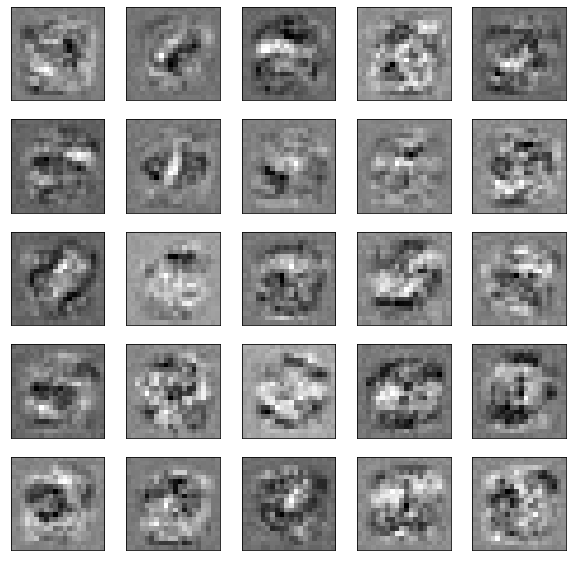


```python
test_lambda(50)
```

    Lambda:	50
    Cost:	1.9472983729745628
    Training accuracy: 88.92%


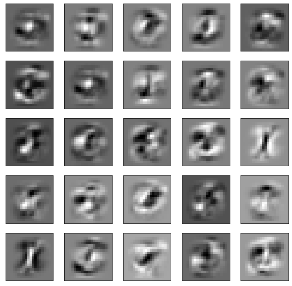


> При увеличении параметра регуляризации изображения на скрытом слое размываются

### 18. conclusions

Была рассмотрена модель нейронной сети с 3 слоями. Построены функции стоимости и градиента. Визуализирован скрытый слой сети. С помощью алгоритма градиентного спуска получена точность распознования 93.4%.


# lab5
> Метод опорных векторов

- Наборы данных `ex5data1.mat` и `ex5data2.mat` содержат три переменные `X1` и `X2` (независимые переменные) и `y` (метка класса). Данные являются линейно разделимыми.

- Набор данных `ex5data3.mat` содержит три переменные `X1` и `X2` (независимые переменные) и `y` (метка класса). Данные разделены на две выборки: обучающая выборка `(X, y)`, по которой определяются параметры модели; валидационная выборка `(Xval, yval)`, на которой настраивается коэффициент регуляризации и параметры Гауссового ядра.

- Набор данных `spamTrain.mat` содержит две переменные `X` - вектор, кодирующий отсутствие `(0)` или присутствие `(1)` слова из словаря `vocab.txt` в письме, и `y` - метка класса: `0` - не спам, `1` - спам. Набор используется для обучения классификатора.

- Набор данных `spamTest.mat` содержит две переменные `Xtest` - вектор, кодирующий отсутствие `(0)` или присутствие `(1)` слова из словаря `vocab.txt` в письме, и `ytest` - метка класса: `0` - не спам, `1` - спам. Набор используется для проверки качества классификатора.

## tasks

1. Загрузите данные `ex5data1.mat` из файла.
2. Постройте график для загруженного набора данных: по осям - переменные `X1`, `X2`, а точки, принадлежащие различным классам должны быть обозначены различными маркерами.
3. Обучите классификатор с помощью библиотечной реализации `SVM` с линейным ядром на данном наборе.
4. Постройте разделяющую прямую для классификаторов с различными параметрами `C=1`, `C=100` (совместно с графиком из пункта 2). Объясните различия в полученных прямых?
5. Реализуйте функцию вычисления _Гауссового ядра_ для алгоритма `SVM`.
6. Загрузите данные `ex5data2.mat` из файла.
7. Обработайте данные с помощью функции _Гауссового ядра_.
8. Обучите классификатор `SVM`.
9. Визуализируйте данные вместе с разделяющей кривой (аналогично пункту 4).
10. Загрузите данные `ex5data3.mat` из файла.
11. Вычислите параметры классификатора `SVM` на обучающей выборке, а также подберите параметры `C` и `σ2` на валидационной выборке.
12. Визуализируйте данные вместе с разделяющей кривой (аналогично пункту 4).
13. Загрузите данные `spamTrain.mat` из файла.
14. Обучите классификатор `SVM`.
15. Загрузите данные `spamTest.mat` из файла.
16. Подберите параметры `C` и `σ2`.
17. Реализуйте функцию предобработки текста письма, включающую в себя:
    - перевод в нижний регистр;
    - удаление `HTML` тэгов;
    - замена `URL` на одно слово (например, `httpaddr`);
    - замена `email`-адресов на одно слово (например, `emailaddr`);
    - замена чисел на одно слово (например, `number`);
    - замена знаков доллара `$` на слово `dollar`;
    - замена форм слов на исходное слово (например, слова `discount`, `discounts`, `discounted`, `discounting` должны быть заменены на слово `discount`). Такой подход называется `stemming`;
    - остальные символы должны быть удалены и заменены на пробелы, т.е. в результате получится текст, состоящий из слов, разделенных пробелами.
18. Загрузите коды слов из словаря `vocab.txt`.
19. Реализуйте функцию замены слов в тексте письма после предобработки на их соответствующие коды.
20. Реализуйте функцию преобразования текста письма в вектор признаков (в таком же формате как в файлах `spamTrain.mat` и `spamTest.mat`).
21. Проверьте работу классификатора на письмах из файлов `emailSample1.txt`, `emailSample2.txt`, `spamSample1.txt` и `spamSample2.txt`.
22. Также можете проверить его работу на собственных примерах.
23. Создайте свой набор данных из оригинального корпуса текстов - http://spamassassin.apache.org/old/publiccorpus/.
24. Постройте собственный словарь.
25. Как изменилось качество классификации? Почему?
26. Ответы на вопросы представьте в виде отчета.

### results

```python
import os

import numpy as np

import scipy.optimize as opt
import scipy.io

import matplotlib.pyplot as plt
import matplotlib.image as mpimg
```

### 1. read `ex5data1.mat`


```python
data = scipy.io.loadmat('data/ex5data1.mat')
X = data['X']
y = np.squeeze(data['y'])
X.shape, y.size
```


    ((51, 2), 51)


### 2. plot data


```python
def plot_data(X, y, axes=None):    
    if axes == None:
        axes = plt.gca()

    axes.scatter(X[y == 1, 0], X[y == 1, 1], marker='x', c='g', s=30, label='y = 1')
    axes.scatter(X[y == 0, 0], X[y == 0, 1], c='r', s=30, label='y = 0')
    axes.set_xlabel('X1')
    axes.set_ylabel('X2')
    axes.legend(frameon= True, fancybox = True)

    return axes

plot_data(X, y)
```


    <matplotlib.axes._subplots.AxesSubplot at 0x129856290>


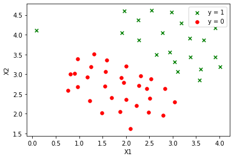


### 3. svm classifier


```python
from sklearn import svm

clf = svm.LinearSVC()
clf.fit(X, y)
```


    LinearSVC(C=1.0, class_weight=None, dual=True, fit_intercept=True,
              intercept_scaling=1, loss='squared_hinge', max_iter=1000,
              multi_class='ovr', penalty='l2', random_state=None, tol=0.0001,
              verbose=0)


### 4. descision boundary with `c=1`, `c=100`


```python
C_VALS = [1, 100]
fig, axes = plt.subplots(1, 2, sharey = True, figsize=(16, 6))

def get_meshgrid(X, num=100):
    return np.meshgrid(
        np.linspace(X[:, 0].min(), X[:, 0].max(), num=100),
        np.linspace(X[:, 1].min(), X[:, 1].max(), num=100)
    )

for i, C in enumerate(C_VALS):
    X_1, X_2 = get_meshgrid(X)

    clf = svm.LinearSVC(C=C, max_iter=100000)
    clf.fit(X, y)
    Z = clf.predict(np.array([X_1.ravel(), X_2.ravel()]).T).reshape(X_1.shape)

    plot_data(X, y, axes[i])
    axes[i].contour(X_1, X_2, Z, 1, colors='b')
    axes[i].set_title(f'Descision Boundary with C={C}')
```


> При `C=100` можно наблюдать переобученую модель: граница захватывает случайные выбросы. При `C=1` граница выглядит правильно.

### 5. svm gaussian kernel


```python
def gaussian_kernel(x1, x2, sigma):
    return np.exp(-np.sum((x1 - x2) ** 2) / (2 * (sigma ** 2)))

def gaussian_kernel_gram_matrix(X, L, sigma, K_function=gaussian_kernel):
    gram_matrix = np.zeros((X.shape[0], L.shape[0]))
    for i, x in enumerate(X):
        for j, l in enumerate(L):
            gram_matrix[i, j] = K_function(x, l, sigma)
    return gram_matrix
```

### 6-8. `ex5data2.mat` with svm gaussian kernel


```python
data = scipy.io.loadmat('data/ex5data2.mat')
X = data['X']
y = np.squeeze(data['y'])

L = X
sigma = 0.1
gram = gaussian_kernel_gram_matrix(X, L, sigma)
clf = svm.SVC(kernel='precomputed')
clf.fit(gram, y)
```


    SVC(C=1.0, cache_size=200, class_weight=None, coef0=0.0,
        decision_function_shape='ovr', degree=3, gamma='auto_deprecated',
        kernel='precomputed', max_iter=-1, probability=False, random_state=None,
        shrinking=True, tol=0.001, verbose=False)


### 9. plot data


```python
ax = plot_data(X, y)

X_1, X_2 = get_meshgrid(X)
X_plot = np.array([X_1.ravel(), X_2.ravel()]).T
gram_plot = gaussian_kernel_gram_matrix(X_plot, L, sigma)
Z = clf.predict(gram_plot).reshape(X_1.shape)

ax.contour(X_1, X_2, Z, 1, colors='b')
```


    <matplotlib.contour.QuadContourSet at 0x102ef2910>


### 10. read `ex5data3` data


```python
data = scipy.io.loadmat('data/ex5data3.mat')
X = data['X']
y = np.squeeze(data['y'])
X_val = data['Xval']
y_val = np.squeeze(data['yval'])

X.shape, X_val.shape
```


    ((211, 2), (200, 2))


### 11. cross validation


```python
def cross_validate(X, y, X_val, y_val):
    C_array = np.array([0.01, 0.03, 0.1, 0.3, 1, 3, 10, 30])
    sigma_array = np.array([0.01, 0.03, 0.1, 0.3, 1, 3, 10, 30])
    err_array = np.zeros([C_array.size, sigma_array.size])

    for i in np.arange(C_array.size):
        for j in np.arange(sigma_array.size):
            sigma = sigma_array[j]
            C = C_array[i]

            gram = gaussian_kernel_gram_matrix(X, X, sigma)
            clf = svm.SVC(C=C, kernel='precomputed')
            clf.fit(gram, y)

            predictions = clf.predict(gaussian_kernel_gram_matrix(X_val, X, sigma))
            pred_error = np.mean(predictions != y_val)

            err_array[i, j] = pred_error

    idx = np.unravel_index(np.argmin(err_array, axis=None), err_array.shape)
    C = C_array[idx[0]]
    sigma = sigma_array[idx[1]]

    return C, sigma
```


```python
C, sigma = cross_validate(X, y, X_val, y_val)
print(f'Found:\nC:\t{C}\nsigma:\t{sigma}')
```

    Found:
    C:	1.0
    sigma:	0.1


```python
gram = gaussian_kernel_gram_matrix(X, X, sigma)
clf = svm.SVC(C=C, kernel='precomputed')
clf.fit(gram, y)
```


    SVC(C=1.0, cache_size=200, class_weight=None, coef0=0.0,
        decision_function_shape='ovr', degree=3, gamma='auto_deprecated',
        kernel='precomputed', max_iter=-1, probability=False, random_state=None,
        shrinking=True, tol=0.001, verbose=False)


### 12. plot data


```python
ax = plot_data(X, y)

X_1, X_2 = get_meshgrid(X, num=50)
X_plot = np.array([X_1.ravel(), X_2.ravel()]).T
gram_plot = gaussian_kernel_gram_matrix(X_plot, X, sigma)
Z = clf.predict(gram_plot).reshape(X_1.shape)

ax.contour(X_1, X_2, Z, 1, colors='b')
```


    <matplotlib.contour.QuadContourSet at 0x12903e7d0>


### 13-15. read `spamTrain.mat` & `spamTest.mat` data


```python
spam_train = scipy.io.loadmat('data/spamTrain.mat')
X = spam_train['X']
y = np.squeeze(spam_train['y'])

spam_test = scipy.io.loadmat('data/spamTest.mat')
X_test = spam_test['Xtest']
y_test = np.squeeze(spam_test['ytest'])
```

### 14-16. svm + cross validation


```python
def spam_cross_validation(X, y, X_val, y_val):
    C_array = np.array([0.01, 0.1, 0.3, 1, 10])
    err_array = np.zeros(C_array.size)

    for i in np.arange(C_array.size):
        C = C_array[i]

        clf = svm.SVC(C=C, kernel='linear')
        clf.fit(X, y)

        predictions = clf.predict(X_val)
        pred_error = np.mean(predictions != y_val)

        err_array[i] = pred_error

    idx = np.unravel_index(np.argmin(err_array, axis=None), err_array.shape)
    return C_array[idx[0]]
```


```python
C = spam_cross_validation(X, y, X_test, y_test)
print(f'Found:\nC:\t{C}\n')
```

    Found:
    C:	0.1


```python
clf = svm.SVC(C=C, kernel='linear')
clf.fit(X, y)

train_accuracy = clf.score(X, y) * 100
test_accuracy = clf.score(X_test, y_test) * 100

print(f'Train accuracy:\t{train_accuracy}%')
print(f'Test accuracy:\t{test_accuracy}%')
```

    Train accuracy:	99.825%
    Test accuracy:	98.9%


> Линейное ядро быстрее и точнее чем Гаусовское

### 17. text preprocessing


```python
import re
from nltk.stem import PorterStemmer

ps = PorterStemmer()
HTML_REGEX = r'<.*?>'
URL_REGEX = r'[http|https]://[^\s]*'
EMAIL_REGEX = r'[^\s]+@[^\s]+'
NUMBER_REGEX = r'[0-9]+'
DOLLAR_REGEX = r'[$]+'

def preprocess_data(data):
    result = data.lower()
    result = re.sub(HTML_REGEX, '', result)
    result = re.sub(URL_REGEX, 'httpaddr', result)
    result = re.sub(EMAIL_REGEX, 'emailaddr', result)
    result = re.sub(NUMBER_REGEX, ' number ', result)
    result = re.sub(DOLLAR_REGEX, ' dollar ', result)
    result = re.sub(r'[^a-zA-Z\s]+', ' ', result)
    result = result.replace('\n', ' ')
    result = [ps.stem(token) for token in result.split(' ')]
    result = ' '.join(result)
    return result
```

### 18. read `vocab.txt`


```python
vocab_data = open('data/vocab.txt', 'r').read().split('\n')[:-1]
vocab = {}
for elem in vocab_data:
    index, word = elem.split('\t')[:]
    vocab[word] = index
```

### 19. word to code


```python
def map_to_vocabulary(data, vocab):
    result = []
    for word in data.split():
        if len(word) > 1 and word in vocab:
            result.append(int(vocab[word]))

    return result
```

### 20. text to feature vector


```python
def map_to_feature(data, vocab):
    n = len(vocab)
    features = np.zeros((n,))
    for i in data:
        features[i] = 1

    return features
```


```python
def generate_feature(data, vocab):
    preprocessed = preprocess_data(data)
    word_indexes = map_to_vocabulary(preprocessed, vocab)
    feature = map_to_feature(word_indexes, vocab)

    return feature
```

### 21. test classifier


```python
def predict_from_files(files, vocab, clf):
    features = []
    for file in files:
        feature = generate_feature(open(f'data/{file}', 'r').read(), vocab)
        features.append(feature)

    features = np.array(features)
    result = clf.predict(features)
    return zip(files, result)
```


```python
FILES = ['emailSample1.txt', 'emailSample2.txt', 'spamSample1.txt', 'spamSample2.txt']
predicts = predict_from_files(FILES, vocab, clf)

for file, predict in predicts:
    res = 'spam' if predict == 1 else 'not spam'
    print(f'{file} - {res}')
```

    emailSample1.txt - not spam
    emailSample2.txt - not spam
    spamSample1.txt - spam
    spamSample2.txt - spam


### 22. get dataset from [`spamassassin.apache.org/old/publiccorpus`](http://spamassassin.apache.org/old/publiccorpus/)


```python
HAM_DIR = 'data/easy_ham'
SPAM_DIR = 'data/spam'

def read_data(data_dir, out):
    files = os.listdir(data_dir)
    for file_name in files:
        if file_name == '.DS_Store':
            continue
        with open(f'{data_dir}/{file_name}', 'r') as f:
            try:
                out.append(f.read())
            except:
                continue
    return out

X_data = []
X_data = read_data(HAM_DIR, X_data)
y_ham = np.zeros(len(X_data))

X_data = read_data(SPAM_DIR, X_data)
y_spam = np.ones(len(X_data) - len(y_ham))
y = np.concatenate((y_ham, y_spam))

len(X_data), y.size
```


    (2827, 2827)


### 24. build vocabulary


```python
from sklearn.feature_extraction.text import CountVectorizer
from sklearn.model_selection import  train_test_split

X_vocab = []
for data in X_data[100:]:
    X_vocab.append(preprocess_data(data))

vectorizer = CountVectorizer()
vectorizer.fit(X_vocab)
n = 1000
vocab = {}
index = 0
for word in vectorizer.vocabulary_:
    vocab[word] = index
    index += 1
    if index >= n:
        break
```

### 25. test new dataset


```python
X = []
for data in X_data:
    feature = generate_feature(data, vocab)
    X.append(feature)

X = np.array(X)
```


```python
X_train, X_test, y_train, y_test = train_test_split(X, y, test_size=0.2)
```


```python
C = 0.1
clf = svm.SVC(C=C, kernel='linear')
clf.fit(X_train, y_train)

train_accuracy = clf.score(X, y) * 100
test_accuracy = clf.score(X_test, y_test) * 100

print(f'Train accuracy:\t{train_accuracy}%')
print(f'Test accuracy:\t{test_accuracy}%')
```

    Train accuracy:	100.0%
    Test accuracy:	100.0%


```python
FILES = ['emailSample1.txt', 'emailSample2.txt', 'spamSample1.txt', 'spamSample2.txt']
predicts = predict_from_files(FILES, vocab, clf)

for file, predict in predicts:
    res = 'spam' if predict == 1 else 'not spam'
    print(f'{file} - {res}')
```

    emailSample1.txt - not spam
    emailSample2.txt - not spam
    spamSample1.txt - spam
    spamSample2.txt - spam


> Качество классификации сохранилось, тк новый датасет достаточно большой, что позволяет произвести обучение

### 26. conclusions

Был рассмотрен метод опорных векторов, обучен класификатор с разными ядрами, подобраны параметры C и σ2. Протестирован анализатор спама в сообщениях как на готовом наборе признаков, так и на собственном словаре

# lab6
> Кластеризация

- Набор данных `ex6data1.mat` содержит две переменные `X1` и `X2` - координаты точек, которые необходимо кластеризовать.

- Набор данных `bird_small.mat` содержит массив размером `(16384, 3)` - изображение `128x128` в формате RGB.

## tasks

1. Загрузите данные `ex6data1.mat` из файла.
2. Реализуйте функцию случайной инициализации K центров кластеров.
3. Реализуйте функцию определения принадлежности к кластерам.
4. Реализуйте функцию пересчета центров кластеров.
5. Реализуйте алгоритм _K-средних_.
6. Постройте график, на котором данные разделены на `K=3` кластеров (при помощи различных маркеров или цветов), а также траекторию движения центров кластеров в процессе работы алгоритма
7. Загрузите данные `bird_small.mat` из файла.
8. С помощью алгоритма _K-средних_ используйте 16 цветов для кодирования пикселей.
9. Насколько уменьшился размер изображения? Как это сказалось на качестве?
10. Реализуйте алгоритм _K-средних_ на другом изображении.
11. Реализуйте алгоритм иерархической кластеризации на том же изображении. Сравните полученные результаты.
12. Ответы на вопросы представьте в виде отчета.

### results

```python
import numpy as np
import matplotlib.pyplot as plt
import scipy.io
```

### 1. read data


```python
data = scipy.io.loadmat('data/ex6data1.mat')
X = data['X']

X.shape
```


    (50, 2)


### 2. random init centroids


```python
def rand_centroids(X, K):
    rand_indices = np.arange(len(X))
    np.random.shuffle(rand_indices)
    centroids = X[rand_indices][:K]
    return centroids

rand_centroids(X, 3)
```


    array([[3.97176248, 5.40773735],
           [3.47580524, 3.63284876],
           [4.57407171, 5.39765069]])


### 3. closest centroids search


```python
def find_closest_centroids(X, centroids):
    distances = np.array([np.sqrt((X.T[0] - c[0])**2 + (X.T[1] - c[1])**2) for c in centroids])
    return distances.argmin(axis=0)
```

### 4. centroids recompute


```python
def compute_means(X, centroid_idx, K):
    centroids = []
    for k in range(K):
        t = X[centroid_idx == k]
        c = np.mean(t, axis=0) if t.size > 0 else np.zeros((X.shape[1],))
        centroids.append(c)

    return np.array(centroids)
```

### 5. k-means algorithm


```python
def run_k_means(X, K, num_iter=10):
    centroids = rand_centroids(X, K)
    centroids_history = [centroids]

    for i in range(num_iter):
        centroid_idx = find_closest_centroids(X, centroids)
        centroids = compute_means(X, centroid_idx, K)
        centroids_history.append(centroids)

    return centroids, centroid_idx, centroids_history
```


```python
def k_means_distortion(X, centroids, idx):
    K = centroids.shape[0]
    distortion = 0

    for i in range(K):
        distortion += np.sum((X[idx == i] - centroids[i])**2)

    distortion /= X.shape[0]
    return distortion
```


```python
def find_best_k_means(X, K, num_iter=100):
    result = np.inf
    r_centroids = None
    r_idx = None
    r_history = None

    for i in range(num_iter):
        centroids, idx, history = run_k_means(X, K)
        d = k_means_distortion(X, centroids, idx)

        if d < result:
            print(f'> [{i}]: k-means improved with distortion: {d}')
            r_centroids = centroids
            r_idx = idx
            r_history = history
            result = d

    return r_centroids, r_idx, r_history
```

### 6. plot data with `K=3`


```python
import matplotlib.cm as cm

def plot_k_means(X, K, centroid_idx, centroids_history):
    plt.figure(figsize=(15, 10))
    colors = cm.rainbow(np.linspace(0, 1, K))

    for k in range(K):
        plt.scatter(X[centroid_idx == k][:, 0], X[centroid_idx == k][:, 1], c=[colors[k]])

    for i in range(K):
        vals = np.array([points[i] for points in centroids_history])
        plt.plot(vals[:, 0], vals[:, 1], '-Xk', c=colors[i], markeredgecolor='black')

    plt.title(f'K-Means with K={K}, {len(centroids_history)-1} iterations')
    plt.show()
```


```python
K = 3
centroids, idx, history = find_best_k_means(X, K)
plot_k_means(X, K, idx, history)
```

    > [0]: k-means improved with distortion: 0.5927612624586158
    > [4]: k-means improved with distortion: 0.5927612624586157


### 7. read `bird_small.mat` data


```python
img = scipy.io.loadmat('data/bird_small.mat')
A = np.reshape(img['A'], newshape=(-1, 3))
A = A.astype('float') / 255.0

A.shape
```


    (16384, 3)


### 8. compress image with k-means, 16 colors


```python
def show_images(original, compressed):
    fig, axs = plt.subplots(1, 2, figsize=(15, 10))
    axs.flat[0].imshow(original)
    axs.flat[1].imshow(compressed)
    plt.show()
```


```python
K = 16
centroids, idx, _ = find_best_k_means(A, K)

A_recon = centroids[idx]
A_recon = A_recon.reshape(-1, 128, 3)

show_images(img['A'], A_recon)
```

    > [0]: k-means improved with distortion: 0.01506200171688582
    > [8]: k-means improved with distortion: 0.014609319348327236
    > [18]: k-means improved with distortion: 0.014438079802673498
    > [23]: k-means improved with distortion: 0.014037904778534324
    > [36]: k-means improved with distortion: 0.014002710979502245
    > [95]: k-means improved with distortion: 0.013966168991687834


```python
w, h = 128, 128
bits_per_pixel = 24
o_size = w * h * bits_per_pixel
print(f'Original:\t{o_size} bytes, {A.nbytes / 1024} kb')

colors = 16
comp_size = colors * bits_per_pixel + w * h * colors / 4

print(f'Compressed:\t{comp_size} bytes, {comp_size / 1024} kb, x{o_size / comp_size:.0f} times smaller')
```

    Original:	393216 bytes, 384.0 kb
    Compressed:	65920.0 bytes, 64.375 kb, x6 times smaller


### 9. test one more image


```python
import matplotlib.image as mpimg

lena = mpimg.imread('data/lena.png')
lena = lena[:, :, :3]

A = np.reshape(lena, newshape=(-1, 3))
K = 16

centroids, idx, _ = find_best_k_means(A, K)
A_recon = centroids[idx]
A_recon = A_recon.reshape(-1, lena.shape[1], 3)
```

    > [0]: k-means improved with distortion: 0.0042567076670820825
    > [1]: k-means improved with distortion: 0.004147654079133645
    > [6]: k-means improved with distortion: 0.0041380758048035204
    > [7]: k-means improved with distortion: 0.004073591306223534
    > [11]: k-means improved with distortion: 0.004045207242597826
    > [15]: k-means improved with distortion: 0.004021155495138373
    > [71]: k-means improved with distortion: 0.00396623823326081


```python
show_images(lena, A_recon)
```


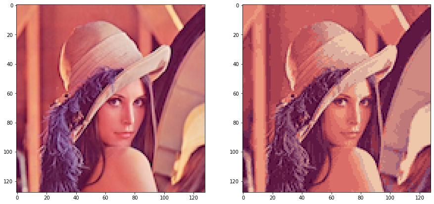


### 10. hierarchical clustering algorithm


```python
from sklearn.cluster import AgglomerativeClustering

clustering = AgglomerativeClustering(n_clusters=K).fit(A)
idx = clustering.labels_
centroids = compute_means(A, idx, K)
A_recon = centroids[idx]
A_recon = A_recon.reshape(-1, data.shape[1], 3)
```


```python
show_images(lena, A_recon)
```


> На глаз результат сжатия методом `K-means` и иерахической кластеризации используя `scipy` реализацию `AgglomerativeClustering` получился одинаковым

### 12. conclusions

В данной работе рассмотрен метод кластеризации `K-means`, произведено сжатие изображения до 16 цветов

# lab7
> Метод главных компонент

- Набор данных `ex7data1.mat` содержит две переменные `X1` и `X2` - координаты точек, для которых необходимо выделить главные компоненты.
- Набор данных `ex7faces.mat` содержит `5000` изображений `32x32` в оттенках серого. Каждый пиксель представляет собой значение яркости (вещественное число). Каждое изображение сохранено в виде вектора из `1024` элементов. В результате загрузки набора данных должна быть получена матрица `5000x1024`.

## tasks

1. Загрузите данные `ex7data1.mat` из файла.
2. Постройте график загруженного набора данных.
3. Реализуйте функцию вычисления матрицы ковариации данных.
4. Вычислите координаты собственных векторов для набора данных с помощью сингулярного разложения матрицы ковариации (разрешается использовать библиотечные реализации матричных разложений).
5. Постройте на графике из пункта 2 собственные векторы матрицы ковариации.
6. Реализуйте функцию проекции из пространства большей размерности в пространство меньшей размерности с помощью метода главных компонент.
7. Реализуйте функцию вычисления обратного преобразования.
8. Постройте график исходных точек и их проекций на пространство меньшей размерности (с линиями проекций).
9. Загрузите данные `ex7faces.mat` из файла.
10. Визуализируйте 100 случайных изображений из набора данных.
11. С помощью метода главных компонент вычислите собственные векторы.
12. Визуализируйте 36 главных компонент с наибольшей дисперсией.
13. Как изменилось качество выбранных изображений?
14. Визуализируйте 100 главных компонент с наибольшей дисперсией.
15. Как изменилось качество выбранных изображений?
16. Используйте изображение, сжатое в лабораторной работе `#6` (Кластеризация).
17. С помощью метода главных компонент визуализируйте данное изображение в `3D` и `2D`.
18. Соответствует ли `2D` изображение какой-либо из проекций в `3D`?
19. Ответы на вопросы представьте в виде отчета.

### results

```python
import numpy as np
import matplotlib.pyplot as plt
import scipy.io
```

### 1. read `ex7data1.mat` data


```python
data = scipy.io.loadmat('data/ex7data1.mat')
X = data['X']
X.shape
```


    (300, 2)


### 2. plot data


```python
plt.figure(figsize=(12, 8))
plt.scatter(X[:, 0], X[:, 1], facecolors='none', edgecolors='b', s=50)
plt.show()
```


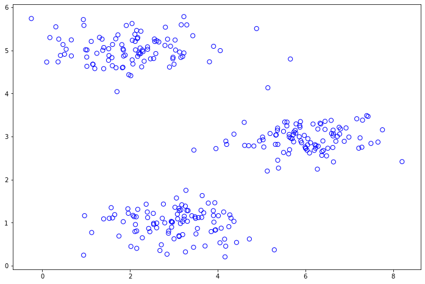


### 3-4. data covariance matrix + eigenvector


```python
def pca(X):
    m = X.shape[0]
    sigma = 1 / m * X.T.dot(X)
    U, S, V = np.linalg.svd(sigma)
    return U, S

def feature_normalization(X):
    norm = (X - X.mean(axis=0)) / X.std(axis=0)
    mu = X.mean(axis=0)
    sigma = X.std(axis=0)
    return norm, mu, sigma

X_norm, mu, sig = feature_normalization(X)
U, S = pca(X_norm)

print(f'Eigen Vector:\t{U[:,0].ravel()}')
```

    Eigen Vector:	[-0.70710678  0.70710678]


### 5. plot eigenvector


```python
plt.figure(figsize=(12, 8))
plt.scatter(X[:, 0], X[:, 1], facecolors='none', edgecolors='b', s=50)

plt.arrow(
    mu[0],
    mu[1],
    1.5 * S[0]*U[0, 0],
    1.5 * S[0]*U[1, 0],
    head_width=0.25,
    head_length=0.2,
    fc='r',
    ec='r',
    lw=2,
    zorder=1000,
)
plt.arrow(
    mu[0],
    mu[1],
    1.5 * S[1]*U[0, 1],
    1.5 * S[1]*U[1, 1],
    head_width=0.25,
    head_length=0.2,
    fc='k',
    ec='k',
    lw=2,
    zorder=1000
)

plt.annotate('First Principal Component', xy=(8.5, 0.3), xytext=(6.3, 0.3), arrowprops={'arrowstyle': '->', 'lw': 1.5, 'ec': 'r'}, va='center')
plt.annotate('Second Principal Component', xy=(8.5, 0.1), xytext=(6.1, 0.1), arrowprops={'arrowstyle': '->', 'lw': 1.5}, va='center')
plt.show()
```


# 6.  dimensionality reduction


```python
def project_data(X, U, K):
    return X.dot(U[:, :K])
```

### 7. reconstructing an approximation of the data


```python
def recover_data(Z, U, K):
    return Z.dot(U[:, :K].T)
```

### 8. projections plot


```python
Z = project_data(X_norm, U, 1)
X_rec = recover_data(Z, U, 1)
X_rec = X_rec * sig + mu

print(f'First Approximation:\t{X_rec[0].ravel()}')
```

    First Approximation:	[1.83735239 4.60343487]


```python
fig, ax = plt.subplots(figsize=(16, 12))
ax.set_aspect('equal')
ax.grid(False)

ax.plot(X[:, 0], X[:, 1], 'bo', ms=10, mfc='none', label='Original Data Points')
ax.plot(X_rec[:, 0], X_rec[:, 1], 'ro', ms=10, mfc='none', label='PCA Reduced Data Points')

for xnorm, xrec in zip(X, X_rec):
    ax.plot([xnorm[0], xrec[0]], [xnorm[1], xrec[1]], 'k--', lw=0.5)

ax.set_title('Example Dataset: Reduced Dimension Points Shown', fontsize=14)
ax.set_xlabel('x1 [Feature Normalized]', fontsize=14)
ax.set_ylabel('x2 [Feature Normalized]', fontsize=14)
plt.legend()
plt.show()
```


### 9. read `ex7faces.mat`


```python
data = scipy.io.loadmat('data/ex7faces.mat')
X = data['X']

X.shape
```


    (5000, 1024)


### 10. show 10 random faces


```python
def show_faces(X, title):
    m, n = X.shape

    dim = int(np.sqrt(m))

    fig, axs = plt.subplots(dim, dim, figsize=(8, 8))
    fig.subplots_adjust(wspace=0.025, hspace=0.025)

    example_width = int(np.round(np.sqrt(n)))
    example_height = int(n / example_width)
    for i, ax in enumerate(axs.flat):
        ax.axis('off')
        w = int(np.sqrt(n))
        ax.imshow(X[i].reshape(example_height, example_width, order='F'), cmap='gray')

    plt.title(title, loc='right', pad=400)
    plt.show()

show_faces(X[100:200, :], 'Random 100 Faces')
```


### 11. get eigenvectors


```python
X_norm, mu, sigma = feature_normalization(X)
U, S = pca(X_norm)
```

### 12. show 36 main components


```python
show_faces(U[:, :36].T, '36 main components')
```


### 13. show 100 main components


```python
show_faces(U[:, :100].T, '100 main components')
```


> Изображения размываются


```python
K = 100
Z = project_data(X_norm, U, K)
X_rec = recover_data(Z, U, K)
```


```python
show_faces(X_norm[100:200, :], 'Original Data')
```


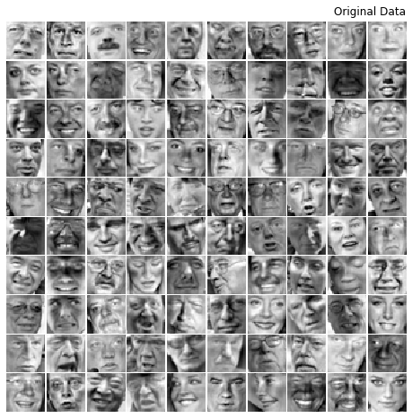


```python
show_faces(X_rec[100:200, :], 'Reconstructed Data')
```


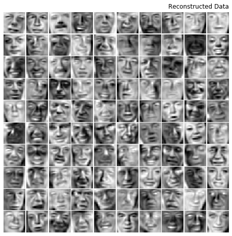


### 16-18. `2D` & `3D` visualize compressed image from `lab6`


```python
import matplotlib.image as mpimg
from mpl_toolkits.mplot3d import Axes3D

from k_means import find_best_k_means

lena = mpimg.imread('../lab6/data/lena.png')
lena = lena[:, :, :3]

X = np.reshape(lena, newshape=(-1, 3))
K = 16

centroids, idx, _ = find_best_k_means(X, K)
X_rec = centroids[idx]
X_rec = X_rec.reshape(-1, lena.shape[1], 3)
```

    > [0]: k-means improved with distortion: 0.004678657518525142
    > [1]: k-means improved with distortion: 0.004394731760839932
    > [2]: k-means improved with distortion: 0.004112903683562763
    > [7]: k-means improved with distortion: 0.004044861751026474
    > [11]: k-means improved with distortion: 0.004039863415528089
    > [21]: k-means improved with distortion: 0.004026258517114911
    > [91]: k-means improved with distortion: 0.0039976816333364695


```python
fig = plt.figure(figsize=(12, 10))
ax = fig.add_subplot(111, projection='3d')

ax.scatter(X[:, 0], X[:, 1], X[:, 2], cmap='rainbow', c=idx, s=8**2)
ax.set_title('Pixel dataset plotted in 3D.\nColor shows centroid memberships')

plt.show()
```


```python
X_norm, mu, sig = feature_normalization(X)
U, S = pca(X_norm)
Z = project_data(X_norm, U, K)

fig = plt.figure(figsize=(12, 10))

ax = fig.add_subplot(111)
ax.scatter(Z[:, 0], Z[:, 1], cmap='rainbow', c=idx, s=64)
ax.set_title('Pixel dataset plotted in 2D, using PCA for dimensionality reduction')
ax.grid(False)

plt.show()
```


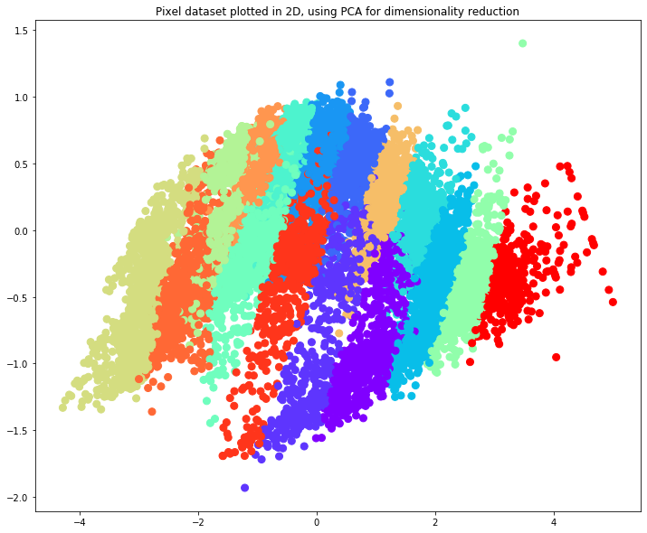


> На графиках по цветам кластеров видно соответствие между `3D` изображением и его `2D` проекции

### 19. conclusions

Был рассмотрен метод главных компонент. Произведены уменьшения размерности данных, сжатия картинок, показан результат работы метода главных компонент в сравнении с методом К-средних.

# lab8
> Выявление аномалий

- Набор данных `ex8data1.mat` содержит две переменные `X1` и `X2` - задержка в мс и пропускная способность в мб/c серверов. Среди серверов необходимо выделить те, характеристики которых аномальные. Набор разделен на обучающую выборку `(X)`, которая не содержит меток классов, а также валидационную `(Xval, yval)`, на которой необходимо оценить качество алгоритма выявления аномалий. В метках классов 0 обозначает отсутствие аномалии, а 1, соответственно, ее наличие.

- Набор данных `ex8data2.mat` содержит 11-мерную переменную `X` - координаты точек, среди которых необходимо выделить аномальные. Набор разделен на обучающую выборку `(X)`, которая не содержит меток классов, а также валидационную `(Xval, yval)`, на которой необходимо оценить качество алгоритма выявления аномалий.

## tasks

1. Загрузите данные `ex8data1.mat` из файла.
2. Постройте график загруженных данных в виде диаграммы рассеяния.
3. Представьте данные в виде двух независимых нормально распределенных случайных величин.
4. Оцените параметры распределений случайных величин.
5. Постройте график плотности распределения получившейся случайной величины в виде изолиний, совместив его с графиком из пункта 2.
6. Подберите значение порога для обнаружения аномалий на основе валидационной выборки. В качестве метрики используйте `F1`-меру.
7. Выделите аномальные наблюдения на графике из пункта 5 с учетом выбранного порогового значения.
8. Загрузите данные `ex8data2.mat` из файла.
9. Представьте данные в виде 11-мерной нормально распределенной случайной величины.
10. Оцените параметры распределения случайной величины.
11. Подберите значение порога для обнаружения аномалий на основе валидационной выборки. В качестве метрики используйте `F1`-меру.
12. Выделите аномальные наблюдения в обучающей выборке. Сколько их было обнаружено? Какой был подобран порог?
13. Ответы на вопросы представьте в виде отчета.

### results

```python
import numpy as np
import matplotlib.pyplot as plt
import scipy.io
```

### 1. read `ex8data1.mat` data


```python
data1 = scipy.io.loadmat('data/ex8data1.mat')
X = data1['X']
X_val = data1['Xval']
y_val = np.squeeze(data1['yval'])

X.shape
```


    (307, 2)


### 2. plot data


```python
def plot_data():
    plt.figure(figsize=(10, 8))
    ax = plt.gca()
    ax.scatter(X[:, 0], X[:, 1])
    ax.set_xlabel('Latency (ms)')
    ax.set_ylabel('Bandwidth (mb/s)')
    return ax

plot_data()
```


    <matplotlib.axes._subplots.AxesSubplot at 0x1260cdd10>


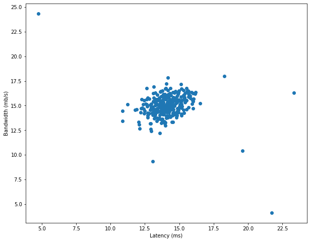


### 3-4. gaussian distributed values


```python
def gaussian_params(X):
    m = X.shape[0]
    mu = (1 / m) * np.sum(X, axis=0)
    sigma2 = (1 / m) * np.sum((X - mu) ** 2, axis=0)
    return mu, sigma2

mu, sigma2 = gaussian_params(X)
print(f'Mu:\t{mu}\nsigma^2: {sigma2}')
```

    Mu:	[14.11222578 14.99771051]
    sigma^2: [1.83263141 1.70974533]


```python
def gaussian_distribution(X, mu, sigma2):
    xmu2 = (X - mu.T) ** 2
    xmu2sg = xmu2 / sigma2.T

    exp = np.exp(-0.5 * xmu2sg)
    dn = np.sqrt(2 * np.pi * sigma2.T)

    p = exp / dn
    p = np.product(p, axis=1)
    return p
```

### 5. distribution density plot


```python
def plot_distribution():
    mu, sigma2 = gaussian_params(X)
    X1, X2 = np.meshgrid(np.arange(0, 30.5, 0.1), np.arange(0, 30.5, 0.1))
    Z = gaussian_distribution(np.stack([X1.ravel(), X2.ravel()], axis=1), mu, sigma2)
    Z = Z.reshape(X1.shape)

    ax = plot_data()
    ax.contour(X1, X2, Z, 10.**np.arange(-21, -2, 3))
    return ax

plot_distribution()
```


    <matplotlib.axes._subplots.AxesSubplot at 0x127d32290>


### 6. anomaly threshold with `F1-measure`


```python
def compute_threshold(yval, pval):
    best_f1 = 0
    best_eps = 0
    eps_values = np.linspace(1.01 * np.min(pval), np.max(pval), 1000)

    for eps in eps_values:
        predictions = (pval < eps)

        tp = np.sum((predictions == yval) & (yval == 1))
        fp = np.sum((predictions == 1) & (yval == 0))
        fn = np.sum((predictions == 0) & (yval == 1))

        prec = tp / (tp + fp)
        rec = tp / (tp + fn)
        f1 = 2 * prec * rec / (prec + rec)

        if f1 > best_f1:
            best_f1 = f1
            best_eps = eps

    return best_eps, best_f1
```


```python
mu, sigma2 = gaussian_params(X)
p_val = gaussian_distribution(X_val, mu, sigma2)

eps, f1 = compute_threshold(y_val, p_val)
print(f'epsilon:\t{eps}\nF1:\t\t{f1}')
```

    epsilon:	8.999852631901397e-05
    F1:		0.8750000000000001


### 7. show anomalies


```python
p = gaussian_distribution(X, mu, sigma2)
anomalies = p < eps

ax = plot_distribution()
plt.plot(X[anomalies, 0], X[anomalies, 1], 'ro', ms=15, mfc='None', mew=1)
```


    [<matplotlib.lines.Line2D at 0x126104f10>]


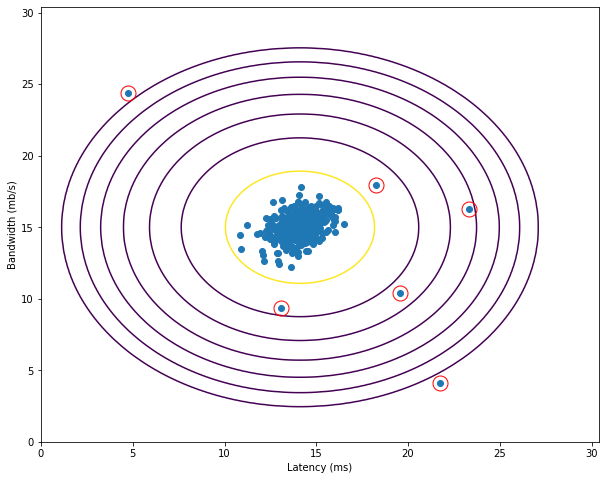


### 7. read `ex8data2.mat` data


```python
data2 = scipy.io.loadmat('data/ex8data2.mat')
X = data2['X']
X_val = data2['Xval']
y_val = np.squeeze(data2['yval'])

X.shape
```


    (1000, 11)


### 9-10. gaussian distributed values

mu, sigma2 = gaussian_params(X)
print(f'Mu:\n{mu}\n\nsigma^2:\n{sigma2}')

p = gaussian_distribution(X, mu, sigma2)
p.shape

### 11. anomaly threshold


```python
mu, sigma2 = gaussian_params(X)
p_val = gaussian_distribution(X_val, mu, sigma2)

eps, f1 = compute_threshold(y_val, p_val)
print(f'epsilon:\t{eps}\nF1:\t\t{f1}')
```

    epsilon:	1.3786074987947628e-18
    F1:		0.6153846153846154


### 12. get anomalies


```python
anomalies = np.sum(p < eps)
print(f'Anomalies found:\t{anomalies}')
```

    Anomalies found:	117


### 13. conclusions

Был рассмотрен метод выявления аномалий с помощью гауссовского нормального распределения. Реализованы функции нахождения параметров распределения, порогового значения аномалии. Результаты визуализированы на графиках

# lab9
> Рекомендательные системы

- Набор данных `ex9_movies.mat` содержит две матрицы `Y` и `R` - рейтинг 1682 фильмов среди 943 пользователей. Значение `R_ij` может быть равно 0 или 1 в зависимости от того оценил ли пользователь `j` фильм `i`. Матрица `Y` содержит числа от 1 до 5 - оценки в баллах пользователей, выставленные фильмам.

## tasks

1. Загрузите данные `ex9_movies.mat` из файла.
2. Выберите число признаков фильмов `(n)` для реализации алгоритма коллаборативной фильтрации.
3. Реализуйте функцию стоимости для алгоритма.
4. Реализуйте функцию вычисления градиентов.
5. При реализации используйте векторизацию для ускорения процесса обучения.
6. Добавьте L2-регуляризацию в модель.
7. Обучите модель с помощью градиентного спуска или других методов оптимизации.
8. Добавьте несколько оценок фильмов от себя. Файл `movie_ids.txt` содержит индексы каждого из фильмов.
9. Сделайте рекомендации для себя. Совпали ли они с реальностью?
10. Также обучите модель с помощью сингулярного разложения матриц. Отличаются ли полученные результаты?
11. Ответы на вопросы представьте в виде отчета.

### results

```python
import numpy as np
import matplotlib.pyplot as plt
import scipy.io
```

### 1. read `ex9_movies.mat` data


```python
data = scipy.io.loadmat('data/ex9_movies.mat')
Y = data['Y']
R = data['R']

num_movies, num_users = Y.shape
num_movies, num_users
```


    (1682, 943)


### 2. number of featurs


```python
NUM_FEATURES = 10
```

### 3-6. cost function + gradient


```python
def get_reg_term(X, theta, lambda_):
    return (lambda_ / 2) * np.sum(np.square(X)) + (lambda_ / 2) * np.sum(np.square(theta))

def calc_cost(X, Y, R, theta):
    return (1 / 2) * np.sum(np.square((X.dot(theta.T) - Y) * R))


def cost_function(params, Y, R, num_users, num_movies, num_features, lambda_):
    X = params[:num_movies * num_features].reshape(num_movies, num_features)
    theta = params[num_movies * num_features:].reshape(num_users, num_features)

    X_grad = np.zeros(X.shape)
    theta_grad = np.zeros(theta.shape)

    J = calc_cost(X, Y, R, theta) + get_reg_term(X, theta, lambda_)

    for i in range(num_movies):
        idx = np.where(R[i, :] == 1)[0]
        theta_i = theta[idx, :]
        Y_i = Y[i, idx]
        X_grad[i, :] = (X[i, :].dot(theta_i.T) - Y_i).dot(theta_i) + lambda_ * X[i, :]

    for j in range(num_users):
        idx = np.where(R[:, j] == 1)[0]
        X_j = X[idx, :]
        Y_j = Y[idx, j]
        theta_grad[j, :] = (X_j.dot(theta[j, :]) - Y_j).dot(X_j) + lambda_ * theta[j, :]

    grad = np.concatenate([X_grad.ravel(), theta_grad.ravel()])
    return J, grad
```

### 7. train model with `scipy`


```python
import scipy.optimize

def train(Y, R, num_features = NUM_FEATURES, lambda_=0.0):
    num_movies, num_users = Y.shape
    initial_X = np.random.randn(num_movies, num_features)
    initial_theta = np.random.randn(num_users, num_features)

    cost_f = lambda x: cost_function(x, Y, R, num_users, num_movies, num_features, lambda_)
    initial_params = np.concatenate([initial_X.ravel(), initial_theta.ravel()])

    # Truncated Newton Algorithm
    params = scipy.optimize.minimize(cost_f, initial_params, method='TNC', jac=True).x

    idx = num_movies * num_features
    theta = params[idx:].reshape(num_users, num_features)
    X = params[:idx].reshape(num_movies, num_features)

    return X, theta
```


```python
train(Y, R, lambda_=10)
```


    (array([[ 1.4438716 , -0.39240415, -0.43620424, ...,  0.52014848,
              0.06694878, -0.16276768],
            [ 0.84902957, -0.30851568, -0.27051436, ...,  0.23291525,
              0.25925657,  0.20671643],
            [ 0.63175791, -0.00927988,  0.52589506, ..., -0.47434056,
              0.11256896, -0.05332482],
            ...,
            [ 0.12733217, -0.04512815,  0.0130063 , ..., -0.11735913,
             -0.06047865, -0.11521279],
            [ 0.13715983, -0.18520116,  0.00823545, ..., -0.05045468,
              0.07466929,  0.04718126],
            [ 0.25144985, -0.13913787,  0.03557105, ..., -0.03601842,
             -0.014978  ,  0.02562142]]),
     array([[ 1.52693186, -0.75135164,  0.40942174, ...,  0.00504388,
              0.40482936, -0.13868873],
            [ 1.07152901, -0.35972028, -0.49640467, ..., -0.0479072 ,
             -0.06016762,  0.18030974],
            [ 0.88823404, -0.52252648, -0.34845443, ...,  0.32460284,
              0.28596222, -0.31952627],
            ...,
            [ 1.23947958, -0.36239146, -0.16369162, ...,  0.03706565,
              0.10257671, -0.19273455],
            [ 1.10837565, -0.27744029, -0.41411452, ...,  0.05353096,
              0.21606041,  0.76446523],
            [ 0.578459  , -0.78164048, -0.27596438, ..., -0.34310137,
             -0.17185575, -0.56158548]]))


### 8. add own ratings


```python
MOVIES_IDS = {}
MOVIES_NAMES = {}

with open('data/movie_ids.txt',  encoding='ISO-8859-1') as file:
    movies = file.readlines()

    for movie in movies:
        _id, _name = movie.split(' ', 1)
        id = int(_id)
        name = _name.strip()
        MOVIES_IDS[name] = id
        MOVIES_NAMES[id] = name

MOVIES_IDS['Toy Story (1995)']
```


    1


```python
MY_RATINGS = {
    'Toy Story (1995)': 5,
    'Godfather, The (1972)': 2,
    'Home Alone (1990)': 4,
    'Pulp Fiction (1994)': 5,
    'Star Wars (1977)': 5,
    'Titanic (1997)': 2,
    'Men in Black (1997)': 5,
    'Turbo: A Power Rangers Movie (1997)': 1,
    '101 Dalmatians (1996)': 3,
    'Indiana Jones and the Last Crusade (1989)': 3,
    'Back to the Future (1985)': 5,
    'Wallace & Gromit: The Best of Aardman Animation (1996)': 3,
    'Forrest Gump (1994)': 4,
    'Taxi Driver (1976)': 3,
}

my_ratings_list = np.zeros(num_movies)

for name, rate in MY_RATINGS.items():
    id = MOVIES_IDS[name]
    my_ratings_list[id] = rate

my_ratings_list
```


    array([0., 5., 0., ..., 0., 0., 0.])


### 9. get recommendations


```python
def normalize_ratings(Y, R):
    n = Y.shape[0]
    Ymean = np.zeros(n)
    Ynorm = np.zeros(Y.shape)

    for i in range(n):
        idx = R[i, :] == 1
        Ymean[i] = np.mean(Y[i, idx])
        Ynorm[i, idx] = Y[i, idx] - Ymean[i]

    return Ynorm, Ymean
```


```python
Y = np.hstack([my_ratings_list[:, None], Y])
R = np.hstack([(my_ratings_list > 0)[:, None], R])
Ynorm, Ymean = normalize_ratings(Y, R)

X, theta = train(Ynorm, R, lambda_=10)
p = np.dot(X, theta.T)
```


```python
def print_predict(p, n=30):
    predict = p[:, 0] + Ymean
    idx = np.argsort(predict)[::-1]

    for i in range(n):
        print(f'{i+1}.\t{predict[idx[i]]:.2f}\t{MOVIES_NAMES[idx[i]]}')

print_predict(p)
```

    1.	5.00	Celluloid Closet, The (1995)
    2.	5.00	City of Industry (1997)
    3.	5.00	Temptress Moon (Feng Yue) (1996)
    4.	5.00	Simple Wish, A (1997)
    5.	5.00	Kim (1950)
    6.	5.00	Young Guns II (1990)
    7.	5.00	Enfer, L' (1994)
    8.	5.00	Umbrellas of Cherbourg, The (Parapluies de Cherbourg, Les) (1964)
    9.	5.00	Margaret's Museum (1995)
    10.	5.00	Grosse Fatigue (1994)
    11.	4.63	My Favorite Season (1993)
    12.	4.58	Midnight in the Garden of Good and Evil (1997)
    13.	4.58	In the Name of the Father (1993)
    14.	4.52	Santa Clause, The (1994)
    15.	4.51	Death in Brunswick (1991)
    16.	4.50	Of Human Bondage (1934)
    17.	4.50	Dadetown (1995)
    18.	4.49	Some Like It Hot (1959)
    19.	4.47	Twister (1996)
    20.	4.46	Monty Python and the Holy Grail (1974)
    21.	4.45	Horseman on the Roof, The (Hussard sur le toit, Le) (1995)
    22.	4.44	Spy Hard (1996)
    23.	4.41	American in Paris, An (1951)
    24.	4.37	Ruby in Paradise (1993)
    25.	4.37	Dances with Wolves (1990)
    26.	4.37	Around the World in 80 Days (1956)
    27.	4.36	Transformers: The Movie, The (1986)
    28.	4.35	Princess Bride, The (1987)
    29.	4.35	Muppet Treasure Island (1996)
    30.	4.35	Philadelphia Story, The (1940)


> Сложно оценить правильность рекомендаций так как я не смотрел много фильмов до 2000 года выпуска

### 10. train with singular vectors


```python
from scipy.sparse.linalg import svds

U, sigma, Vt = svds(Y, NUM_FEATURES)
sigma = np.diag(sigma)
p = U.dot(sigma).dot(Vt)
```


```python
print_predict(p)
```

    1.	5.01	Young Guns II (1990)
    2.	5.01	Celluloid Closet, The (1995)
    3.	5.00	Grosse Fatigue (1994)
    4.	5.00	Simple Wish, A (1997)
    5.	5.00	Kim (1950)
    6.	5.00	Temptress Moon (Feng Yue) (1996)
    7.	5.00	City of Industry (1997)
    8.	5.00	Umbrellas of Cherbourg, The (Parapluies de Cherbourg, Les) (1964)
    9.	5.00	Margaret's Museum (1995)
    10.	4.99	Enfer, L' (1994)
    11.	4.67	I.Q. (1994)
    12.	4.63	My Favorite Season (1993)
    13.	4.59	Spy Hard (1996)
    14.	4.58	Monty Python and the Holy Grail (1974)
    15.	4.56	Midnight in the Garden of Good and Evil (1997)
    16.	4.53	In the Name of the Father (1993)
    17.	4.52	Horseman on the Roof, The (Hussard sur le toit, Le) (1995)
    18.	4.52	Princess Bride, The (1987)
    19.	4.51	Twister (1996)
    20.	4.51	Dadetown (1995)
    21.	4.50	Of Human Bondage (1934)
    22.	4.50	Death in Brunswick (1991)
    23.	4.48	Delicatessen (1991)
    24.	4.48	Santa Clause, The (1994)
    25.	4.47	Some Like It Hot (1959)
    26.	4.46	Seven (Se7en) (1995)
    27.	4.45	Sleepless in Seattle (1993)
    28.	4.42	Starship Troopers (1997)
    29.	4.42	Empire Strikes Back, The (1980)
    30.	4.42	Annie Hall (1977)


> Результаты незначительно отличаются

### 11. conclusions

Была рассмотрена и реализована рекомендательная система с использованием алгоритма коллаборативной фильтрации.

Получены рекомендации на основе собственных оценок.

Также получены рекомендации с помощью сингулярного разложения матриц.

# lab10
> Градиентный бустинг

- Для выполнения задания используйте набор данных [boston](https://scikit-learn.org/stable/datasets/index.html#boston-dataset) из библиотеки `sklearn`

## tasks

1. Загрузите данные с помощью библиотеки `sklearn`.
2. Разделите выборку на обучающую (`75%`) и контрольную (`25%`).
3. Заведите массив для объектов `DecisionTreeRegressor` (они будут использоваться в качестве базовых алгоритмов) и для вещественных чисел (коэффициенты перед базовыми алгоритмами).
4. В цикле обучите последовательно 50 решающих деревьев с параметрами `max_depth=5` и `random_state=42` (остальные параметры - по умолчанию). Каждое дерево должно обучаться на одном и том же множестве объектов, но ответы, которые учится прогнозировать дерево, будут меняться в соответствие с отклонением истинных значений от предсказанных.
5. Попробуйте всегда брать коэффициент равным 0.9. Обычно оправдано выбирать коэффициент значительно меньшим - порядка 0.05 или 0.1, но на стандартном наборе данных будет всего 50 деревьев, возьмите для начала шаг побольше.
6. В процессе реализации обучения вам потребуется функция, которая будет вычислять прогноз построенной на данный момент композиции деревьев на выборке `X`. Реализуйте ее. Эта же функция поможет вам получить прогноз на контрольной выборке и оценить качество работы вашего алгоритма с помощью `mean_squared_error` в `sklearn.metrics`.
7. Попробуйте уменьшать вес перед каждым алгоритмом с каждой следующей итерацией по формуле `0.9 / (1.0 + i)`, где `i` - номер итерации _(от 0 до 49)_. Какое получилось качество на контрольной выборке?
8. Исследуйте, переобучается ли градиентный бустинг с ростом числа итераций, а также с ростом глубины деревьев. Постройте графики. Какие выводы можно сделать?
9. Сравните качество, получаемое с помощью градиентного бустинга с качеством работы линейной регрессии. Для этого обучите `LinearRegression` из sklearn.linear_model (с параметрами по умолчанию) на обучающей выборке и оцените для прогнозов полученного алгоритма на тестовой выборке `RMSE`.
10. Ответы на вопросы представьте в виде отчета.

### results

```python
import numpy as np
import matplotlib.pyplot as plt

import sklearn
import sklearn.datasets
import sklearn.model_selection
import sklearn.metrics
import sklearn.tree
import sklearn.linear_model
```

### 1. get dataset from `sklearn`


```python
boston = sklearn.datasets.load_boston()
boston.data.shape
```


    (506, 13)


### 2. get train and validation sets


```python
X_train, X_test, y_train, y_test = sklearn.model_selection.train_test_split(
    boston.data.astype(np.float32),
    boston.target,
    test_size=0.25,
    random_state=42
)

X_train.shape, X_test.shape
```


    ((379, 13), (127, 13))


### 3-6. train with `DecisionTreeRegressor`


```python
def default_get_weight(x):
    return 0.9

def iter_get_weight(i):
    return 0.9 / (1.0 + i)

def get_clf(depth):
    return sklearn.tree.DecisionTreeRegressor(max_depth=depth, random_state=42)

def predict_boosted(models, X, y, weights):
    p = np.zeros(y.shape)
    for i, model in enumerate(models):
        p += model.predict(X) * weights[i]

    loss = sklearn.metrics.mean_squared_error(y, p)
    return p, loss

def train_boosted(X, y, num_iters=50, get_weight=default_get_weight, depth=5):
    models = []

    y = np.copy(y)
    weights = np.ones(shape=(num_iters,))

    for i in range(num_iters):
        clf = get_clf(depth)
        clf.fit(X_train, y)

        models.append(clf)
        weights[i] = get_weight(i)

        pred, loss = predict_boosted(models, X_train, y_train, weights)

        h = clf.predict(X_train)
        y = y - h * weights[i]

    return models, weights
```


```python
models, weights = train_boosted(X_train, y_train)
```


```python
def print_results(models, weights):
    p, loss = predict_boosted(models, X_train, y_train, weights)
    test_p, test_loss = predict_boosted(models, X_test, y_test, weights)

    print(f'Training Set MSE loss:\t{loss}')
    print(f'Test Set MSE loss:\t{test_loss}')

    return test_loss

test_loss = print_results(models, weights)
```

    Training Set MSE loss:	3.7686156404275976e-05
    Test Set MSE loss:	13.600735758368467


### 7. change weights on each iteration


```python
models, weights = train_boosted(X_train, y_train, get_weight=iter_get_weight)
test_loss = print_results(models, weights)
```

    Training Set MSE loss:	1.4211440991285953
    Test Set MSE loss:	8.987354822947314


> при константном весе модель имеет меньшую ошибку на тренировочных данных, но большую на валидационной выборке

### 8a. test on large number of iterations


```python
def test_num_iters(X_train, y_train, X_val, y_val):
    steps = 10
    iters = np.linspace(10, 400, steps, dtype=int)

    train_loss = np.zeros(steps)
    val_loss = np.zeros(steps)
    for i, num_iters in enumerate(iters):
        models, weights = train_boosted(X_train, y_train, num_iters, get_weight=iter_get_weight)

        p, loss = predict_boosted(models, X_train, y_train, weights)
        test_p, test_loss = predict_boosted(models, X_val, y_val, weights)

        train_loss[i] = loss
        val_loss[i] = test_loss

    best_iters = iters[val_loss.argmin()]
    return best_iters, train_loss, val_loss, iters
```


```python
best_num_iters, train_loss, test_loss, iters = test_num_iters(X_train, y_train, X_test, y_test)
best_num_iters
```


    400


```python
def plot_data(iters, train_loss, test_loss, xlabel):
    plt.figure(figsize=(10, 6))
    plt.plot(iters, train_loss, c='b', label='Train')
    plt.plot(iters, test_loss, c='r', label='Test')
    plt.xlabel(xlabel)
    plt.ylabel('MSE Loss')
    plt.legend()
    plt.show()

plot_data(iters, train_loss, test_loss, 'Number of iterations')
```


> По графику ошибка убывает с числом итераций для обоих выборок (тренировочной и валидационной) - те модель не переобучается с ростом числа итераций

### 8b. test on large tree depth


```python
def test_tree_depth(X_train, y_train, X_val, y_val):
    depths = range(2, 20)
    steps = len(depths)

    train_loss = np.zeros(steps)
    val_loss = np.zeros(steps)
    for i, depth in enumerate(depths):
        models, weights = train_boosted(X_train, y_train, depth=depth, get_weight=iter_get_weight)

        p, loss = predict_boosted(models, X_train, y_train, weights)
        test_p, test_loss = predict_boosted(models, X_val, y_val, weights)

        train_loss[i] = loss
        val_loss[i] = test_loss

    best_depth = depths[val_loss.argmin()]
    return best_depth, train_loss, val_loss, depths
```


```python
best_depth, train_loss, test_loss, depths = test_tree_depth(X_train, y_train, X_test, y_test)
best_depth
```


    5


```python
plot_data(depths, train_loss, test_loss, 'Max Tree Depth')
```


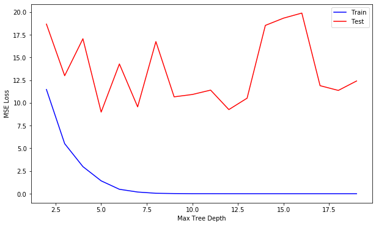


> При увеличении глубины дерева, ошибка на тренировочной выборке падает, а на валидационной скачет - что говорит о переобучении модели

### 9. compare with `sklearn.linear_model`


```python
lr = sklearn.linear_model.LinearRegression()
lr.fit(X_train, y_train)

lr_p = lr.predict(X_train)
lr_test_p = lr.predict(X_test)
lr_train_loss = sklearn.metrics.mean_squared_error(y_train, lr_p)
lr_test_loss = sklearn.metrics.mean_squared_error(y_test, lr_test_p)
```


```python
print(f'LR train MSE:\t{lr_train_loss}')
print(f'LR test MSE:\t{lr_test_loss}')

print(f'GB RMSE loss:\t{np.sqrt(test_loss)}')
print(f'LR RMSE loss:\t{np.sqrt(lr_test_loss)}')
print(f'GB perfomance is {np.sqrt(lr_test_loss)/np.sqrt(test_loss):.2}x better')
```

    LR train MSE:	22.3400585447522
    LR test MSE:	22.09877006714036
    GB RMSE loss:	2.9978917296906027
    LR RMSE loss:	4.7009328932819665
    GB perfomance is 1.6x better


### 10. conclusions

Был рассмотрен метод градиентного бустинга используя деревья решений.

Проанализировано влияние параметров (количество итераций и глубина дерева) на качество обучения.

Проведено сравнение градиентного бустинга с линейной регрессией.

# lab11
> Реализация криптографических атак с помощью машинного обучения на физически неклонируемые функции

- _Физически неклонируемые функции_ (ФНФ) часто используются в качестве криптографических примитивов при реализации протоколов аутентификации.
- Рассмотрим простейший из них, основанный на на запросах и ответах (_challenge response_). Схема данного типа протокола приведена на рис. 1.


В данном случае устройство `А`, содержащее реализацию ФНФ, может быть аутентифицировано с помощью набора запросов (_challenge_) и проверки ответов на них (_response_). При этом использованные пары запрос-ответ удаляются из базы данных устройства.


Более подробно о физически неклонируемых функциях можно прочесть:
- [Физически неклонируемые функции: защита электроники от нелегального копирования](https://habr.com/post/343386/)
- [Alexander Ivaniuk, Проектирование встраиваемых цифровых устройств и систем, (глава 5, раздел 4)](https://www.researchgate.net/profile/Alexander_Ivaniuk/publication/322077869_Proektirovanie_vstraivaemyh_cifrovyh_ustrojstv_i_sistem/links/5a43724caca272d2945a0464/Proektirovanie-vstraivaemyh-cifrovyh-ustrojstv-i-sistem.pdf)


## tasks

1. Изучите классическую работу У. Рурмаира о криптографических атаках с помощью машинного обучения на ФНФ. [U. Ruhrmair et al., “Modeling attacks on physical unclonable functions,” in Proc. ACM Conf. on Comp. and Comm. Secur. (CCS’10), Oct. 2010, pp. 237–249.](https://eprint.iacr.org/2010/251.pdf)
2. Сформулируйте задачу в терминах машинного обучения.
3. Обучите модель, которая могла бы предсказывать ответы по запросам, которых нет в обучающей выборке.
4. Применить как минимум 3 различных алгоритма (например, метод опорных векторов, логистическая регрессия и градиентный бустинг).
5. Какая метрика наиболее подходит для оценки качества алгоритма?
6. Какой наибольшей доли правильных ответов (`Accuracy`) удалось достичь?
7. Какой размер обучающей выборки необходим, чтобы достигнуть доли правильных ответов минимум 0.95?
8. Как зависит доля правильных ответов от `N`?
9. Ответы на вопросы представьте в виде графиков.
10. Развернутые ответы на вопросы оформите в виде отчета.

### results

### 1. Physical Unclonable Functions, PUF
Физически неклонируемые функции, ФНФ

ФНФ - это аппаратные реализации хеш функций, которые позволяют проверить уникальность интегральной схемы

`R_i = PUF(CH_i)`, где `R` - это ответ ( _response_ ), а `CH` - запрос ( _challenge_ )

### 2. problem in terms of ml

В простейщем случае ФНФ это отображение из `CH` в `R`. Таким образом задача машинного обучения - предсказывать ответы на основе запросов.

Входные данные _challenge_ : `10001001` - бинарный вектор, ответ - `0` или `1`. Получается задача бинарной классификации.

### 3. train model for response predictions


```python
import numpy as np

import matplotlib.pyplot as plt
import matplotlib.cm as cm

import sklearn
import sklearn.model_selection
import sklearn.linear_model
import sklearn.neural_network
import sklearn.ensemble
```

#### puf simulator


```python
MEAN = 0
STD = 1

class PUFSimulator:
    def __init__(self, f_size, set_size):
        self.size = f_size
        # mock hardware delays with normal distribution
        self.delays = np.random.normal(MEAN, STD, 2 * f_size)

        _sub = self.delays[:f_size] - self.delays[f_size:]
        _sum = self.delays[:f_size] + self.delays[f_size:]
        self.param = np.concatenate((_sub, np.array([0])), 0)
        self.param[1:] += _sum
        self.challenges = np.random.randint(0, 2, [f_size, set_size])

    def _get_featrue(self, i):
        return np.prod(1 - 2 * self.challenges[i:, :], 0)

    def get_features(self):
        features = [self._get_featrue(i) for i in range(self.size)]
        ones = np.ones((1, self.challenges.shape[1]))
        return np.concatenate((features, ones))

    def get_response(self, features):
        return np.sign(np.dot(self.param, features))
```


```python
NUM_FEATURES = 32
SET_SIZE = 10000

puf = PUFSimulator(NUM_FEATURES, SET_SIZE)
X = puf.get_features()
y = puf.get_response(X)
X = X.T

X.shape
```


    (10000, 33)


#### train helpers


```python
def build_model(X, y, clf, silent=True):
    X_train, X_test, y_train, y_test = sklearn.model_selection.train_test_split(X, y, test_size=0.25)
    clf.fit(X_train, y_train)
    train_score, test_score = clf.score(X_train, y_train), clf.score(X_test, y_test)
    if not silent:
        print(f'> {type(clf).__name__}:')
        print(f'\tTrain:\t{train_score}\n\tTest:\t{test_score}')
    return train_score, test_score
```


```python
def run_model(X, y, clf, sizes):
    train_scores = []
    test_scores = []
    for size in sizes:
        train_score, test_score = build_model(X[:size], y[:size], clf)
        train_scores.append(train_score)
        test_scores.append(test_score)

    plt.figure(figsize=(12, 6))
    plt.plot(sizes, train_scores, c='b', label='Train Score')
    plt.plot(sizes, test_scores, c='r', label='Test Score')
    plt.xlabel('Dataset Size')
    plt.ylabel('Accuracy')
    plt.title(type(clf).__name__)
    plt.legend()
    plt.show()

    return test_scores
```

#### `LogisticRegression`


```python
get_lr = lambda: sklearn.linear_model.LogisticRegression(solver='liblinear')
build_model(X, y, get_lr(), silent=False);
```

    > LogisticRegression:
    	Train:	0.9965333333333334
    	Test:	0.9956


```python
TEST_SIZES = np.linspace(100, 2500, 10, dtype=int)
lg_scores = run_model(X, y, get_lr(), TEST_SIZES)
```


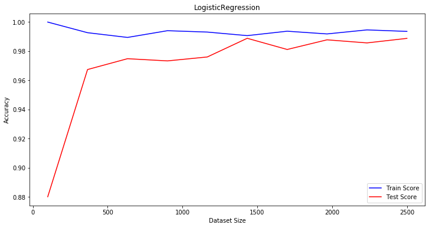


> Из графика видно что точность растёт с ростом размера данных. При `1000+` достигается точность в `97%`

#### `SVM` - Support Vector Machine


```python
get_svc = lambda: sklearn.svm.SVC(C=1, gamma='scale')
build_model(X, y, get_svc(), silent=False);
```

    > SVC:
    	Train:	0.9985333333333334
    	Test:	0.97


```python
svc_scores = run_model(X, y, get_svc(), TEST_SIZES)
```


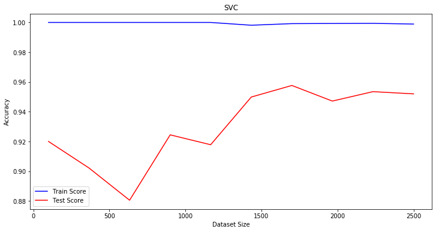


> Для метода опорных векторов получаем худщее качество на валидационной выборке. При `2000+` достигается точность в `95%`

 #### neural network `MLPClassifier`


```python
get_nn = lambda: sklearn.neural_network.MLPClassifier(
    hidden_layer_sizes=(NUM_FEATURES),
    alpha=1e-3,
    max_iter=1000
)

build_model(X, y, get_nn(), silent=False);
```

    > MLPClassifier:
    	Train:	1.0
    	Test:	0.986


```python
nn_scores = run_model(X, y, get_nn(), TEST_SIZES)
```


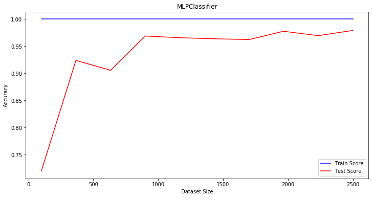


> Точность с нейронной сетью стремится к `99%`, При `1000+` достигается `95%`

#### `GradientBoostingClassifier`


```python
get_gb = lambda: sklearn.ensemble.GradientBoostingClassifier(n_estimators=400, max_depth=3)

build_model(X, y, get_gb(), silent=False);
```

    > GradientBoostingClassifier:
    	Train:	0.9889333333333333
    	Test:	0.9544


```python
gb_scores = run_model(X, y, get_gb(), TEST_SIZES)
```


> Результат градиентного бустинга очень похож на полученный с помощью нейронной сети

#### all results on one plot


```python
plt.figure(figsize=(12, 6))
plt.plot(TEST_SIZES, lg_scores, c='r', label='LR')
plt.plot(TEST_SIZES, svc_scores, c='g', label='SVC')
plt.plot(TEST_SIZES, nn_scores, c='b', label='NN')
plt.plot(TEST_SIZES, gb_scores, c='c', label='GB')
plt.xlabel('Dataset size')
plt.ylabel('Accuracy')
plt.legend()
plt.show()
```


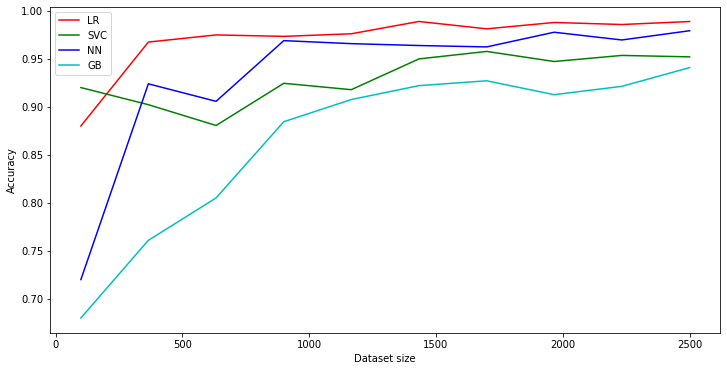


> В сравнении лучше всего себя проявляет логистическая регрессия

#### test on real data


```python
def read_data(size):
    filename = f'data/Base{size}.txt'
    raw_data = np.genfromtxt(filename, delimiter=' ', dtype=str)
    target = np.squeeze(raw_data[:, 1]).astype(int)
    data = [list(str) for str in raw_data[:, 0]]
    data = np.array(data, dtype=float)
    return data, target
```


```python
base8_X, base8_y = read_data(8)

base8_X.shape
```


    (1000000, 8)


```python
def run_models(models, X, y, sizes):
    colors = cm.rainbow(np.linspace(0, 1, len(models)))
    models_scores = []

    for model in models:
        train_score, test_score = build_model(X, y, clf=model, silent=False)
        scores = run_model(X, y, model, sizes)
        models_scores.append(scores)

    plt.figure(figsize=(12, 6))
    for i, sc in enumerate(models_scores):
        plt.plot(sizes, sc, c=colors[i], label=type(models[i]).__name__)

    plt.xlabel('Dataset Size')
    plt.ylabel('Accuracy')
    plt.legend()
    plt.show()
```


```python
lr_clf = sklearn.linear_model.LogisticRegression(solver='liblinear')
svc_clf = sklearn.svm.SVC(C=1, gamma='scale')
nn_clf = sklearn.neural_network.MLPClassifier(hidden_layer_sizes=(8, 8, 8), alpha=1e-3, max_iter=1000)
gb_clf = sklearn.ensemble.GradientBoostingClassifier(n_estimators=500, max_depth=3)

models = [lr_clf, svc_clf, nn_clf, gb_clf]
run_models(models, base8_X[:SET_SIZE], base8_y[:SET_SIZE], TEST_SIZES)
```

    > LogisticRegression:
    	Train:	0.7361333333333333
    	Test:	0.74


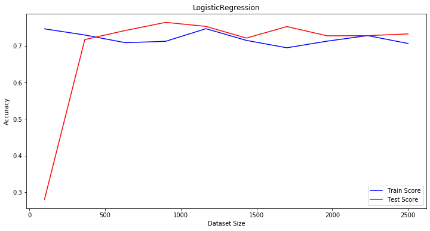


    > SVC:
    	Train:	1.0
    	Test:	1.0


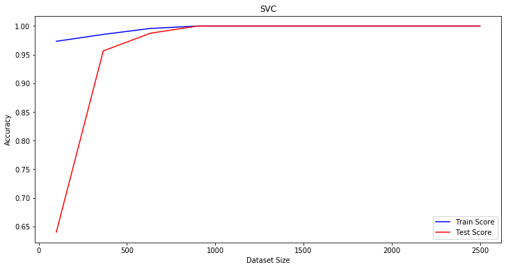


    > MLPClassifier:
    	Train:	1.0
    	Test:	1.0


    /Users/drapegnik/.pyenv/versions/3.7.4/envs/bsuir/lib/python3.7/site-packages/sklearn/neural_network/multilayer_perceptron.py:566: ConvergenceWarning: Stochastic Optimizer: Maximum iterations (1000) reached and the optimization hasn't converged yet.
      % self.max_iter, ConvergenceWarning)


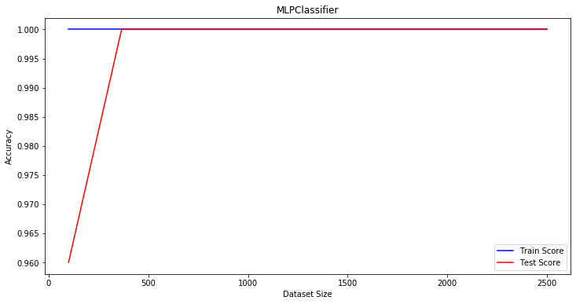


    > GradientBoostingClassifier:
    	Train:	1.0
    	Test:	1.0


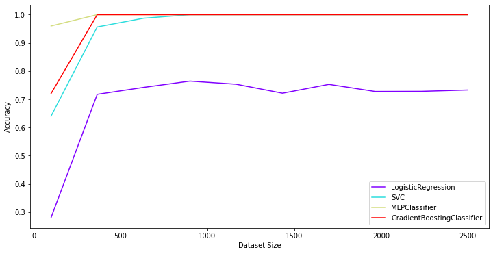


> для реальных данных `Base8` логистическая регрессия показывает себя хуже всего. Остальные 3 метода - одинаково хороши

#### `base16` test


```python
base16_X, base16_y = read_data(16)

base16_X.shape
```


    (1000000, 16)


```python
lr_clf = sklearn.linear_model.LogisticRegression(solver='liblinear')
svc_clf = sklearn.svm.SVC(C=1, gamma='scale')
nn_clf = sklearn.neural_network.MLPClassifier(hidden_layer_sizes=(32, 32, 32), alpha=1e-3, max_iter=10000)
gb_clf = sklearn.ensemble.GradientBoostingClassifier(n_estimators=600, max_depth=4)

models = [lr_clf, svc_clf, nn_clf, gb_clf]
run_models(models, base16_X[:SET_SIZE], base16_y[:SET_SIZE], sizes=np.linspace(500, 10000, 10, dtype=int))
```

    > LogisticRegression:
    	Train:	0.5996
    	Test:	0.614


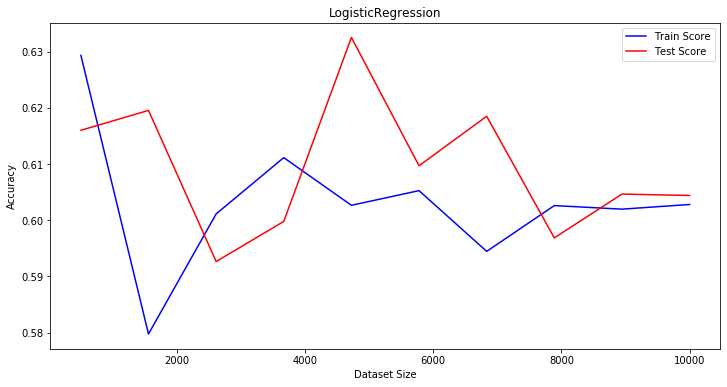


    > SVC:
    	Train:	0.7244
    	Test:	0.7


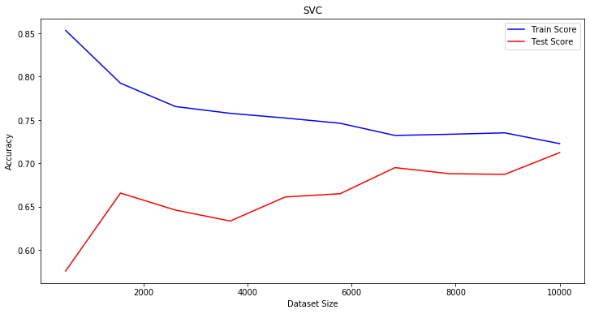


    > MLPClassifier:
    	Train:	0.9642666666666667
    	Test:	0.8184


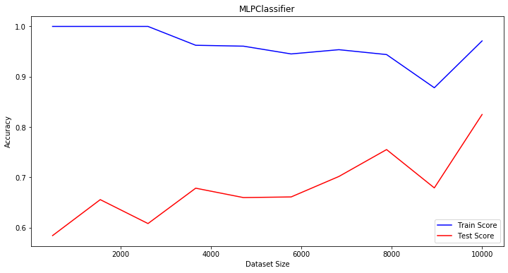


    > GradientBoostingClassifier:
    	Train:	0.7618666666666667
    	Test:	0.6908


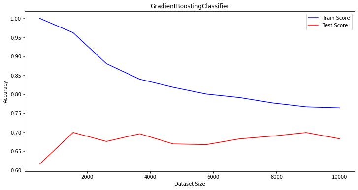


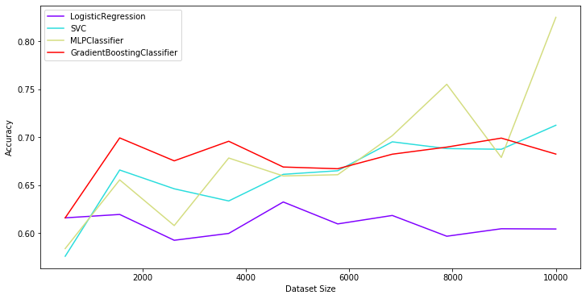


> Для данных большей размерности результаты сразу ухудшаются, однако нейронная сеть достигает точности в `82%` на большой выборке (10000)

### 10. conclusions

Был рассмотрен метод криптоатаки на физически неклонируемые функции.

Использовались различные методы: логистическая регрессия, метод опорных векторов, нейронные сети и градиентный бустинг.

Для оценки качеста использовалась метрика точности классификации (`Accuracy`).

Для `Base8` удалось достичь `100%` точности, однако для уже `Base16` максимум был `82%` у нейронной сети.

Точность увеличивается с размером тестовой выборки.
