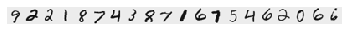

# ml lab2


```python
import numpy as np
import pandas as pd
import matplotlib.pyplot as plt
import scipy.optimize as opt

pd.set_option('display.max_rows', 10)
```

### 1. read ex1 data


```python
data1 = pd.DataFrame(np.genfromtxt('data/ex2data1.txt', delimiter=','), columns=['Grade1', 'Grade2', 'Accepted'])
data1
```


<div>
<style scoped>
    .dataframe tbody tr th:only-of-type {
        vertical-align: middle;
    }

    .dataframe tbody tr th {
        vertical-align: top;
    }

    .dataframe thead th {
        text-align: right;
    }
</style>
<table border="1" class="dataframe">
  <thead>
    <tr style="text-align: right;">
      <th></th>
      <th>Grade1</th>
      <th>Grade2</th>
      <th>Accepted</th>
    </tr>
  </thead>
  <tbody>
    <tr>
      <th>0</th>
      <td>34.623660</td>
      <td>78.024693</td>
      <td>0.0</td>
    </tr>
    <tr>
      <th>1</th>
      <td>30.286711</td>
      <td>43.894998</td>
      <td>0.0</td>
    </tr>
    <tr>
      <th>2</th>
      <td>35.847409</td>
      <td>72.902198</td>
      <td>0.0</td>
    </tr>
    <tr>
      <th>3</th>
      <td>60.182599</td>
      <td>86.308552</td>
      <td>1.0</td>
    </tr>
    <tr>
      <th>4</th>
      <td>79.032736</td>
      <td>75.344376</td>
      <td>1.0</td>
    </tr>
    <tr>
      <th>...</th>
      <td>...</td>
      <td>...</td>
      <td>...</td>
    </tr>
    <tr>
      <th>95</th>
      <td>83.489163</td>
      <td>48.380286</td>
      <td>1.0</td>
    </tr>
    <tr>
      <th>96</th>
      <td>42.261701</td>
      <td>87.103851</td>
      <td>1.0</td>
    </tr>
    <tr>
      <th>97</th>
      <td>99.315009</td>
      <td>68.775409</td>
      <td>1.0</td>
    </tr>
    <tr>
      <th>98</th>
      <td>55.340018</td>
      <td>64.931938</td>
      <td>1.0</td>
    </tr>
    <tr>
      <th>99</th>
      <td>74.775893</td>
      <td>89.529813</td>
      <td>1.0</td>
    </tr>
  </tbody>
</table>
<p>100 rows × 3 columns</p>
</div>


### 2. plot data


```python
def get_plot(data, x_label = 'Grade1', y_label = 'Grade2'):
    plt.figure()
    ax = data.loc[data.Accepted == 1].plot(x=x_label, y=y_label, style=['gx'], label='Accepted')
    ay = data.loc[data.Accepted == 0].plot(x=x_label, y=y_label, style=['rx'], label='Not Accepted', ax=ax)
    ax.set_xlabel(x_label)
    ax.set_ylabel(y_label)
    plt.legend()
    return plt, ax

def plot_data(data, label_x='Grade1', label_y='Grade2', axes=None):
    pos = data.loc[data.Accepted == 1]
    neg = data.loc[data.Accepted == 0]

    if axes == None:
        axes = plt.gca()

    axes.scatter(pos[label_x], pos[label_y], marker='x', c='g', s=30, label='Accepted')
    axes.scatter(neg[label_x], neg[label_y], c='r', s=30, label='Not Accepted')
    axes.set_xlabel(label_x)
    axes.set_ylabel(label_y)
    axes.legend(frameon= True, fancybox = True)

plot_data(data1)
```


### 3. cost function J(θ) + gradient descent


```python
def sigmoid(X):
    return 1 / (1 + np.exp(-X))

def cost_function(theta, X, y):
    m = y.size
    h = sigmoid(X @ theta)
    J = (-1 / m) * ((y.T @ np.log(h)) + ((1 - y).T @ np.log(1 - h)))
    error = h - y
    gd = (1 / m) * (X.T @ error)
    return J, gd
```


```python
m, n = data1.shape
initial_theta = np.zeros(n)

X = data1[['Grade1', 'Grade2']]
X.insert(0, 'theta_0', 1)
y = data1['Accepted']

cost, gd = cost_function(initial_theta, X, y)
print(f'Cost with initial_theta:\t{cost}')
print(f'Gradient with initial_theta:\t{gd.ravel()}')
```

    Cost with initial_theta:	0.6931471805599452
    Gradient with initial_theta:	[ -0.1        -12.00921659 -11.26284221]


### 4. optimize cost


```python
def optimize_cost(theta, X, y):
    cost, _ = cost_function(theta, X, y)
    return cost

def optimize_gradient(theta, X, y):
    _, gd = cost_function(theta, X, y)
    return gd

def optimize(func, gradient, X, y, method):
    initial_theta = np.zeros(n)

    result = opt.minimize(fun=func, x0=initial_theta, args=(X, y), method=method, jac=gradient)
    theta = result.x
    cost = func(theta, X, y)

    print(f'theta:\t{theta.ravel()}\ncost:\t{cost}')
    return result
```

#### Nelder-Mead


```python
result = optimize(optimize_cost, optimize_gradient, X, y, 'Nelder-Mead')
result
```

    theta:	[-25.16130062   0.20623142   0.20147143]
    cost:	0.2034977015902151


     final_simplex: (array([[-25.16130062,   0.20623142,   0.20147143],
           [-25.16135807,   0.20623176,   0.20147199],
           [-25.1613519 ,   0.20623203,   0.20147171],
           [-25.16137971,   0.20623202,   0.20147188]]), array([0.2034977, 0.2034977, 0.2034977, 0.2034977]))
               fun: 0.2034977015902151
           message: 'Optimization terminated successfully.'
              nfev: 287
               nit: 157
            status: 0
           success: True
                 x: array([-25.16130062,   0.20623142,   0.20147143])


#### Broyden-Fletcher-Goldfarb-Shanno


```python
result = optimize(optimize_cost, optimize_gradient, X, y, 'BFGS')
result
```

    theta:	[-25.16133284   0.2062317    0.2014716 ]
    cost:	0.20349770158944375


    /Users/drapegnik/.pyenv/versions/3.7.4/envs/bsuir/lib/python3.7/site-packages/ipykernel_launcher.py:7: RuntimeWarning: divide by zero encountered in log
      import sys


          fun: 0.20349770158944375
     hess_inv: array([[ 3.31474479e+03, -2.63892205e+01, -2.70237122e+01],
           [-2.63892205e+01,  2.23869433e-01,  2.02682332e-01],
           [-2.70237122e+01,  2.02682332e-01,  2.35335117e-01]])
          jac: theta_0   -9.524768e-09
    Grade1    -9.319213e-07
    Grade2    -2.826089e-07
    dtype: float64
      message: 'Optimization terminated successfully.'
         nfev: 31
          nit: 23
         njev: 31
       status: 0
      success: True
            x: array([-25.16133284,   0.2062317 ,   0.2014716 ])


### 5. predict function


```python
def predict(theta, X):
    predict = sigmoid(np.dot(X, theta))
    return predict > 0.5

theta = result.x
sample = np.array([1, 57, 79])
probability = sigmoid(sample @ theta)
print(f'With Grades {sample[1:]}, probability of acceptance is: {probability}')
```

    With Grades [57 79], probability of acceptance is: 0.924848961903417


```python
def get_accuracy(theta, X, y):
    p = predict(theta, X)
    return y[p == y].size / y.size * 100
print(f'Train Accuracy: {get_accuracy(theta, X, y)}%')
```

    Train Accuracy: 89.0%


### 6. decision surface


```python
plot, ax = get_plot(data1)
slope = -(theta[1] / theta[2])
intercept = -(theta[0] / theta[2])

xs = np.array(ax.get_xlim())
ys = intercept + (slope * xs)

plot.plot(xs, ys);
plot.show()
```


    <Figure size 432x288 with 0 Axes>


### 7. read ex2 data


```python
data2 = pd.DataFrame(np.genfromtxt('data/ex2data2.txt', delimiter=','), columns=['Test1', 'Test2', 'Accepted'])
data2
```


<div>
<style scoped>
    .dataframe tbody tr th:only-of-type {
        vertical-align: middle;
    }

    .dataframe tbody tr th {
        vertical-align: top;
    }

    .dataframe thead th {
        text-align: right;
    }
</style>
<table border="1" class="dataframe">
  <thead>
    <tr style="text-align: right;">
      <th></th>
      <th>Test1</th>
      <th>Test2</th>
      <th>Accepted</th>
    </tr>
  </thead>
  <tbody>
    <tr>
      <th>0</th>
      <td>0.051267</td>
      <td>0.699560</td>
      <td>1.0</td>
    </tr>
    <tr>
      <th>1</th>
      <td>-0.092742</td>
      <td>0.684940</td>
      <td>1.0</td>
    </tr>
    <tr>
      <th>2</th>
      <td>-0.213710</td>
      <td>0.692250</td>
      <td>1.0</td>
    </tr>
    <tr>
      <th>3</th>
      <td>-0.375000</td>
      <td>0.502190</td>
      <td>1.0</td>
    </tr>
    <tr>
      <th>4</th>
      <td>-0.513250</td>
      <td>0.465640</td>
      <td>1.0</td>
    </tr>
    <tr>
      <th>...</th>
      <td>...</td>
      <td>...</td>
      <td>...</td>
    </tr>
    <tr>
      <th>113</th>
      <td>-0.720620</td>
      <td>0.538740</td>
      <td>0.0</td>
    </tr>
    <tr>
      <th>114</th>
      <td>-0.593890</td>
      <td>0.494880</td>
      <td>0.0</td>
    </tr>
    <tr>
      <th>115</th>
      <td>-0.484450</td>
      <td>0.999270</td>
      <td>0.0</td>
    </tr>
    <tr>
      <th>116</th>
      <td>-0.006336</td>
      <td>0.999270</td>
      <td>0.0</td>
    </tr>
    <tr>
      <th>117</th>
      <td>0.632650</td>
      <td>-0.030612</td>
      <td>0.0</td>
    </tr>
  </tbody>
</table>
<p>118 rows × 3 columns</p>
</div>


### 8. plot data


```python
plot_data(data2, 'Test1', 'Test2')
```


### 9. map features


```python
def map_feature(x1, x2, degree=6):
    '''
    Maps the two input features to quadratic features.
    Returns features array:
        x1, x2, x1**2, x2**2, x1*x2, x1*x2**2...
    '''
    x1.shape = (x1.size, 1)
    x2.shape = (x2.size, 1)
    result = np.ones(shape=(x1[:, 0].size, 1))
    m, n = result.shape

    for i in range(1, degree + 1):
        for j in range(i + 1):
            r = (x1 ** (i - j)) * (x2 ** j)
            result = np.append(result, r, axis=1)

    return result

x1 = np.array(data2['Test1'])
x2 = np.array(data2['Test2'])
mapped = map_feature(x1, x2)
mapped.shape
```


    (118, 28)


### 10. l2 regularization with gradient descent


```python
def cost_function_reg(theta, X, y, l=1):
    h = sigmoid(X.dot(theta))
    thetaR = theta[1:, 0]

    J = (-1.0 / m) * ((y.T @ np.log(h)) + ((1 - y.T) @ np.log(1.0 - h))) + (l / (2.0 * m)) * (thetaR.T @ thetaR)

    y.shape = h.shape
    delta = h - y
    sumdelta = delta.T @ X[:, 1]
    grad1 = (1.0 / m) * sumdelta

    XR = X[:, 1:X.shape[1]]
    sumdelta = delta.T @ XR

    grad = (1.0 / m) * (sumdelta + l * thetaR)

    out = np.zeros(shape=(grad.shape[0], grad.shape[1] + 1))

    out[:, 0] = grad1
    out[:, 1:] = grad

    return J.flatten(), out.T.flatten()

def gradient_reg(theta, X, y, l=1, alpha=0.2, num_iters=400):
    m = y.size
    j_history = []
    for i in range(0, num_iters):
        cost, grad = cost_function_reg(theta, X, y, l)
        grad.shape = theta.shape
        theta -= alpha * grad
        j_history.append(cost)

    return theta, j_history
```


```python
m, n = data2.shape

y = np.array(data2['Accepted'])
y.shape = (m, 1)
initial_theta = np.zeros(shape=(mapped.shape[1], 1))

cost, _ = cost_function_reg(initial_theta, mapped, y)
print(f'Initial Cost:\t{cost}')

gd_theta, _ = gradient_reg(initial_theta, mapped, y)
```

    Initial Cost:	[0.69314718]


### 11. other regularization functions


```python
def reshape_decorator(return_type):
    def reshape_theta(theta, X, y):
        theta.shape = (mapped.shape[1], 1)
        cost, grad = cost_function_reg(theta, X, y)
        theta.shape = (mapped.shape[1],)
        return cost if return_type == 'cost' else grad
    return reshape_theta

result = opt.minimize(
    fun=reshape_decorator('cost'),
    x0=initial_theta,
    args=(mapped, y),
    method='BFGS',
    jac=reshape_decorator('gd')
)
bfgs_theta = result.x
bfgs_theta.shape = (mapped.shape[1], 1)
```

### 12. predict function


```python
print(f'GD Train Accuracy: {get_accuracy(gd_theta, mapped, y)}%')
print(f'BFGS Train Accuracy: {get_accuracy(bfgs_theta, mapped, y)}%')
```

    GD Train Accuracy: 80.50847457627118%
    BFGS Train Accuracy: 82.20338983050848%


### 13-14. decision surface + different  λ


```python
def get_contour(theta):
    u = np.linspace(-1, 1.5)
    v = np.linspace(-1, 1.5)
    z = np.zeros(shape=(len(u), len(v)))
    for i in range(len(u)):
        for j in range(len(v)):
            z[i, j] = map_feature(np.array(u[i]), np.array(v[j])).dot(np.array(theta))
    return u, v, z.T
```


```python
LAMBDAS = [0, 1, 5, 50]
fig, axes = plt.subplots(2, 2, sharey = True, figsize=(12, 10))

for i, reg_lambda in enumerate(LAMBDAS):
    initial_theta = np.zeros(shape=(mapped.shape[1], 1))
    theta, _ = gradient_reg(initial_theta, mapped, y, reg_lambda, 0.2, 1000)    
    accuracy = np.round(get_accuracy(theta, mapped, y), decimals=2)

    plot_data(data2, 'Test1', 'Test2', axes.flatten()[i])
    u, v, z = get_contour(theta)

    axes.flatten()[i].contour(u, v, z, colors='b', linewidths=1);       
    axes.flatten()[i].set_title(f'Train accuracy {accuracy}% with Lambda={reg_lambda}')
```


### 15. read ex3 data


```python
import scipy.io

data3 = scipy.io.loadmat('data/ex2data3.mat')
x = np.array(data3['X'])
y = np.squeeze(data3['y'])
np.place(y, y == 10, 0)
n = x.shape[1]
m = x.shape[0]
labels_count = 10
```

### 16. visualize data


```python
import matplotlib.image as mpimg

X = np.ones(shape=(x.shape[0], x.shape[1] + 1))
X[:, 1:] = x

sample = np.random.choice(X.shape[0], 20)
plt.imshow(X[sample,1:].reshape(-1, 20).T, cmap='binary')
plt.axis('off');
```





### 17-18. vectorizing logistic regression + L2

### 19. one-vs-all classification


```python
classifiers = np.zeros(shape=(labels_count, n + 1))
for i in range(0, labels_count):
    label = (y == i).astype(int)
    initial_theta = np.zeros(shape=(X.shape[1], 1))
    theta, costs = gradient_reg(initial_theta, X, label, 0.4, 2.8, 10000)
    classifiers[i, :] = np.squeeze(theta)
```

### 20. predict function


```python
def predict_class(input, classifiers):
    class_probs = sigmoid(input @ classifiers.transpose())
    if len(class_probs.shape) == 1:
        class_probs.shape = (1, class_probs.shape[0])
    predictions = class_probs.argmax(axis=1)
    return predictions
```

### 21. training accuracy


```python
predictions = predict_class(X, classifiers)
accuracy = 100 * np.mean(predictions == y)
print(f'Training accuracy: {accuracy}')
```

    Training accuracy: 94.74000000000001


### 22. conclusion

В данной лабораторной работе рассмотрена модель логистической регрессии.
Реализована `L2`-регуляризация, реализован бинарный классификатор с помощью логистической регрессии, который использовался для реализации многоклассового классификатора по методу "один против всех".

В пункте #14 показана зависимость результатов от параметра регуляризации `λ`: переобучение или недообучение выборки.
