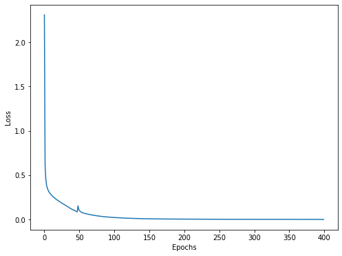
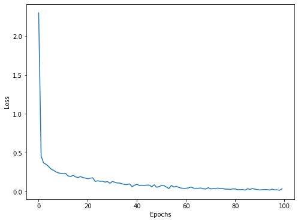
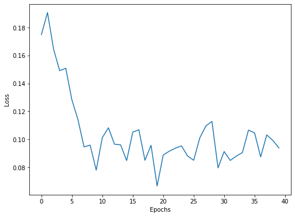

# ml lab2


```python
import numpy as np
import matplotlib.pyplot as plt
```

### 1.1 read lab1 data


```python
import os

DATA_PATH = '../lab1/data/notMNIST_small'

letters = sorted(os.listdir(DATA_PATH))

image_width = 28

X = []
y = []

for l_id, letter in enumerate(letters):
    l_dir = f'{DATA_PATH}/{letter}'
    for image in os.listdir(l_dir):
        try:
            img = plt.imread(f'{l_dir}/{image}')
            X.append(img.reshape(-1, image_width * image_width)[0])
            y.append(l_id)
        except:
            continue
```


```python
len(X), len(y)
```


    (18724, 18724)


```python
from sklearn.model_selection import train_test_split

X_train, X_test, y_train, y_test = train_test_split(X, y, test_size=0.2, train_size=0.8)
```

### 1.2 build network


```python
import torch
import torch.nn as nn
import torch.nn.functional as F
```


```python
sizes = [784, 1200, 1200, 1200, 400, 100, 10]

epochs = 400
step = 512
learning_rate = 1e-3

mu = np.mean(X)
std = np.std(X)
```


```python
class Network(nn.Module):
    def __init__(self):
        super(Network, self).__init__()
        for i in range(1, len(sizes)):
            l = nn.Linear(sizes[i - 1], sizes[i])
            setattr(self, f'l{i}', l)
            if i != len(sizes) - 1:
                setattr(self, f'relu{i}', nn.LeakyReLU())

    def forward(self, x):
        for l in network.children():
            x = l(x)
        return F.log_softmax(x, dim=1)

network = Network()
devide = torch.device('cpu')
network.to(devide)
```


    Network(
      (l1): Linear(in_features=784, out_features=1200, bias=True)
      (relu1): LeakyReLU(negative_slope=0.01)
      (l2): Linear(in_features=1200, out_features=1200, bias=True)
      (relu2): LeakyReLU(negative_slope=0.01)
      (l3): Linear(in_features=1200, out_features=1200, bias=True)
      (relu3): LeakyReLU(negative_slope=0.01)
      (l4): Linear(in_features=1200, out_features=400, bias=True)
      (relu4): LeakyReLU(negative_slope=0.01)
      (l5): Linear(in_features=400, out_features=100, bias=True)
      (relu5): LeakyReLU(negative_slope=0.01)
      (l6): Linear(in_features=100, out_features=10, bias=True)
    )


```python
import torch.optim as optim

optimizer = optim.Adagrad(network.parameters(), lr=learning_rate)
loss_func = nn.CrossEntropyLoss()

x_tensor = torch.FloatTensor(X_train)
y_tensor = torch.LongTensor(y_train)

n = len(X_train)
n
```


    14979


```python
loss_data = []

for e in range(epochs):
    for i in range(0, n - step, step):
        x_i = x_tensor[i:i + step].to(devide)
        y_i = y_tensor[i:i + step].to(devide)

        optimizer.zero_grad()
        predict = network(x_i)

        loss = loss_func(predict, y_i)
        loss.backward()
        optimizer.step()

        if i % 1000 == 0:
            loss_data.append(loss.data)
    if e > 0 and e % 10 == 0:    
        print(f'Epoch{e}:\tloss: {loss.data:.6f}')
```

    Epoch10:	loss: 0.271209
    Epoch20:	loss: 0.208018
    Epoch30:	loss: 0.160350
    Epoch40:	loss: 0.119195
    Epoch50:	loss: 0.098869
    Epoch60:	loss: 0.078770
    Epoch70:	loss: 0.066453
    Epoch80:	loss: 0.054954
    Epoch90:	loss: 0.044032
    Epoch100:	loss: 0.033680
    Epoch110:	loss: 0.022876
    Epoch120:	loss: 0.014876
    Epoch130:	loss: 0.010553
    Epoch140:	loss: 0.008259
    Epoch150:	loss: 0.006850
    Epoch160:	loss: 0.005875
    Epoch170:	loss: 0.005169
    Epoch180:	loss: 0.004641
    Epoch190:	loss: 0.004260
    Epoch200:	loss: 0.003956
    Epoch210:	loss: 0.003726
    Epoch220:	loss: 0.003561
    Epoch230:	loss: 0.003391
    Epoch240:	loss: 0.003280
    Epoch250:	loss: 0.003158
    Epoch260:	loss: 0.003073
    Epoch270:	loss: 0.003018
    Epoch280:	loss: 0.002937
    Epoch290:	loss: 0.002881
    Epoch300:	loss: 0.002840
    Epoch310:	loss: 0.002789
    Epoch320:	loss: 0.002751
    Epoch330:	loss: 0.002719
    Epoch340:	loss: 0.002691
    Epoch350:	loss: 0.002686
    Epoch360:	loss: 0.002646
    Epoch370:	loss: 0.002615
    Epoch380:	loss: 0.002608
    Epoch390:	loss: 0.002584


```python
def draw(data):
    plt.figure(figsize=(8, 6))
    plt.plot(data)
    plt.xlabel('Epochs')
    plt.ylabel('Loss')
    plt.show()

network.eval();
draw(loss_data)
```





### 2. accuracy


```python
def get_accuracy(net, normilize=False):
    test_tensor = torch.FloatTensor(X_test).to(device)
    if normilize:
        test_tensor = (test_tensor - mu) / std
    test_predict = net(test_tensor)

    _, max_index = torch.max(test_predict, 1)
    y_predict = max_index.tolist()


    return accuracy_score(y_predict, y_test)

test_score = get_accuracy(network)
print(f'score:\t{test_score * 100:.2f}%')
```

    score:	91.05%


> `91.1%` vs `86.7%` with logistic regression

### 3. regularization & dropout vs overfitting


```python
epochs = 100
```


```python
class DropoutNetwork(nn.Module):
    def __init__(self):
        super(DropoutNetwork, self).__init__()
        self.l1 = nn.Linear(sizes[0], sizes[1])
        self.bn1 = nn.BatchNorm1d(num_features=sizes[1])
        self.relu1 = nn.LeakyReLU()
        self.drop1 = nn.Dropout(0.25)
        self.l2 = nn.Linear(sizes[1], sizes[2])
        self.relu2 = nn.LeakyReLU()
        self.drop2 = nn.Dropout(0.5)
        self.l3 = nn.Linear(sizes[2], sizes[3])
        self.relu3 = nn.LeakyReLU()
        self.drop3 = nn.Dropout(0.25)
        self.l4 = nn.Linear(sizes[3], sizes[4])
        self.relu4 = nn.LeakyReLU()
        self.drop4 = nn.Dropout(0.5)
        self.l5 = nn.Linear(sizes[4], sizes[5])
        self.relu5 = nn.LeakyReLU()
        self.l6 = nn.Linear(sizes[5], sizes[6])

    def forward(self, x):
        x = self.bn1(self.l1(x))
        x = F.relu(x)
        x = self.relu1(x)
        x = self.drop1(x)
        x = self.l2(x)
        x = self.relu2(x)
        x = self.drop2(x)
        x = self.l3(x)
        x = self.relu3(x)
        x = self.drop3(x)
        x = self.l4(x)
        x = self.relu4(x)
        x = self.drop4(x)
        x = self.l5(x)
        x = self.relu5(x)
        x = self.l6(x)
        return F.log_softmax(x, dim=0)

d_network = DropoutNetwork()
d_network.to(device)
```


    DropoutNetwork(
      (l1): Linear(in_features=784, out_features=1200, bias=True)
      (bn1): BatchNorm1d(1200, eps=1e-05, momentum=0.1, affine=True, track_running_stats=True)
      (relu1): LeakyReLU(negative_slope=0.01)
      (drop1): Dropout(p=0.25, inplace=False)
      (l2): Linear(in_features=1200, out_features=1200, bias=True)
      (relu2): LeakyReLU(negative_slope=0.01)
      (drop2): Dropout(p=0.5, inplace=False)
      (l3): Linear(in_features=1200, out_features=1200, bias=True)
      (relu3): LeakyReLU(negative_slope=0.01)
      (drop3): Dropout(p=0.25, inplace=False)
      (l4): Linear(in_features=1200, out_features=400, bias=True)
      (relu4): LeakyReLU(negative_slope=0.01)
      (drop4): Dropout(p=0.5, inplace=False)
      (l5): Linear(in_features=400, out_features=100, bias=True)
      (relu5): LeakyReLU(negative_slope=0.01)
      (l6): Linear(in_features=100, out_features=10, bias=True)
    )


```python
x_norm_tensor = torch.FloatTensor((X_train - mu) / std)
y_norm_tensor = torch.LongTensor(y_train)

optimizer = optim.Adagrad(d_network.parameters(), lr=learning_rate)
```


```python
norm_loss_data = []

for e in range(epochs):
    for i in range(0, n - step, step):
        x_i = x_norm_tensor[i:i + step].to(devide)
        y_i = y_norm_tensor[i:i + step].to(devide)

        optimizer.zero_grad()
        predict = d_network(x_i)

        loss = loss_func(predict, y_i)
        loss.backward()
        optimizer.step()

        if i % 1000 == 0:
            norm_loss_data.append(loss.data)
    if e % 10 == 0:    
        print(f'Epoch{e}:\tloss: {loss.data:.6f}')
```

    Epoch0:	loss: 0.447742
    Epoch10:	loss: 0.232536
    Epoch20:	loss: 0.146050
    Epoch30:	loss: 0.105410
    Epoch40:	loss: 0.092520
    Epoch50:	loss: 0.071526
    Epoch60:	loss: 0.045665
    Epoch70:	loss: 0.040764
    Epoch80:	loss: 0.038154
    Epoch90:	loss: 0.024794


```python
network.eval();
draw(norm_loss_data)
```





### 4. dynamic learning rate


```python
from torch.optim.lr_scheduler import ReduceLROnPlateau

epochs = 40
learning_rate = 0.1
optimizer = torch.optim.SGD(d_network.parameters(), lr=learning_rate, momentum=0.9, nesterov=True)
scheduler = ReduceLROnPlateau(optimizer, mode='max', factor=0.1, patience=0, verbose=True)
```


```python
loss_data = []

for e in range(epochs):
    for i in range(0, n - step, step):
        x_i = x_norm_tensor[i:i + step].to(devide)
        y_i = y_norm_tensor[i:i + step].to(devide)

        optimizer.zero_grad()
        predict = xd(x_i)

        loss = loss_func(predict, y_i)
        loss.backward()
        optimizer.step()

        if i % 1000 == 0:
            loss_data.append(loss.data)
    accuracy = get_accuracy(d_network, True)
    if e % 10 == 0:
        print(f'Epoch#{e}:\tloss: {loss.data:.6f}\taccuracy: {accuracy:.6f}')
    scheduler.step(accuracy)
```

    Epoch#0:	loss: 0.228552	accuracy: 0.888117
    Epoch     4: reducing learning rate of group 0 to 1.0000e-02.
    Epoch     6: reducing learning rate of group 0 to 1.0000e-03.
    Epoch     8: reducing learning rate of group 0 to 1.0000e-04.
    Epoch    10: reducing learning rate of group 0 to 1.0000e-05.
    Epoch#10:	loss: 0.132488	accuracy: 0.909212
    Epoch    11: reducing learning rate of group 0 to 1.0000e-06.
    Epoch    12: reducing learning rate of group 0 to 1.0000e-07.
    Epoch    13: reducing learning rate of group 0 to 1.0000e-08.
    Epoch#20:	loss: 0.124134	accuracy: 0.909212
    Epoch#30:	loss: 0.119830	accuracy: 0.906008


```python
draw(loss_data)
d_network.eval();
```





```python
test_score = get_accuracy(d_network, True)
print(f'score:\t{test_score * 100:.2f}%')
```

    score:	91.51%
