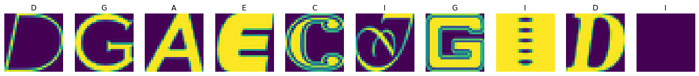
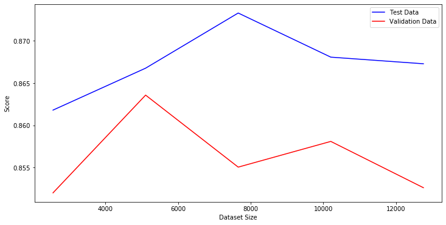
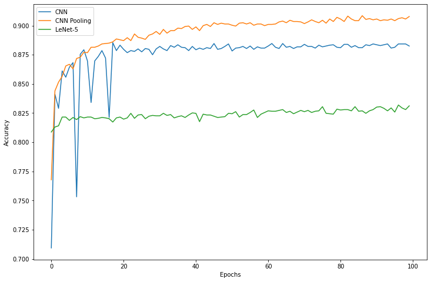
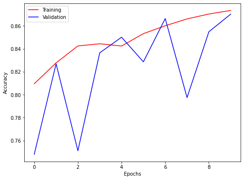

# Машинное Обучение
Отчет по лабораторным работам студента 858341 группы Пажитных Ивана Павловича
# lab1
> Логистическая регрессия в качестве нейронной сети

- Данные: В работе предлагается использовать набор данных `notMNIST`, который состоит из изображений размерностью `28x28` первых `10` букв латинского алфавита (`A...J`, соответственно).
- Обучающая выборка содержит порядка 500 тыс. изображений, а тестовая – около 19 тыс.

Данные можно скачать по ссылке:
- [большой набор данных](https://commondatastorage.googleapis.com/books1000/notMNIST_large.tar.gz)
- [маленький набор данных](https://commondatastorage.googleapis.com/books1000/notMNIST_small.tar.gz)
- [описание данных на английском языке](http://yaroslavvb.blogspot.sg/2011/09/notmnist-dataset.html)

## tasks
1. Загрузите данные и отобразите на экране несколько из изображений с помощью языка `Python`
2. Проверьте, что классы являются сбалансированными, т.е. количество изображений, принадлежащих каждому из классов, примерно одинаково (В данной задаче 10 классов)
3. Разделите данные на три подвыборки: обучающую (200 тыс. изображений), валидационную (10 тыс. изображений) и контрольную (тестовую) (19 тыс. изображений)
4. Проверьте, что данные из обучающей выборки не пересекаются с данными из валидационной и контрольной выборок. Другими словами, избавьтесь от дубликатов в обучающей выборке
5. Постройте простейший классификатор (например, с помощью логистической регрессии). Постройте график зависимости точности классификатора от размера обучающей выборки (50, 100, 1000, 50000) Для построения классификатора можете использовать библиотеку [scikit-learn](http://scikit-learn.org)
6. Результат выполнения заданий опишите в отчете.
# ml lab1


```python
import os

import numpy as np
import matplotlib.pyplot as plt

DATA_URL = 'https://commondatastorage.googleapis.com/books1000/notMNIST_small.tar.gz'
DATA_DIR = 'data'
```

### 1.1 fetch data


```python
import requests
import humanize
import tarfile

filename = os.path.basename(DATA_URL)
filepath = f'{DATA_DIR}/{filename}'

print(f'path:\t{filepath}')

def fetch():
    if os.path.exists(filepath):
        return
    r = requests.get(DATA_URL)
    size = r.headers.get('content-length', 0)
    print(f'size:\t{humanize.naturalsize(size)}')

    os.makedirs(DATA_DIR, exist_ok=True)

    with open(filepath, 'wb') as f:
        f.write(r.content)


def parse():
    tar = tarfile.open(filepath)
    members = tar.getmembers()
    print(f'files:\t{len(members)}')
    sub_folder = members[0].name
    tar.extractall(DATA_DIR)
    tar.close()
    return f'{DATA_DIR}/{sub_folder}'

fetch()
data_path = parse()
```

    path:	data/notMNIST_small.tar.gz
    files:	18737


### 1.2 plot data


```python
import random

letters = sorted(os.listdir(data_path))
fig, axs = plt.subplots(1, 10, figsize=(20, 2))

for ax in axs:
    l = random.choice(letters)
    l_dir = f'{data_path}/{l}'
    image = random.choice(os.listdir(l_dir))
    ax.imshow(plt.imread(f'{l_dir}/{image}'))
    ax.set_title(l)
    ax.axis('off')
```





### 2. check dataset balance


```python
stats = dict()

for l in letters:
    l_dir = f'{data_path}/{l}'
    stats[l] = len(os.listdir(l_dir))

total = sum(stats.values())
print(f'total: {total}')
print(f'balanced: {total / len(letters)}')
print('real:')
stats
```

    total: 18726
    balanced: 1872.6
    real:
    {'A': 1873,
     'B': 1873,
     'C': 1873,
     'D': 1873,
     'E': 1873,
     'F': 1873,
     'G': 1872,
     'H': 1872,
     'I': 1872,
     'J': 1872}


### 3-4. train / test samples + data cleaning


```python
import hashlib

image_width = 28

X = np.zeros((total, image_width, image_width))
y = np.zeros((total))
i = 0

hashes = set()

for l_id, letter in enumerate(letters):
    l_dir = f'{data_path}/{letter}'
    for image in os.listdir(l_dir):
        try:
            img = plt.imread(f'{l_dir}/{image}')
            img_hash = hashlib.sha256(img).hexdigest()
            if img_hash in hashes:
                continue
            hashes.add(img_hash)
            X[i, :, :] = img
            y[i] = l_id
            i += 1
        except:
            continue
```


```python
duplicates = (total - i) / total * 100
print(f'duplicates:\t{duplicates:.2f}%')

# fit in new size
y = y[:i]
X = X[:i]

X.shape, y.size
```

    duplicates:	2.64%
    ((18232, 28, 28), 18232)


```python
from sklearn.model_selection import train_test_split

X_train, X_temp, y_train, y_temp = train_test_split(X, y, train_size=0.7)
X_test, X_val, y_test, y_val = train_test_split(X_temp, y_temp, train_size=0.7)

samples_size = [y_train.size, y_test.size, y_val.size]
samples_size, sum(samples_size)
```

    ([12762, 3828, 1642], 18232)


###  5. build classifier


```python
%%capture --no-stdout

from sklearn.linear_model import LogisticRegression
from sklearn.metrics import accuracy_score

def get_score(_clf, X, y):
    predict = _clf.predict(X.reshape(X.shape[0], -1))
    return accuracy_score(predict, y)    

clf = LogisticRegression(random_state=42, max_iter=1500)

train_total = len(X_train)
runs = 5
step = train_total // runs

test_scores = []
val_scores = []
sizes = range(step, train_total, step)
for size in sizes:
    idx = np.random.randint(0, train_total, size)
    X = X_train[idx, :, :].reshape(-1, X_train.shape[1] * X_train.shape[2])
    y = y_train[idx]

    clf.fit(X, y)
    test_score = get_score(clf, X_test, y_test)
    test_scores.append(test_score)
    val_scores.append(get_score(clf, X_val, y_val))

    print(f'> {size}: {test_score * 100:.3f}%')
```

    > 2552: 86.181%
    > 5104: 86.677%
    > 7656: 87.330%
    > 10208: 86.808%
    > 12760: 86.729%


```python
plt.figure(figsize=(12, 6))
plt.plot(sizes, test_scores, 'b', label='Test Data')
plt.plot(sizes, val_scores, 'r', label='Validation Data')
plt.xlabel('Dataset Size')
plt.ylabel('Score')
plt.legend()
plt.show()
```



# lab2
> Реализация глубокой нейронной сети

- Данные из [lab1](/ml/sem4/lab1)

## tasks

1. Реализуйте полносвязную нейронную сеть с помощью библиотеки **Tensor Flow**.
    - В качестве алгоритма оптимизации можно использовать, например, стохастический градиент (`Stochastic Gradient Descent`, SGD)
    - Определите количество скрытых слоев от 1 до 5, количество нейронов в каждом из слоев до нескольких сотен
    - Определите функции активации (кусочно-линейная, сигмоидная, гиперболический тангенс)
2. Как улучшилась точность классификатора по сравнению с логистической регрессией?
3. Используйте регуляризацию и метод сброса нейронов (`dropout`) для борьбы с переобучением. Как улучшилось качество классификации?
4. Воспользуйтесь динамически изменяемой скоростью обучения (`learning rate`). Наилучшая точность, достигнутая с помощью данной модели составляет `97.1%`. Какую точность демонстрирует Ваша реализованная модель?
5. Результат выполнения заданий опишите в отчете.
# ml lab2


```python
import numpy as np
import matplotlib.pyplot as plt
```

### 1.1 read lab1 data


```python
import os

DATA_PATH = '../lab1/data/notMNIST_small'

letters = sorted(os.listdir(DATA_PATH))

image_width = 28

X = []
y = []

for l_id, letter in enumerate(letters):
    l_dir = f'{DATA_PATH}/{letter}'
    for image in os.listdir(l_dir):
        try:
            img = plt.imread(f'{l_dir}/{image}')
            X.append(img.reshape(-1, image_width * image_width)[0])
            y.append(l_id)
        except:
            continue
```


```python
len(X), len(y)
```


    (18724, 18724)


```python
from sklearn.model_selection import train_test_split

X_train, X_test, y_train, y_test = train_test_split(X, y, test_size=0.2)

len(X_train), len(X_test)
```


    (14979, 3745)


### 1.2 build network


```python
import torch
import torch.nn as nn
```


```python
epochs = 100
batch_size = 512
learning_rate = 1e-3

mu = np.mean(X)
std = np.std(X)
```


```python
network = nn.Sequential(
    nn.Linear(784, 900),
    nn.LeakyReLU(),
    nn.Linear(900, 900),
    nn.LeakyReLU(),
    nn.Linear(900, 500),
    nn.LeakyReLU(),
    nn.Linear(500, 10),
)

device = torch.device('cuda:0') if torch.cuda.is_available() else torch.device('cpu')
device
```


    device(type='cuda', index=0)


```python
network.to(device)
```


    Sequential(
      (0): Linear(in_features=784, out_features=900, bias=True)
      (1): LeakyReLU(negative_slope=0.01)
      (2): Linear(in_features=900, out_features=900, bias=True)
      (3): LeakyReLU(negative_slope=0.01)
      (4): Linear(in_features=900, out_features=500, bias=True)
      (5): LeakyReLU(negative_slope=0.01)
      (6): Linear(in_features=500, out_features=10, bias=True)
    )


```python
import torch.optim as optim

optimizer = optim.Adagrad(network.parameters(), lr=learning_rate)
loss_func = nn.CrossEntropyLoss()

x_tensor = torch.FloatTensor(X_train)
y_tensor = torch.LongTensor(y_train)

x_test_ten = torch.FloatTensor(X_test).to(device)
y_test_ten = torch.LongTensor(y_test).to(device)

n = len(X_train)
n
```


    14979


```python
from tqdm import tqdm

def train(_net, _opt, _x, _y, epochs):
    loss_data = []

    pbar = tqdm(range(epochs))
    for e in pbar:
        e_loss = None
        for i in range(0, n - batch_size, batch_size):
            x_i = _x[i:i + batch_size].to(device)
            y_i = _y[i:i + batch_size].to(device)

            _opt.zero_grad()
            predict = _net(x_i)

            loss = loss_func(predict, y_i)
            loss.backward()
            _opt.step()

            e_loss = loss.data
        loss_data.append(e_loss)
        pbar.set_description(f'[e#{e} loss: {e_loss:.3f}]')
    return loss_data
```


```python
loss_history = train(network, optimizer, x_tensor, y_tensor)
```

    [e#99 loss: 0.087]: 100%|██████████| 100/100 [00:13<00:00,  7.51it/s]


```python
def draw(data):
    plt.figure(figsize=(8, 6))
    plt.plot(data)
    plt.xlabel('Epochs')
    plt.ylabel('Loss')
    plt.show()

network.eval();
draw(loss_history)
```


### 2. accuracy


```python
from sklearn.metrics import accuracy_score

def get_accuracy(net, normilize=False):
    test_tensor = torch.FloatTensor(X_test).to(device)
    if normilize:
        test_tensor = (test_tensor - mu) / std
    test_predict = net(test_tensor)

    _, max_index = torch.max(test_predict, 1)
    y_predict = max_index.tolist()

    return accuracy_score(y_predict, y_test)

test_score = get_accuracy(network)
print(f'Accuracy:\t{test_score:.2%}')
```

    Accuracy:	92.04%


> `92%` vs `86.7%` with logistic regression

### 3. regularization & dropout vs overfitting


```python
d_network = nn.Sequential(
    nn.Linear(784, 900),
    nn.BatchNorm1d(num_features=900),
    nn.LeakyReLU(),
    nn.Dropout(0.25),

    nn.Linear(900, 900),
    nn.LeakyReLU(),
    nn.Dropout(0.25),

    nn.Linear(900, 500),
    nn.LeakyReLU(),
    nn.Dropout(0.25),

    nn.Linear(500, 10),
    nn.LogSoftmax(dim=1)
)

d_network.to(device)
```


    Sequential(
      (0): Linear(in_features=784, out_features=900, bias=True)
      (1): BatchNorm1d(900, eps=1e-05, momentum=0.1, affine=True, track_running_stats=True)
      (2): LeakyReLU(negative_slope=0.01)
      (3): Dropout(p=0.25, inplace=False)
      (4): Linear(in_features=900, out_features=900, bias=True)
      (5): LeakyReLU(negative_slope=0.01)
      (6): Dropout(p=0.25, inplace=False)
      (7): Linear(in_features=900, out_features=500, bias=True)
      (8): LeakyReLU(negative_slope=0.01)
      (9): Dropout(p=0.25, inplace=False)
      (10): Linear(in_features=500, out_features=10, bias=True)
      (11): LogSoftmax()
    )


```python
x_norm_tensor = torch.FloatTensor((X_train - mu) / std)
y_norm_tensor = torch.LongTensor(y_train)

optimizer2 = optim.Adagrad(d_network.parameters(), lr=learning_rate)
```


```python
norm_loss_history = train(d_network, optimizer2, x_tensor, y_tensor, 200)
```

    [e#199 loss: 0.090]: 100%|██████████| 200/200 [00:29<00:00,  6.85it/s]


```python
d_network.eval();
draw(norm_loss_history)
```


```python
print(f'Accuracy:\t{get_accuracy(d_network):.2%}')
```

    Accuracy:	92.20%


### 4. dynamic learning rate


```python
from torch.optim.lr_scheduler import ReduceLROnPlateau

epochs = 100
learning_rate = 0.1
optimizer3 = torch.optim.SGD(d_network.parameters(), lr=learning_rate, momentum=0.9, nesterov=True)
scheduler = ReduceLROnPlateau(optimizer3, mode='max', factor=0.1, patience=0, verbose=True)
```


```python
loss_data = []

for e in range(epochs):
    for i in range(0, n - batch_size, batch_size):
        x_i = x_norm_tensor[i:i + batch_size].to(device)
        y_i = y_norm_tensor[i:i + batch_size].to(device)

        optimizer3.zero_grad()
        predict = d_network(x_i)

        loss = loss_func(predict, y_i)
        loss.backward()
        optimizer3.step()

        if i % 1000 == 0:
            loss_data.append(loss.data)
    accuracy = get_accuracy(d_network, True)
    if e % 10 == 0:
        print(f'Epoch\t{e}:\tloss: {loss.data:.3f}\taccuracy: {accuracy:.3f}')
    scheduler.step(accuracy)
```

    Epoch	0:	loss: 0.433	accuracy: 0.883
    Epoch     7: reducing learning rate of group 0 to 1.0000e-02.
    Epoch    10: reducing learning rate of group 0 to 1.0000e-03.
    Epoch	10:	loss: 0.078	accuracy: 0.920
    Epoch    12: reducing learning rate of group 0 to 1.0000e-04.
    Epoch    13: reducing learning rate of group 0 to 1.0000e-05.
    Epoch    14: reducing learning rate of group 0 to 1.0000e-06.
    Epoch    15: reducing learning rate of group 0 to 1.0000e-07.
    Epoch    16: reducing learning rate of group 0 to 1.0000e-08.
    Epoch	20:	loss: 0.065	accuracy: 0.917
    Epoch	30:	loss: 0.072	accuracy: 0.916
    Epoch	40:	loss: 0.075	accuracy: 0.918
    Epoch	50:	loss: 0.070	accuracy: 0.917
    Epoch	60:	loss: 0.069	accuracy: 0.916
    Epoch	70:	loss: 0.075	accuracy: 0.916
    Epoch	80:	loss: 0.078	accuracy: 0.919
    Epoch	90:	loss: 0.068	accuracy: 0.919


```python
draw(loss_data)
d_network.eval();
```


```python
print(f'Accuracy:\t{get_accuracy(d_network, True):.2%}')
```

    Accuracy:	92.47%
# lab3
> Реализация сверточной нейронной сети

- Данные из [lab1](/ml/sem4/lab1)

## tasks

1. Реализуйте нейронную сеть с двумя сверточными слоями, и одним полносвязным с нейронами с кусочно-линейной функцией активации. Какова точность построенное модели?
2. Замените один из сверточных слоев на слой, реализующий операцию пулинга (`Pooling`) с функцией максимума или среднего. Как это повлияло на точность классификатора?
3. Реализуйте классическую архитектуру сверточных сетей [`LeNet-5`](http://yann.lecun.com/exdb/lenet/).
4. Сравните максимальные точности моделей, построенных в лабораторных работах 1-3. Как можно объяснить полученные различия?
5. Результат выполнения заданий опишите в отчете.
# ml lab3


```python
import numpy as np
import pandas as pd
import matplotlib.pyplot as plt
```

### 0. read lab1 data


```python
import os

DATA_PATH = '../lab1/data/notMNIST_small'

letters = sorted(os.listdir(DATA_PATH))

image_width = 28

labels = []
images = []

for l_id, letter in enumerate(letters):
    l_dir = f'{DATA_PATH}/{letter}'
    for image in os.listdir(l_dir):
        try:
            images.append(plt.imread(f'{l_dir}/{image}'))
            labels.append(l_id)
        except:
            continue

data = pd.DataFrame.from_dict({'image': images, 'label': labels})            
```


```python
data.shape
```


    (18724, 2)


```python
from sklearn.model_selection import train_test_split

train, test = train_test_split(data, test_size=0.2)
test, val = train_test_split(test, test_size=0.25)

train.size, test.size, val.size
```


    (29958, 5616, 1874)


### 1. build network


```python
import torch
import torch.nn as nn
import torch.nn.functional as F
```


```python
epochs = 100
output_size = len(letters)
learning_rate = 1e-3

device = torch.device('cuda:0') if torch.cuda.is_available() else torch.device('cpu')
device
```


    device(type='cuda', index=0)


```python
class Network(nn.Module):
    def __init__(self):
        super(Network, self).__init__()

        self.features = nn.Sequential(
            nn.Conv2d(1, 32, kernel_size=3, stride=1, padding=1),
            nn.BatchNorm2d(32),
            nn.ReLU(inplace=True),
            nn.Conv2d(32, 64, kernel_size=3, stride=1, padding=1),
            nn.BatchNorm2d(64),
            nn.ReLU(inplace=True),
        )

        self.classifier = nn.Sequential(
            nn.Linear(64 * 28 * 28, 512),
            nn.Linear(512, output_size),
        )


    def forward(self, x):
        x = self.features(x)
        x = x.view(x.size(0), -1)
        x = self.classifier(x)
        return x

network = Network()
network.to(device)
```


    Network(
      (features): Sequential(
        (0): Conv2d(1, 32, kernel_size=(3, 3), stride=(1, 1), padding=(1, 1))
        (1): BatchNorm2d(32, eps=1e-05, momentum=0.1, affine=True, track_running_stats=True)
        (2): ReLU(inplace=True)
        (3): Conv2d(32, 64, kernel_size=(3, 3), stride=(1, 1), padding=(1, 1))
        (4): BatchNorm2d(64, eps=1e-05, momentum=0.1, affine=True, track_running_stats=True)
        (5): ReLU(inplace=True)
      )
      (classifier): Sequential(
        (0): Linear(in_features=50176, out_features=512, bias=True)
        (1): Linear(in_features=512, out_features=10, bias=True)
      )
    )


```python
from torch.utils.data import Dataset, DataLoader
from torchvision import transforms

transform = transforms.Compose([transforms.ToTensor()])

class ImageDataset(Dataset):
    def __init__(self, _data):
        print(len(_data))
        self.data = _data

    def __len__(self):
        return len(self.data)

    def __getitem__(self, i):
        image = self.data.iloc[i, 0]
        label = self.data.iloc[i, 1]
        return transform(np.uint8(image)), label

def get_loader(_data, batch_size=128, shuffle=False):
    return DataLoader(ImageDataset(_data), num_workers=8, batch_size=batch_size, shuffle=True)

train_loader = get_loader(train, 2048, True)
test_loader = get_loader(test)
val_loader = get_loader(val)
```

    14979
    2808
    937


```python
from tqdm import tqdm

loss_func = nn.CrossEntropyLoss()

def calculate_accuracy(_net, _data):
    correct = 0
    total = 0

    for imgs, lbls in _data:
        imgs = imgs.to(device)
        lbls = lbls.to(device)

        out = _net(imgs)
        _, predicted = torch.max(out.data, 1)

        total += lbls.size(0)
        correct += (predicted == lbls).sum()

    accuracy = correct.cpu().numpy() / total
    return accuracy


def train(_net, _opt):
    accs = []
    pbar = tqdm(range(epochs))
    for e in pbar:
        for i, (imgs, lbls) in enumerate(train_loader):
            imgs = imgs.to(device)
            lbls = lbls.to(device)

            out = _net(imgs)
            loss = loss_func(out, lbls)

            _opt.zero_grad()
            loss.backward()
            _opt.step()

        accuracy = calculate_accuracy(_net, test_loader)
        accs.append(accuracy)
        pbar.set_description(f'[e#{e} accuracy: {accuracy:.3f}]')
    return accs
```


```python
import torch.optim as optim

optimizer = optim.Adagrad(network.parameters(), lr=learning_rate)
```


```python
acc_log = train(network, optimizer)
```

    [e#99 accuracy: 0.882]: 100%|██████████| 100/100 [06:00<00:00,  3.61s/it]


```python
network.eval()

calculate_accuracy(network, train_loader), calculate_accuracy(network, test_loader)
```


    (0.9825756058481875, 0.8839031339031339)


### 2. pooling


```python
def _num_flat_features(x):
    size = x.size()[1:]
    num_features = 1
    for s in size:
        num_features *= s
    return num_features


class Network2(nn.Module):
    def __init__(self):
        super(Network2, self).__init__()

        self.features = nn.Sequential(
            nn.Conv2d(1, 32, kernel_size=3, stride=1, padding=1),
            nn.BatchNorm2d(32),
            nn.ReLU(inplace=True),
            nn.MaxPool2d(2),
            nn.Conv2d(32, 64, kernel_size=3, stride=1, padding=1),
            nn.BatchNorm2d(64),
            nn.ReLU(inplace=True),
            nn.MaxPool2d(2)
        )

        self.classifier = nn.Sequential(
            nn.Linear(3136, 512),
            nn.Linear(512, output_size),
        )

    def num_flat_features(self, x):
        return _num_flat_features(x)

    def forward(self, x):
        x = self.features(x)
        x = x.view(x.size(0), -1)
        x = self.classifier(x)
        return x
```


```python
network2 = Network2()
network2.to(device)
```


    Network2(
      (features): Sequential(
        (0): Conv2d(1, 32, kernel_size=(3, 3), stride=(1, 1), padding=(1, 1))
        (1): BatchNorm2d(32, eps=1e-05, momentum=0.1, affine=True, track_running_stats=True)
        (2): ReLU(inplace=True)
        (3): MaxPool2d(kernel_size=2, stride=2, padding=0, dilation=1, ceil_mode=False)
        (4): Conv2d(32, 64, kernel_size=(3, 3), stride=(1, 1), padding=(1, 1))
        (5): BatchNorm2d(64, eps=1e-05, momentum=0.1, affine=True, track_running_stats=True)
        (6): ReLU(inplace=True)
        (7): MaxPool2d(kernel_size=2, stride=2, padding=0, dilation=1, ceil_mode=False)
      )
      (classifier): Sequential(
        (0): Linear(in_features=3136, out_features=512, bias=True)
        (1): Linear(in_features=512, out_features=10, bias=True)
      )
    )


```python
optimizer2 = optim.Adagrad(network2.parameters(), lr=learning_rate)
acc_log2 = train(network2, optimizer2)
```

    [e#99 accuracy: 0.908]: 100%|██████████| 100/100 [02:28<00:00,  1.48s/it]


```python
network2.eval()

calculate_accuracy(network2, train_loader), calculate_accuracy(network2, test_loader)
```


    (0.9297015822151011, 0.907051282051282)


### 3. `LeNet-5`


```python
class LeNet(nn.Module):
    def __init__(self):
        super(LeNet, self).__init__()
        self.conv1 = nn.Conv2d(1, 6, 3)
        self.conv2 = nn.Conv2d(6, 16, 3)

        self.fc1 = nn.Linear(400, 120)
        self.fc2 = nn.Linear(120, 84)
        self.fc3 = nn.Linear(84, output_size)

    def num_flat_features(self, x):
        return _num_flat_features(x)

    def forward(self, x):
        x = F.max_pool2d(F.relu(self.conv1(x)), (2, 2))
        x = F.max_pool2d(F.relu(self.conv2(x)), 2)
        x = x.view(-1, self.num_flat_features(x))
        x = F.relu(self.fc1(x))
        x = F.relu(self.fc2(x))
        x = self.fc3(x)
        return x
```


```python
network3 = LeNet()
network3.to(device)
```


    LeNet(
      (conv1): Conv2d(1, 6, kernel_size=(3, 3), stride=(1, 1))
      (conv2): Conv2d(6, 16, kernel_size=(3, 3), stride=(1, 1))
      (fc1): Linear(in_features=400, out_features=120, bias=True)
      (fc2): Linear(in_features=120, out_features=84, bias=True)
      (fc3): Linear(in_features=84, out_features=10, bias=True)
    )


```python
optimizer3 = optim.AdamW(network3.parameters(), lr=learning_rate)
acc_log3 = train(network3, optimizer3)
```

    [e#99 accuracy: 0.831]: 100%|██████████| 100/100 [01:16<00:00,  1.30it/s]


```python
network3.eval()

calculate_accuracy(network3, train_loader), calculate_accuracy(network3, test_loader)
```


    (0.8349689565391548, 0.8311965811965812)


### 4. results


```python
plt.figure(figsize=(12, 8))
plt.plot(acc_log, label='CNN')
plt.plot(acc_log2, label='CNN Pooling')
plt.plot(acc_log3, label='LeNet-5')
plt.xlabel('Epochs')
plt.ylabel('Accuracy')
plt.legend()
plt.show()
```



# lab4
> Реализация приложения по распознаванию номеров домов

- Набор изображений из _Google Street View_ с изображениями номеров домов, содержащий 10 классов, соответствующих цифрам от 0 до 9.
- `73257` изображений цифр в обучающей выборке;
- `26032` изображения цифр в тестовой выборке;
- `531131` изображения, которые можно использовать как дополнение к обучающей выборке;

В двух форматах:
- Оригинальные изображения с выделенными цифрами;
- Изображения размером `32 × 32`, содержащих одну цифру;

Данные первого формата можно скачать по ссылкам:
- [обучающая выборка](http://ufldl.stanford.edu/housenumbers/train.tar.gz)
- [тестовая выборка](http://ufldl.stanford.edu/housenumbers/test.tar.gz)
- [дополнительные данные](http://ufldl.stanford.edu/housenumbers/extra.tar.gz)

Данные второго формата можно скачать по ссылкам:
- [обучающая выборка](http://ufldl.stanford.edu/housenumbers/train_32x32.mat)
- [тестовая выборка](http://ufldl.stanford.edu/housenumbers/test_32x32.mat)
- [дополнительные данные](http://ufldl.stanford.edu/housenumbers/extra_32x32.mat)

Описание данных на английском языке доступно [по ссылке](http://ufldl.stanford.edu/housenumbers/)

## tasks
1. Реализуйте глубокую нейронную сеть (полносвязную или сверточную) и обучите ее на синтетических данных (например, наборы [MNIST](http://yann.lecun.com/exdb/mnist/) или `notMNIST`).
Ознакомьтесь с имеющимися работами по данной тематике: [англоязычная статья](http://static.googleusercontent.com/media/research.google.com/en//pubs/archive/42241.pdf), [видео на YouTube](https://www.youtube.com/watch?v=vGPI_JvLoN0).
2. После уточнения модели на синтетических данных попробуйте обучить ее на реальных данных (набор _Google Street View_). Что изменилось в модели?
3. Сделайте множество снимков изображений номеров домов с помощью смартфона. Также можно использовать библиотеки `OpenCV`, `SimpleCV` или `Pygame` для обработки изображений с общедоступных [камер видеонаблюдения](https://www.earthcam.com/). Пример использования библиотеки `TensorFlow` на смартфоне можете воспользоваться демонстрационным [приложением от Google](https://github.com/tensorflow/tensorflow/tree/master/tensorflow/examples/android).
4. Реализуйте приложение, которое может распознавать цифры в номерах домов, используя разработанный ранее классификатор. Какова доля правильных классификаций?
5. Результат выполнения заданий опишите в отчете.
# ml lab4


```python
import numpy as np
import tensorflow as tf
import matplotlib.pyplot as plt
```

### 0. load mnist data


```python
from tensorflow.keras.datasets import mnist

(X_train, y_train), (X_test, y_test) = mnist.load_data()

X_train = np.expand_dims(X_train, axis=-1)
X_test = np.expand_dims(X_test, axis=-1)        
```


```python
X_train.shape, X_test.shape
```


    ((60000, 28, 28, 1), (10000, 28, 28, 1))


```python
from random import randrange

def show_images(X, y, shift=0):
    fig, axs = plt.subplots(1, 10, figsize=(20, 2))
    for ax in axs:
        i = randrange(X.shape[0])
        ax.imshow(X[i, :, :, 0])
        ax.set_title(y[i] + shift)
        ax.axis('off')
```


```python
show_images(X_train, y_train)
```


### 1. build network


```python
from tensorflow.keras.models import Sequential
from tensorflow.keras.layers import Conv2D, Activation, MaxPooling2D, Flatten, Dense, Activation

def build_model(image_shape, output_size):
    model = Sequential()
    model.add(Conv2D(32, 3, padding='same', input_shape=image_shape))
    model.add(Activation('relu'))
    model.add(Conv2D(32, 3))
    model.add(Activation('relu'))
    model.add(MaxPooling2D(pool_size=2))

    model.add(Conv2D(64, 3, padding='same'))
    model.add(Activation('relu'))
    model.add(Conv2D(64, 3))
    model.add(Activation('relu'))
    model.add(MaxPooling2D(pool_size=2))

    model.add(Flatten())
    model.add(Dense(512))
    model.add(Activation('relu'))
    model.add(Dense(output_size))
    model.add(Activation('softmax'))

    return model
```


```python
from keras_tqdm import TQDMNotebookCallback

model = build_model(X_train.shape[1:], 10)
model.compile(
    optimizer='adam',
    loss='sparse_categorical_crossentropy',
    metrics=['accuracy']
)

history = model.fit(
    X_train,
    y_train,
    batch_size=128,
    epochs=20,
    validation_data=(X_test, y_test),
    verbose=0,
    callbacks=[TQDMNotebookCallback()]
)
```

    Using TensorFlow backend.


    HBox(children=(FloatProgress(value=0.0, description='Training', max=20.0, style=ProgressStyle(description_widt…


    HBox(children=(FloatProgress(value=0.0, description='Epoch 0', max=60000.0, style=ProgressStyle(description_wi…


    HBox(children=(FloatProgress(value=0.0, description='Epoch 1', max=60000.0, style=ProgressStyle(description_wi…


    HBox(children=(FloatProgress(value=0.0, description='Epoch 2', max=60000.0, style=ProgressStyle(description_wi…


    HBox(children=(FloatProgress(value=0.0, description='Epoch 3', max=60000.0, style=ProgressStyle(description_wi…


    HBox(children=(FloatProgress(value=0.0, description='Epoch 4', max=60000.0, style=ProgressStyle(description_wi…


    HBox(children=(FloatProgress(value=0.0, description='Epoch 5', max=60000.0, style=ProgressStyle(description_wi…


    HBox(children=(FloatProgress(value=0.0, description='Epoch 6', max=60000.0, style=ProgressStyle(description_wi…


    HBox(children=(FloatProgress(value=0.0, description='Epoch 7', max=60000.0, style=ProgressStyle(description_wi…


    HBox(children=(FloatProgress(value=0.0, description='Epoch 8', max=60000.0, style=ProgressStyle(description_wi…


    HBox(children=(FloatProgress(value=0.0, description='Epoch 9', max=60000.0, style=ProgressStyle(description_wi…


    HBox(children=(FloatProgress(value=0.0, description='Epoch 10', max=60000.0, style=ProgressStyle(description_w…


    HBox(children=(FloatProgress(value=0.0, description='Epoch 11', max=60000.0, style=ProgressStyle(description_w…


    HBox(children=(FloatProgress(value=0.0, description='Epoch 12', max=60000.0, style=ProgressStyle(description_w…


    HBox(children=(FloatProgress(value=0.0, description='Epoch 13', max=60000.0, style=ProgressStyle(description_w…


    HBox(children=(FloatProgress(value=0.0, description='Epoch 14', max=60000.0, style=ProgressStyle(description_w…


    HBox(children=(FloatProgress(value=0.0, description='Epoch 15', max=60000.0, style=ProgressStyle(description_w…


    HBox(children=(FloatProgress(value=0.0, description='Epoch 16', max=60000.0, style=ProgressStyle(description_w…


    HBox(children=(FloatProgress(value=0.0, description='Epoch 17', max=60000.0, style=ProgressStyle(description_w…


    HBox(children=(FloatProgress(value=0.0, description='Epoch 18', max=60000.0, style=ProgressStyle(description_w…


    HBox(children=(FloatProgress(value=0.0, description='Epoch 19', max=60000.0, style=ProgressStyle(description_w…


```python
def plot(_history):    
    plt.figure(figsize=(8, 6))
    plt.plot(_history.history['accuracy'], 'r')
    plt.plot(_history.history['val_accuracy'], 'b')
    plt.legend(['Training', 'Validation'])
    plt.xlabel('Epochs')
    plt.ylabel('Accuracy')
```


```python
plot(history)
```


### 2. train on svhn data


```python
import os
import requests
import humanize

DATA_DIR = './data'

def fetch(url):
    filename = os.path.basename(url)
    filepath = f'{DATA_DIR}/{filename}'

    if os.path.exists(filepath):
        return

    r = requests.get(url)
    size = r.headers.get('content-length', 0)
    print(filepath)
    print(f'size:\t{humanize.naturalsize(size)}')

    os.makedirs(DATA_DIR, exist_ok=True)

    with open(filepath, 'wb') as f:
        f.write(r.content)
```


```python
fetch('http://ufldl.stanford.edu/housenumbers/train_32x32.mat')
```

    ./data/train_32x32.mat
    size:	182.0 MB


```python
fetch('http://ufldl.stanford.edu/housenumbers/test_32x32.mat')
```

    ./data/test_32x32.mat
    size:	64.3 MB


```python
import scipy.io

def read_data(filename):
    filepath = f'{DATA_DIR}/{filename}'
    data = scipy.io.loadmat(filepath)
    return np.moveaxis(data['X'], -1, 0), data['y'].flatten() - 1

X_train, y_train = read_data('train_32x32.mat')
X_test, y_test = read_data('test_32x32.mat')
```


```python
show_images(X_train, y_train, 1)
```


```python
X_train.shape, y_train.shape, X_test.shape, y_test.shape
```


    ((73257, 32, 32, 3), (73257,), (26032, 32, 32, 3), (26032,))


```python
model = build_model(X_train.shape[1:], len(np.unique(y_train)))
```


```python
model.summary()
```

    Model: "sequential_1"
    _________________________________________________________________
    Layer (type)                 Output Shape              Param #   
    =================================================================
    conv2d_4 (Conv2D)            (None, 32, 32, 32)        896       
    _________________________________________________________________
    activation_6 (Activation)    (None, 32, 32, 32)        0         
    _________________________________________________________________
    conv2d_5 (Conv2D)            (None, 30, 30, 32)        9248      
    _________________________________________________________________
    activation_7 (Activation)    (None, 30, 30, 32)        0         
    _________________________________________________________________
    max_pooling2d_2 (MaxPooling2 (None, 15, 15, 32)        0         
    _________________________________________________________________
    conv2d_6 (Conv2D)            (None, 15, 15, 64)        18496     
    _________________________________________________________________
    activation_8 (Activation)    (None, 15, 15, 64)        0         
    _________________________________________________________________
    conv2d_7 (Conv2D)            (None, 13, 13, 64)        36928     
    _________________________________________________________________
    activation_9 (Activation)    (None, 13, 13, 64)        0         
    _________________________________________________________________
    max_pooling2d_3 (MaxPooling2 (None, 6, 6, 64)          0         
    _________________________________________________________________
    flatten_1 (Flatten)          (None, 2304)              0         
    _________________________________________________________________
    dense_2 (Dense)              (None, 512)               1180160   
    _________________________________________________________________
    activation_10 (Activation)   (None, 512)               0         
    _________________________________________________________________
    dense_3 (Dense)              (None, 10)                5130      
    _________________________________________________________________
    activation_11 (Activation)   (None, 10)                0         
    =================================================================
    Total params: 1,250,858
    Trainable params: 1,250,858
    Non-trainable params: 0
    _________________________________________________________________


```python
model.compile(
    optimizer='adam',
    loss='sparse_categorical_crossentropy',
    metrics=['accuracy']
)

history = model.fit(
    X_train,
    y_train,
    batch_size=128,
    epochs=10,
    validation_data=(X_test, y_test),
    verbose=0,
    callbacks=[TQDMNotebookCallback()]
)
```


    HBox(children=(FloatProgress(value=0.0, description='Training', max=10.0, style=ProgressStyle(description_widt…


    HBox(children=(FloatProgress(value=0.0, description='Epoch 0', max=73257.0, style=ProgressStyle(description_wi…


    HBox(children=(FloatProgress(value=0.0, description='Epoch 1', max=73257.0, style=ProgressStyle(description_wi…


    HBox(children=(FloatProgress(value=0.0, description='Epoch 2', max=73257.0, style=ProgressStyle(description_wi…


    HBox(children=(FloatProgress(value=0.0, description='Epoch 3', max=73257.0, style=ProgressStyle(description_wi…


    HBox(children=(FloatProgress(value=0.0, description='Epoch 4', max=73257.0, style=ProgressStyle(description_wi…


    HBox(children=(FloatProgress(value=0.0, description='Epoch 5', max=73257.0, style=ProgressStyle(description_wi…


    HBox(children=(FloatProgress(value=0.0, description='Epoch 6', max=73257.0, style=ProgressStyle(description_wi…


    HBox(children=(FloatProgress(value=0.0, description='Epoch 7', max=73257.0, style=ProgressStyle(description_wi…


    HBox(children=(FloatProgress(value=0.0, description='Epoch 8', max=73257.0, style=ProgressStyle(description_wi…


    HBox(children=(FloatProgress(value=0.0, description='Epoch 9', max=73257.0, style=ProgressStyle(description_wi…


```python
plot(history)
```


```python
loss, acc = model.evaluate(X_test, y_test, batch_size=128)
```

    26032/26032 [==============================] - 3s 98us/sample - loss: 0.8024 - accuracy: 0.8846


```python
print(f'{acc * 100:.2f}%')
```

    88.46%


```python
predictions = model.predict_classes(X_test)
```


```python
fig, axs = plt.subplots(1, 10, figsize=(20, 2))
for ax in axs:
    i = randrange(X_test.shape[0])
    ax.imshow(X_test[i, :, :, 0])
    ax.set_title(f'Pred: {predictions[i] + 1}, True: {y_test[i] + 1}')
    ax.axis('off')
```


### 3. save model


```python
model.save(f'{DATA_DIR}/svhn_model.h5', save_format='h5')
```
# lab5
> Применение сверточных нейронных сетей (бинарная классификация)

- Набор данных `DogsVsCats`, который состоит из изображений различной размерности, содержащих фотографии собак и кошек.
- Обучающая выборка включает в себя 25 тыс. изображений:
    - 12,5 тыс. кошек: cat.0.jpg, ..., cat.12499.jpg
    - 12,5 тыс. собак: dog.0.jpg, ..., dog.12499.jpg
- Контрольная выборка содержит 12,5 тыс. неразмеченных изображений
- Скачать данные, а также проверить качество классификатора на тестовой выборке можно на сайте [Kaggle](https://www.kaggle.com/c/dogs-vs-cats/data)

## tasks
1. Загрузите данные. Разделите исходный набор данных на обучающую, валидационную и контрольную выборки.
2. Реализуйте глубокую нейронную сеть с как минимум тремя сверточными слоями. Какое качество классификации получено?
3. Примените дополнение данных (_data augmentation_). Как это повлияло на качество классификатора?
4. Поэкспериментируйте с готовыми нейронными сетями (например, `AlexNet`, `VGG16`, `Inception` и т.п.), применив передаточное обучение. Как это повлияло на качество классификатора? Какой максимальный результат удалось получить на сайте Kaggle? Почему?
5. Результат выполнения заданий опишите в отчете.
# ml lab5


```python
import numpy as np
import pandas as pd
import matplotlib.pyplot as plt
```

### 0. load dataset


```python
!chmod +x ./download_data.sh
!./download_data.sh
```

    data/dogs-vs-cats already exist


### 1. train / test split


```python
import os
import glob
```


```python
image_shape = (128, 128, 3)

DATASET_PATH = './data/dogs-vs-cats/train'

def get_label(name):
    label = 'dog' if 'dog' in name else 'cat'
    return [name, label]

data_df = pd.DataFrame(
    data=[
        get_label(os.path.basename(image_path))
        for image_path in glob.glob(f'{DATASET_PATH}/*.jpg')
    ],
    columns=['name', 'label']
)
data_df.head()
```


<div>
<style scoped>
    .dataframe tbody tr th:only-of-type {
        vertical-align: middle;
    }

    .dataframe tbody tr th {
        vertical-align: top;
    }

    .dataframe thead th {
        text-align: right;
    }
</style>
<table border="1" class="dataframe">
  <thead>
    <tr style="text-align: right;">
      <th></th>
      <th>name</th>
      <th>label</th>
    </tr>
  </thead>
  <tbody>
    <tr>
      <th>0</th>
      <td>cat.5554.jpg</td>
      <td>cat</td>
    </tr>
    <tr>
      <th>1</th>
      <td>cat.8958.jpg</td>
      <td>cat</td>
    </tr>
    <tr>
      <th>2</th>
      <td>cat.2610.jpg</td>
      <td>cat</td>
    </tr>
    <tr>
      <th>3</th>
      <td>cat.8360.jpg</td>
      <td>cat</td>
    </tr>
    <tr>
      <th>4</th>
      <td>dog.9646.jpg</td>
      <td>dog</td>
    </tr>
  </tbody>
</table>
</div>


```python
from tensorflow.keras.preprocessing.image import ImageDataGenerator
from sklearn.model_selection import train_test_split

train_df, test_df = train_test_split(data_df, test_size=0.3, random_state=42)

train_df = train_df.reset_index(drop=True)
test_df = test_df.reset_index(drop=True)

def generate_data(datagen, df, batch_size=64):
    return datagen.flow_from_dataframe(
        df,
        DATASET_PATH,
        x_col='name',
        y_col='label',
        target_size=image_shape[:-1],
        class_mode='binary',
        batch_size=batch_size
    )

datagen = ImageDataGenerator(rescale=1./255)
train_generator = generate_data(datagen, train_df)
test_generator = generate_data(datagen, test_df)
```

    Found 17500 validated image filenames belonging to 2 classes.
    Found 7500 validated image filenames belonging to 2 classes.


```python
from random import randrange

fig, axs = plt.subplots(1, 10, figsize=(20, 2))
for ax in axs:
    i = randrange(train_df.shape[0])
    ax.imshow(plt.imread(f'{DATASET_PATH}/{train_df["name"][i]}'))
    ax.set_title(train_df['label'][i])
    ax.axis('off')
```


### 2. build network


```python
from tensorflow.keras.models import Sequential
from tensorflow.keras.layers import Conv2D, MaxPooling2D, Dense, Activation, BatchNormalization, Dropout, Flatten

def build_model():
    model = Sequential()

    model.add(Conv2D(32, 3, padding='same', input_shape=image_shape))
    model.add(BatchNormalization())
    model.add(MaxPooling2D(pool_size=2))
    model.add(Dropout(0.25))

    model.add(Conv2D(64, 3, activation='relu'))
    model.add(BatchNormalization())
    model.add(MaxPooling2D(pool_size=2))
    model.add(Dropout(0.25))

    model.add(Conv2D(128, 3, activation='relu'))
    model.add(BatchNormalization())
    model.add(MaxPooling2D(pool_size=2))
    model.add(Dropout(0.25))

    model.add(Flatten())
    model.add(Dense(512, activation='relu'))
    model.add(BatchNormalization())
    model.add(Dropout(0.5))
    model.add(Dense(1, activation='sigmoid'))

    return model
```


```python
model = build_model()
model.compile(loss='binary_crossentropy', optimizer='adam', metrics=['accuracy'])    
model.summary()
```

    Model: "sequential"
    _________________________________________________________________
    Layer (type)                 Output Shape              Param #   
    =================================================================
    conv2d (Conv2D)              (None, 128, 128, 32)      896       
    _________________________________________________________________
    batch_normalization (BatchNo (None, 128, 128, 32)      128       
    _________________________________________________________________
    max_pooling2d (MaxPooling2D) (None, 64, 64, 32)        0         
    _________________________________________________________________
    dropout (Dropout)            (None, 64, 64, 32)        0         
    _________________________________________________________________
    conv2d_1 (Conv2D)            (None, 62, 62, 64)        18496     
    _________________________________________________________________
    batch_normalization_1 (Batch (None, 62, 62, 64)        256       
    _________________________________________________________________
    max_pooling2d_1 (MaxPooling2 (None, 31, 31, 64)        0         
    _________________________________________________________________
    dropout_1 (Dropout)          (None, 31, 31, 64)        0         
    _________________________________________________________________
    conv2d_2 (Conv2D)            (None, 29, 29, 128)       73856     
    _________________________________________________________________
    batch_normalization_2 (Batch (None, 29, 29, 128)       512       
    _________________________________________________________________
    max_pooling2d_2 (MaxPooling2 (None, 14, 14, 128)       0         
    _________________________________________________________________
    dropout_2 (Dropout)          (None, 14, 14, 128)       0         
    _________________________________________________________________
    flatten (Flatten)            (None, 25088)             0         
    _________________________________________________________________
    dense (Dense)                (None, 512)               12845568  
    _________________________________________________________________
    batch_normalization_3 (Batch (None, 512)               2048      
    _________________________________________________________________
    dropout_3 (Dropout)          (None, 512)               0         
    _________________________________________________________________
    dense_1 (Dense)              (None, 1)                 513       
    =================================================================
    Total params: 12,942,273
    Trainable params: 12,940,801
    Non-trainable params: 1,472
    _________________________________________________________________


```python
from tensorflow.keras.callbacks import EarlyStopping

history = model.fit(
    train_generator,
    validation_data=test_generator,
    epochs=10,
    workers=4,
    callbacks=[EarlyStopping(patience=5)]
)
```

    WARNING:tensorflow:sample_weight modes were coerced from
      ...
        to  
      ['...']
    WARNING:tensorflow:sample_weight modes were coerced from
      ...
        to  
      ['...']
    Train for 313 steps, validate for 79 steps
    Epoch 1/50
    313/313 [==============================] - 177s 564ms/step - loss: 0.1648 - accuracy: 0.9356 - val_loss: 0.4378 - val_accuracy: 0.8388
    Epoch 2/50
    313/313 [==============================] - 177s 564ms/step - loss: 0.1422 - accuracy: 0.9449 - val_loss: 0.4538 - val_accuracy: 0.8448
    Epoch 3/50
    313/313 [==============================] - 177s 565ms/step - loss: 0.1107 - accuracy: 0.9582 - val_loss: 0.5196 - val_accuracy: 0.8352
    Epoch 4/50
    313/313 [==============================] - 177s 566ms/step - loss: 0.0925 - accuracy: 0.9647 - val_loss: 0.5537 - val_accuracy: 0.8482
    Epoch 5/50
    156/313 [=============>................] - ETA: 1:24 - loss: 0.0820 - accuracy: 0.9706


```python
print(f'Train accuracy: {history.history["accuracy"][-1]*100:.2f}%')
```

    Train accuracy: 97.86%


```python
def plot(_history):    
    plt.figure(figsize=(8, 6))
    plt.plot(_history.history['accuracy'], 'r')
    plt.plot(_history.history['val_accuracy'], 'b')
    plt.legend(['Training', 'Validation'])
    plt.xlabel('Epochs')
    plt.ylabel('Accuracy')
```


```python
plot(history)
```


### 2. data augmentation


```python
datagen = ImageDataGenerator(
    rotation_range=15,
    rescale=1./255,
    shear_range=0.2,
    zoom_range=0.2,
    horizontal_flip=True,
    fill_mode='nearest',
    width_shift_range=0.1,
    height_shift_range=0.1
)
train_generator = generate_data(datagen, train_df)

datagen = ImageDataGenerator(rescale=1./255)
test_generator = generate_data(datagen, test_df)
```

    Found 20000 validated image filenames belonging to 2 classes.
    Found 5000 validated image filenames belonging to 2 classes.


```python
model = build_model()
model.compile(loss='binary_crossentropy', optimizer='adam', metrics=['accuracy'])
```


```python
history = model.fit(
    train_generator,
    epochs=10,
    validation_data=test_generator,
    workers=4,
    callbacks=[EarlyStopping(patience=5)]
)
```

    WARNING:tensorflow:sample_weight modes were coerced from
      ...
        to  
      ['...']
    WARNING:tensorflow:sample_weight modes were coerced from
      ...
        to  
      ['...']
    Train for 313 steps, validate for 313 steps
    Epoch 1/10
    313/313 [==============================] - 246s 786ms/step - loss: 0.4176 - accuracy: 0.8095 - val_loss: 0.5354 - val_accuracy: 0.7480
    Epoch 2/10
    313/313 [==============================] - 246s 787ms/step - loss: 0.3877 - accuracy: 0.8278 - val_loss: 0.3834 - val_accuracy: 0.8269
    Epoch 3/10
    313/313 [==============================] - 246s 787ms/step - loss: 0.3568 - accuracy: 0.8425 - val_loss: 0.5951 - val_accuracy: 0.7511
    Epoch 4/10
    313/313 [==============================] - 246s 786ms/step - loss: 0.3515 - accuracy: 0.8444 - val_loss: 0.3584 - val_accuracy: 0.8365
    Epoch 5/10
    313/313 [==============================] - 246s 786ms/step - loss: 0.3534 - accuracy: 0.8425 - val_loss: 0.3412 - val_accuracy: 0.8501
    Epoch 6/10
    313/313 [==============================] - 246s 786ms/step - loss: 0.3332 - accuracy: 0.8533 - val_loss: 0.3766 - val_accuracy: 0.8286
    Epoch 7/10
    313/313 [==============================] - 246s 787ms/step - loss: 0.3188 - accuracy: 0.8601 - val_loss: 0.3062 - val_accuracy: 0.8664
    Epoch 8/10
    313/313 [==============================] - 246s 787ms/step - loss: 0.3082 - accuracy: 0.8661 - val_loss: 0.4804 - val_accuracy: 0.7975
    Epoch 9/10
    313/313 [==============================] - 247s 788ms/step - loss: 0.3033 - accuracy: 0.8704 - val_loss: 0.3424 - val_accuracy: 0.8549
    Epoch 10/10
    313/313 [==============================] - 247s 788ms/step - loss: 0.2956 - accuracy: 0.8735 - val_loss: 0.3023 - val_accuracy: 0.8702


```python
print(f'Train accuracy: {history.history["accuracy"][-1]*100:.2f}%')
```

    Train accuracy: 87.35%


```python
plot(history)
```





> augmentation prevents overfitting

### 4. Try VGG16


```python
from tensorflow.keras import optimizers
from tensorflow.keras.applications import VGG16
from tensorflow.keras.models import Model
from tensorflow.keras.layers import GlobalAveragePooling2D

image_shape = (224, 224, 3)

pre_trained_model = VGG16(input_shape=image_shape, include_top=False, weights='imagenet')


for i, layer in enumerate(pre_trained_model.layers):
    layer.trainable = i > 20

last_layer = pre_trained_model.get_layer('block5_pool')
last_output = last_layer.output

x = GlobalAveragePooling2D()(last_output)
x = Dense(512, activation='relu')(x)
x = Dropout(0.5)(x)
x = Dense(1, activation='sigmoid')(x)

model = Model(pre_trained_model.input, x)

model.compile(
    loss='binary_crossentropy',
    optimizer='adam',
    metrics=['accuracy']
)

model.summary()
```

    Model: "model_3"
    _________________________________________________________________
    Layer (type)                 Output Shape              Param #   
    =================================================================
    input_5 (InputLayer)         [(None, 224, 224, 3)]     0         
    _________________________________________________________________
    block1_conv1 (Conv2D)        (None, 224, 224, 64)      1792      
    _________________________________________________________________
    block1_conv2 (Conv2D)        (None, 224, 224, 64)      36928     
    _________________________________________________________________
    block1_pool (MaxPooling2D)   (None, 112, 112, 64)      0         
    _________________________________________________________________
    block2_conv1 (Conv2D)        (None, 112, 112, 128)     73856     
    _________________________________________________________________
    block2_conv2 (Conv2D)        (None, 112, 112, 128)     147584    
    _________________________________________________________________
    block2_pool (MaxPooling2D)   (None, 56, 56, 128)       0         
    _________________________________________________________________
    block3_conv1 (Conv2D)        (None, 56, 56, 256)       295168    
    _________________________________________________________________
    block3_conv2 (Conv2D)        (None, 56, 56, 256)       590080    
    _________________________________________________________________
    block3_conv3 (Conv2D)        (None, 56, 56, 256)       590080    
    _________________________________________________________________
    block3_pool (MaxPooling2D)   (None, 28, 28, 256)       0         
    _________________________________________________________________
    block4_conv1 (Conv2D)        (None, 28, 28, 512)       1180160   
    _________________________________________________________________
    block4_conv2 (Conv2D)        (None, 28, 28, 512)       2359808   
    _________________________________________________________________
    block4_conv3 (Conv2D)        (None, 28, 28, 512)       2359808   
    _________________________________________________________________
    block4_pool (MaxPooling2D)   (None, 14, 14, 512)       0         
    _________________________________________________________________
    block5_conv1 (Conv2D)        (None, 14, 14, 512)       2359808   
    _________________________________________________________________
    block5_conv2 (Conv2D)        (None, 14, 14, 512)       2359808   
    _________________________________________________________________
    block5_conv3 (Conv2D)        (None, 14, 14, 512)       2359808   
    _________________________________________________________________
    block5_pool (MaxPooling2D)   (None, 7, 7, 512)         0         
    _________________________________________________________________
    global_average_pooling2d_4 ( (None, 512)               0         
    _________________________________________________________________
    dense_6 (Dense)              (None, 512)               262656    
    _________________________________________________________________
    dropout_3 (Dropout)          (None, 512)               0         
    _________________________________________________________________
    dense_7 (Dense)              (None, 1)                 513       
    =================================================================
    Total params: 14,977,857
    Trainable params: 263,169
    Non-trainable params: 14,714,688
    _________________________________________________________________


```python
datagen = ImageDataGenerator(
    rotation_range=15,
    rescale=1./255,
    shear_range=0.2,
    zoom_range=0.2,
    horizontal_flip=True,
    fill_mode='nearest',
    width_shift_range=0.1,
    height_shift_range=0.1
)
train_generator = generate_data(datagen, train_df)

datagen = ImageDataGenerator(rescale=1./255)
test_generator = generate_data(datagen, test_df)
```

    Found 17500 validated image filenames belonging to 2 classes.
    Found 7500 validated image filenames belonging to 2 classes.


```python
history = model.fit(
    train_generator,
    epochs=1,
    validation_data=test_generator,
    workers=4,
    callbacks=[EarlyStopping(patience=5)]
)
```

    WARNING:tensorflow:sample_weight modes were coerced from
      ...
        to  
      ['...']
    WARNING:tensorflow:sample_weight modes were coerced from
      ...
        to  
      ['...']
    Train for 274 steps, validate for 118 steps
    274/274 [==============================] - 1412s 5s/step - loss: 0.3725 - accuracy: 0.8315 - val_loss: 0.2186 - val_accuracy: 0.9128


```python
print(f'Train accuracy: {history.history["accuracy"][-1]*100:.2f}%')
```

    Train accuracy: 83.15%


```python
results = model.evaluate(test_generator)
print(f'Test accuracy: {results[-1]*100:.2f}%')
```

    WARNING:tensorflow:sample_weight modes were coerced from
      ...
        to  
      ['...']
    118/118 [==============================] - 417s 4s/step - loss: 0.2186 - accuracy: 0.9128
    Test accuracy: 91.28%
# lab6

> Применение сверточных нейронных сетей (многоклассовая классификация)

Данные:
- Набор данных для распознавания языка жестов, который состоит из изображений размерности `28x28` в оттенках серого (значение пикселя от 0 до 255).
- Каждое из изображений обозначает букву латинского алфавита, обозначенную с помощью жеста.
- Обучающая выборка включает в себя 27,455 изображений, а контрольная выборка содержит 7172 изображения.
- Данные в виде **csv**-файлов можно скачать на [сайте Kaggle](https://www.kaggle.com/datamunge/sign-language-mnist)

## tasks
1. Загрузите данные. Разделите исходный набор данных на обучающую и валидационную выборки.
2. Реализуйте глубокую нейронную сеть со сверточными слоями. Какое качество классификации получено? Какая архитектура сети была использована?
3. Примените дополнение данных (_data augmentation_). Как это повлияло на качество классификатора?
4. Поэкспериментируйте с готовыми нейронными сетями (например, `AlexNet`, `VGG16`, `Inception` и т.п.), применив передаточное обучение. Как это повлияло на качество классификатора? Можно ли было обойтись без него? Какой максимальный результат удалось получить на контрольной выборке?
5. Результат выполнения заданий опишите в отчете.
# ml lab6


```python
import numpy as np
import pandas as pd
import matplotlib.pyplot as plt
```

### 0. load dataset


```python
!chmod +x ./download_data.sh
!./download_data.sh
```

    data/sign-language-mnist already exist


### 1. train / test split


```python
DATASET_DIR = './data/sign-language-mnist'

train_df = pd.read_csv(f'{DATASET_DIR}/sign_mnist_train.csv')
test_df = pd.read_csv(f'{DATASET_DIR}/sign_mnist_test.csv')
```


```python
train_df.head()
```


<div>
<style scoped>
    .dataframe tbody tr th:only-of-type {
        vertical-align: middle;
    }

    .dataframe tbody tr th {
        vertical-align: top;
    }

    .dataframe thead th {
        text-align: right;
    }
</style>
<table border="1" class="dataframe">
  <thead>
    <tr style="text-align: right;">
      <th></th>
      <th>label</th>
      <th>pixel1</th>
      <th>pixel2</th>
      <th>pixel3</th>
      <th>pixel4</th>
      <th>pixel5</th>
      <th>pixel6</th>
      <th>pixel7</th>
      <th>pixel8</th>
      <th>pixel9</th>
      <th>...</th>
      <th>pixel775</th>
      <th>pixel776</th>
      <th>pixel777</th>
      <th>pixel778</th>
      <th>pixel779</th>
      <th>pixel780</th>
      <th>pixel781</th>
      <th>pixel782</th>
      <th>pixel783</th>
      <th>pixel784</th>
    </tr>
  </thead>
  <tbody>
    <tr>
      <th>0</th>
      <td>3</td>
      <td>107</td>
      <td>118</td>
      <td>127</td>
      <td>134</td>
      <td>139</td>
      <td>143</td>
      <td>146</td>
      <td>150</td>
      <td>153</td>
      <td>...</td>
      <td>207</td>
      <td>207</td>
      <td>207</td>
      <td>207</td>
      <td>206</td>
      <td>206</td>
      <td>206</td>
      <td>204</td>
      <td>203</td>
      <td>202</td>
    </tr>
    <tr>
      <th>1</th>
      <td>6</td>
      <td>155</td>
      <td>157</td>
      <td>156</td>
      <td>156</td>
      <td>156</td>
      <td>157</td>
      <td>156</td>
      <td>158</td>
      <td>158</td>
      <td>...</td>
      <td>69</td>
      <td>149</td>
      <td>128</td>
      <td>87</td>
      <td>94</td>
      <td>163</td>
      <td>175</td>
      <td>103</td>
      <td>135</td>
      <td>149</td>
    </tr>
    <tr>
      <th>2</th>
      <td>2</td>
      <td>187</td>
      <td>188</td>
      <td>188</td>
      <td>187</td>
      <td>187</td>
      <td>186</td>
      <td>187</td>
      <td>188</td>
      <td>187</td>
      <td>...</td>
      <td>202</td>
      <td>201</td>
      <td>200</td>
      <td>199</td>
      <td>198</td>
      <td>199</td>
      <td>198</td>
      <td>195</td>
      <td>194</td>
      <td>195</td>
    </tr>
    <tr>
      <th>3</th>
      <td>2</td>
      <td>211</td>
      <td>211</td>
      <td>212</td>
      <td>212</td>
      <td>211</td>
      <td>210</td>
      <td>211</td>
      <td>210</td>
      <td>210</td>
      <td>...</td>
      <td>235</td>
      <td>234</td>
      <td>233</td>
      <td>231</td>
      <td>230</td>
      <td>226</td>
      <td>225</td>
      <td>222</td>
      <td>229</td>
      <td>163</td>
    </tr>
    <tr>
      <th>4</th>
      <td>13</td>
      <td>164</td>
      <td>167</td>
      <td>170</td>
      <td>172</td>
      <td>176</td>
      <td>179</td>
      <td>180</td>
      <td>184</td>
      <td>185</td>
      <td>...</td>
      <td>92</td>
      <td>105</td>
      <td>105</td>
      <td>108</td>
      <td>133</td>
      <td>163</td>
      <td>157</td>
      <td>163</td>
      <td>164</td>
      <td>179</td>
    </tr>
  </tbody>
</table>
<p>5 rows × 785 columns</p>
</div>


```python
labels_count = len(set(train_df.label))
labels_count
```


    24


```python
from sklearn.model_selection import train_test_split

train_df, val_df = train_test_split(train_df, test_size=0.25, random_state=42)
train_df.shape, val_df.shape, test_df.shape
```


    ((20591, 785), (6864, 785), (7172, 785))


```python
from tensorflow.keras.preprocessing.image import ImageDataGenerator
from tensorflow.keras.utils import to_categorical

image_width = 28
batch_size = 64

def cook_data(df, shuffle, generator=ImageDataGenerator(rescale=1./255), expand=False):
    new_df = df.reset_index(drop=True)
    labels = new_df.label.values
    images = new_df.drop(columns='label').values.reshape(-1, image_width, image_width, 1)

    if expand:
        images = np.concatenate([images] * 3, axis=-1)
        pad = (2, 2)
        images = np.pad(images, ((0, 0), pad, pad, (0, 0)), constant_values=(0, 0))
    print(images.shape)

    return generator.flow(
        images,
        to_categorical(labels),
        batch_size=batch_size,
        shuffle=shuffle,
    )
```


```python
train = cook_data(train_df, True)
val = cook_data(val_df, False)
test = cook_data(test_df, False)
```

    (20591, 28, 28, 1)
    (6864, 28, 28, 1)
    (7172, 28, 28, 1)


### 2. build network


```python
from tensorflow.keras.models import Sequential
from tensorflow.keras.layers import Conv2D, MaxPooling2D, Dense, Activation, BatchNormalization, Dropout, Flatten

def build_model():
    model = Sequential()

    model.add(Conv2D(32, 3, padding='same', input_shape=(image_width, image_width, 1)))
    model.add(BatchNormalization())
    model.add(MaxPooling2D(pool_size=2))
    model.add(Dropout(0.25))

    model.add(Conv2D(64, 3, activation='relu'))
    model.add(BatchNormalization())
    model.add(MaxPooling2D(pool_size=2))
    model.add(Dropout(0.25))

    model.add(Conv2D(128, 3, activation='relu'))
    model.add(BatchNormalization())
    model.add(MaxPooling2D(pool_size=2))
    model.add(Dropout(0.25))

    model.add(Flatten())
    model.add(Dense(512, activation='relu'))
    model.add(BatchNormalization())
    model.add(Dropout(0.5))
    model.add(Dense(labels_count + 1, activation='softmax'))

    return model
```


```python
model = build_model()
model.compile(loss='categorical_crossentropy', optimizer='adam', metrics=['accuracy'])    
model.summary()
```

    Model: "sequential_3"
    _________________________________________________________________
    Layer (type)                 Output Shape              Param #   
    =================================================================
    conv2d_9 (Conv2D)            (None, 28, 28, 32)        320       
    _________________________________________________________________
    batch_normalization_12 (Batc (None, 28, 28, 32)        128       
    _________________________________________________________________
    max_pooling2d_9 (MaxPooling2 (None, 14, 14, 32)        0         
    _________________________________________________________________
    dropout_12 (Dropout)         (None, 14, 14, 32)        0         
    _________________________________________________________________
    conv2d_10 (Conv2D)           (None, 12, 12, 64)        18496     
    _________________________________________________________________
    batch_normalization_13 (Batc (None, 12, 12, 64)        256       
    _________________________________________________________________
    max_pooling2d_10 (MaxPooling (None, 6, 6, 64)          0         
    _________________________________________________________________
    dropout_13 (Dropout)         (None, 6, 6, 64)          0         
    _________________________________________________________________
    conv2d_11 (Conv2D)           (None, 4, 4, 128)         73856     
    _________________________________________________________________
    batch_normalization_14 (Batc (None, 4, 4, 128)         512       
    _________________________________________________________________
    max_pooling2d_11 (MaxPooling (None, 2, 2, 128)         0         
    _________________________________________________________________
    dropout_14 (Dropout)         (None, 2, 2, 128)         0         
    _________________________________________________________________
    flatten_3 (Flatten)          (None, 512)               0         
    _________________________________________________________________
    dense_6 (Dense)              (None, 512)               262656    
    _________________________________________________________________
    batch_normalization_15 (Batc (None, 512)               2048      
    _________________________________________________________________
    dropout_15 (Dropout)         (None, 512)               0         
    _________________________________________________________________
    dense_7 (Dense)              (None, 25)                12825     
    =================================================================
    Total params: 371,097
    Trainable params: 369,625
    Non-trainable params: 1,472
    _________________________________________________________________


```python
from tensorflow.keras.callbacks import EarlyStopping

history = model.fit(
    train,
    validation_data=val,
    epochs=10,
    workers=4,
    callbacks=[EarlyStopping(patience=5)]
)
```

    WARNING:tensorflow:sample_weight modes were coerced from
      ...
        to  
      ['...']
    WARNING:tensorflow:sample_weight modes were coerced from
      ...
        to  
      ['...']
    Train for 322 steps, validate for 108 steps
    Epoch 1/10
    322/322 [==============================] - 6s 20ms/step - loss: 1.2148 - accuracy: 0.6414 - val_loss: 2.2820 - val_accuracy: 0.2599
    Epoch 2/10
    322/322 [==============================] - 6s 18ms/step - loss: 0.2128 - accuracy: 0.9289 - val_loss: 0.0817 - val_accuracy: 0.9774
    Epoch 3/10
    322/322 [==============================] - 6s 18ms/step - loss: 0.0881 - accuracy: 0.9726 - val_loss: 0.0053 - val_accuracy: 0.9996
    Epoch 4/10
    322/322 [==============================] - 6s 18ms/step - loss: 0.0460 - accuracy: 0.9865 - val_loss: 0.0100 - val_accuracy: 0.9990
    Epoch 5/10
    322/322 [==============================] - 6s 18ms/step - loss: 0.0309 - accuracy: 0.9910 - val_loss: 0.0024 - val_accuracy: 0.9997
    Epoch 6/10
    322/322 [==============================] - 6s 20ms/step - loss: 0.0214 - accuracy: 0.9939 - val_loss: 4.4416e-04 - val_accuracy: 1.0000
    Epoch 7/10
    322/322 [==============================] - 6s 20ms/step - loss: 0.0196 - accuracy: 0.9942 - val_loss: 4.2381e-04 - val_accuracy: 1.0000
    Epoch 8/10
    322/322 [==============================] - 6s 20ms/step - loss: 0.0161 - accuracy: 0.9952 - val_loss: 0.0180 - val_accuracy: 0.9937
    Epoch 9/10
    322/322 [==============================] - 6s 20ms/step - loss: 0.0165 - accuracy: 0.9947 - val_loss: 0.0019 - val_accuracy: 0.9994
    Epoch 10/10
    322/322 [==============================] - 6s 20ms/step - loss: 0.0140 - accuracy: 0.9953 - val_loss: 0.0377 - val_accuracy: 0.9872


```python
def evaluate(model, history):
    results = model.evaluate(test)
    print(f'Train accuracy: {history.history["accuracy"][-1]*100:.2f}%')
    print(f'Test accuracy: {results[-1]*100:.2f}%')
```


```python
evaluate(model, history)
```

    WARNING:tensorflow:sample_weight modes were coerced from
      ...
        to  
      ['...']
    113/113 [==============================] - 0s 4ms/step - loss: 0.1948 - accuracy: 0.9426
    Train accuracy: 99.53%
    Test accuracy: 94.26%


```python
def plot(_history):    
    plt.figure(figsize=(8, 6))
    plt.plot(_history.history['accuracy'], 'r')
    plt.plot(_history.history['val_accuracy'], 'b')
    plt.legend(['Training', 'Validation'])
    plt.xlabel('Epochs')
    plt.ylabel('Accuracy')
```


```python
plot(history)
```


### 2. data augmentation


```python
train_generator = ImageDataGenerator(
    rescale=1./255,
    rotation_range=0.05,
    width_shift_range=0.1,
    height_shift_range=0.1,
    zoom_range=0.2,
    horizontal_flip=True
)


train = cook_data(train_df, True, train_generator)
val = cook_data(val_df, False)
test = cook_data(test_df, True)
```

    (20591, 28, 28, 1)
    (6864, 28, 28, 1)
    (7172, 28, 28, 1)


```python
model = build_model()
model.compile(loss='categorical_crossentropy', optimizer='adam', metrics=['accuracy'])
```


```python
history = model.fit(
    train,
    epochs=10,
    validation_data=test,
    workers=4,
    callbacks=[EarlyStopping(patience=5)]
)
```

    WARNING:tensorflow:sample_weight modes were coerced from
      ...
        to  
      ['...']
    WARNING:tensorflow:sample_weight modes were coerced from
      ...
        to  
      ['...']
    Train for 322 steps, validate for 113 steps
    Epoch 1/10
    322/322 [==============================] - 7s 23ms/step - loss: 2.3919 - accuracy: 0.3370 - val_loss: 4.3232 - val_accuracy: 0.1341
    Epoch 2/10
    322/322 [==============================] - 7s 21ms/step - loss: 1.1566 - accuracy: 0.6132 - val_loss: 0.5382 - val_accuracy: 0.8424
    Epoch 3/10
    322/322 [==============================] - 7s 21ms/step - loss: 0.7449 - accuracy: 0.7421 - val_loss: 0.5061 - val_accuracy: 0.8331
    Epoch 4/10
    322/322 [==============================] - 7s 20ms/step - loss: 0.5581 - accuracy: 0.8062 - val_loss: 0.2685 - val_accuracy: 0.9179
    Epoch 5/10
    322/322 [==============================] - 8s 23ms/step - loss: 0.4268 - accuracy: 0.8529 - val_loss: 0.2150 - val_accuracy: 0.9232
    Epoch 6/10
    322/322 [==============================] - 8s 24ms/step - loss: 0.3549 - accuracy: 0.8792 - val_loss: 0.1810 - val_accuracy: 0.9442
    Epoch 7/10
    322/322 [==============================] - 7s 23ms/step - loss: 0.3017 - accuracy: 0.8945 - val_loss: 0.0509 - val_accuracy: 0.9855
    Epoch 8/10
    322/322 [==============================] - 8s 25ms/step - loss: 0.2673 - accuracy: 0.9106 - val_loss: 0.4881 - val_accuracy: 0.8422
    Epoch 9/10
    322/322 [==============================] - 8s 25ms/step - loss: 0.2370 - accuracy: 0.9196 - val_loss: 0.2368 - val_accuracy: 0.9247
    Epoch 10/10
    322/322 [==============================] - 8s 25ms/step - loss: 0.2123 - accuracy: 0.9259 - val_loss: 0.1069 - val_accuracy: 0.9787


```python
evaluate(model, history)
```

    WARNING:tensorflow:sample_weight modes were coerced from
      ...
        to  
      ['...']
    113/113 [==============================] - 0s 4ms/step - loss: 0.1069 - accuracy: 0.9787
    Train accuracy: 92.59%
    Test accuracy: 97.87%


```python
plot(history)
```


> augmentation prevents overfitting

### 4. Try VGG16

> The default input size for this model is `299x299x3`.

> width and height should be no smaller than `32`


```python
train_generator = ImageDataGenerator(
    rescale=1./255,
    rotation_range=0.05,
    width_shift_range=0.1,
    height_shift_range=0.1,
    zoom_range=0.2,
    horizontal_flip=True
)


train = cook_data(train_df, True, train_generator, expand=True)
val = cook_data(val_df, False, ImageDataGenerator(rescale=1./255), expand=True)
test = cook_data(test_df, True, ImageDataGenerator(rescale=1./255), expand=True)
```

    (20591, 32, 32, 3)
    (6864, 32, 32, 3)
    (7172, 32, 32, 3)


```python
from tensorflow.keras import optimizers
from tensorflow.keras.applications import VGG16
from tensorflow.keras.models import Model
from tensorflow.keras.layers import GlobalAveragePooling2D

image_shape = (32, 32, 3)

base_model = VGG16(weights='imagenet', include_top=False, input_shape=image_shape)

for i, layer in enumerate(base_model.layers):
    layer.trainable = i > 20

last_layer = base_model.get_layer('block5_pool')
last_output = last_layer.output

x = GlobalAveragePooling2D()(last_output)
x = Dense(512, activation='relu')(x)
x = Dropout(0.5)(x)
x = Dense(labels_count + 1, activation='softmax')(x)

model = Model(base_model.input, x)

model.compile(
    loss='categorical_crossentropy',
    optimizer='adam',
    metrics=['accuracy']
)

model.summary()
```

    Model: "model"
    _________________________________________________________________
    Layer (type)                 Output Shape              Param #   
    =================================================================
    input_1 (InputLayer)         [(None, 32, 32, 3)]       0         
    _________________________________________________________________
    block1_conv1 (Conv2D)        (None, 32, 32, 64)        1792      
    _________________________________________________________________
    block1_conv2 (Conv2D)        (None, 32, 32, 64)        36928     
    _________________________________________________________________
    block1_pool (MaxPooling2D)   (None, 16, 16, 64)        0         
    _________________________________________________________________
    block2_conv1 (Conv2D)        (None, 16, 16, 128)       73856     
    _________________________________________________________________
    block2_conv2 (Conv2D)        (None, 16, 16, 128)       147584    
    _________________________________________________________________
    block2_pool (MaxPooling2D)   (None, 8, 8, 128)         0         
    _________________________________________________________________
    block3_conv1 (Conv2D)        (None, 8, 8, 256)         295168    
    _________________________________________________________________
    block3_conv2 (Conv2D)        (None, 8, 8, 256)         590080    
    _________________________________________________________________
    block3_conv3 (Conv2D)        (None, 8, 8, 256)         590080    
    _________________________________________________________________
    block3_pool (MaxPooling2D)   (None, 4, 4, 256)         0         
    _________________________________________________________________
    block4_conv1 (Conv2D)        (None, 4, 4, 512)         1180160   
    _________________________________________________________________
    block4_conv2 (Conv2D)        (None, 4, 4, 512)         2359808   
    _________________________________________________________________
    block4_conv3 (Conv2D)        (None, 4, 4, 512)         2359808   
    _________________________________________________________________
    block4_pool (MaxPooling2D)   (None, 2, 2, 512)         0         
    _________________________________________________________________
    block5_conv1 (Conv2D)        (None, 2, 2, 512)         2359808   
    _________________________________________________________________
    block5_conv2 (Conv2D)        (None, 2, 2, 512)         2359808   
    _________________________________________________________________
    block5_conv3 (Conv2D)        (None, 2, 2, 512)         2359808   
    _________________________________________________________________
    block5_pool (MaxPooling2D)   (None, 1, 1, 512)         0         
    _________________________________________________________________
    global_average_pooling2d (Gl (None, 512)               0         
    _________________________________________________________________
    dense_10 (Dense)             (None, 512)               262656    
    _________________________________________________________________
    dropout_20 (Dropout)         (None, 512)               0         
    _________________________________________________________________
    dense_11 (Dense)             (None, 25)                12825     
    =================================================================
    Total params: 14,990,169
    Trainable params: 275,481
    Non-trainable params: 14,714,688
    _________________________________________________________________


```python
history = model.fit(
    train,
    epochs=20,
    validation_data=val,
    workers=4,
    callbacks=[EarlyStopping(patience=5)]
)
```

    WARNING:tensorflow:sample_weight modes were coerced from
      ...
        to  
      ['...']
    WARNING:tensorflow:sample_weight modes were coerced from
      ...
        to  
      ['...']
    Train for 322 steps, validate for 108 steps
    Epoch 1/20
    322/322 [==============================] - 28s 88ms/step - loss: 0.8279 - accuracy: 0.7090 - val_loss: 0.7640 - val_accuracy: 0.7341
    Epoch 2/20
    322/322 [==============================] - 33s 101ms/step - loss: 0.8022 - accuracy: 0.7188 - val_loss: 0.7954 - val_accuracy: 0.7162
    Epoch 3/20
    322/322 [==============================] - 33s 101ms/step - loss: 0.7817 - accuracy: 0.7263 - val_loss: 0.8450 - val_accuracy: 0.6879
    Epoch 4/20
    322/322 [==============================] - 32s 101ms/step - loss: 0.7672 - accuracy: 0.7305 - val_loss: 0.7095 - val_accuracy: 0.7461
    Epoch 5/20
    322/322 [==============================] - 33s 102ms/step - loss: 0.7550 - accuracy: 0.7370 - val_loss: 0.7092 - val_accuracy: 0.7423
    Epoch 6/20
    322/322 [==============================] - 33s 102ms/step - loss: 0.7299 - accuracy: 0.7439 - val_loss: 0.7102 - val_accuracy: 0.7411
    Epoch 7/20
    322/322 [==============================] - 33s 102ms/step - loss: 0.7091 - accuracy: 0.7513 - val_loss: 0.6953 - val_accuracy: 0.7539
    Epoch 8/20
    322/322 [==============================] - 33s 102ms/step - loss: 0.7041 - accuracy: 0.7497 - val_loss: 0.6904 - val_accuracy: 0.7472
    Epoch 9/20
    322/322 [==============================] - 33s 102ms/step - loss: 0.6875 - accuracy: 0.7565 - val_loss: 0.6877 - val_accuracy: 0.7602
    Epoch 10/20
    322/322 [==============================] - 33s 102ms/step - loss: 0.6805 - accuracy: 0.7607 - val_loss: 0.6721 - val_accuracy: 0.7534
    Epoch 11/20
    322/322 [==============================] - 33s 102ms/step - loss: 0.6599 - accuracy: 0.7668 - val_loss: 0.6589 - val_accuracy: 0.7637
    Epoch 12/20
    322/322 [==============================] - 33s 102ms/step - loss: 0.6604 - accuracy: 0.7679 - val_loss: 0.6044 - val_accuracy: 0.7854
    Epoch 13/20
    322/322 [==============================] - 33s 102ms/step - loss: 0.6488 - accuracy: 0.7710 - val_loss: 0.6662 - val_accuracy: 0.7617
    Epoch 14/20
    322/322 [==============================] - 33s 102ms/step - loss: 0.6377 - accuracy: 0.7732 - val_loss: 0.7034 - val_accuracy: 0.7341
    Epoch 15/20
    322/322 [==============================] - 33s 102ms/step - loss: 0.6343 - accuracy: 0.7754 - val_loss: 0.6649 - val_accuracy: 0.7526
    Epoch 16/20
    322/322 [==============================] - 33s 102ms/step - loss: 0.6295 - accuracy: 0.7733 - val_loss: 0.5959 - val_accuracy: 0.7888
    Epoch 17/20
    322/322 [==============================] - 33s 102ms/step - loss: 0.6115 - accuracy: 0.7848 - val_loss: 0.5792 - val_accuracy: 0.7927
    Epoch 18/20
    322/322 [==============================] - 33s 102ms/step - loss: 0.6102 - accuracy: 0.7834 - val_loss: 0.5772 - val_accuracy: 0.8016
    Epoch 19/20
    322/322 [==============================] - 33s 102ms/step - loss: 0.6130 - accuracy: 0.7848 - val_loss: 0.5802 - val_accuracy: 0.7837
    Epoch 20/20
    322/322 [==============================] - 33s 102ms/step - loss: 0.5991 - accuracy: 0.7894 - val_loss: 0.5944 - val_accuracy: 0.8033


```python
evaluate(model, history)
```

    WARNING:tensorflow:sample_weight modes were coerced from
      ...
        to  
      ['...']
    113/113 [==============================] - 7s 58ms/step - loss: 0.8935 - accuracy: 0.6735
    Train accuracy: 78.94%
    Test accuracy: 67.35%


```python
plot(history)
```


# lab7

> Рекуррентные нейронные сети для анализа текста

Данные:
- Набор данных для предсказания оценок для отзывов, собранных с сайта [imdb.com](https://www.imdb.com), который состоит из 50,000 отзывов в виде текстовых файлов.
- Отзывы разделены на положительные (25,000) и отрицательные (25,000).
- Данные предварительно токенизированы по принципу “мешка слов”, индексы слов можно взять из словаря (`imdb.vocab`).
- Обучающая выборка включает в себя 12,500 положительных и 12,500 отрицательных отзывов, контрольная выборка также содержит 12,500 положительных и 12,500 отрицательных отзывов, а также. - Данные можно скачать [по ссылке](https://ai.stanford.edu/~amaas/data/sentiment/)

## tasks
1. Загрузите данные. Преобразуйте текстовые файлы во внутренние структуры данных, которые используют индексы вместо слов.
2. Реализуйте и обучите двунаправленную рекуррентную сеть (`LSTM` или `GRU`). Какого качества классификации удалось достичь?
3. Используйте индексы слов и их различное внутреннее представление (`word2vec`, `glove`). Как влияет данное преобразование на качество классификации?
4. Поэкспериментируйте со структурой сети (добавьте больше рекуррентных, полносвязных или сверточных слоев). Как это повлияло на качество классификации?
5. Используйте предобученную рекуррентную нейронную сеть (например, `DeepMoji` или что-то подобное). Какой максимальный результат удалось получить на контрольной выборке?
6. Результат выполнения заданий опишите в отчете.
# ml lab7


```python
import numpy as np
import pandas as pd
import matplotlib.pyplot as plt
```

### 1. load dataset & prepare data


```python
import tensorflow as tf
import tensorflow_datasets as tfds

DATASET_NAME = 'imdb_reviews/subwords8k'

data, info = tfds.load(DATASET_NAME, as_supervised=True, with_info=True)

print(info.homepage)

data
```

    WARNING:absl:TFDS datasets with text encoding are deprecated and will be removed in a future version. Instead, you should use the plain text version and tokenize the text using `tensorflow_text` (See: https://www.tensorflow.org/tutorials/tensorflow_text/intro#tfdata_example)


    http://ai.stanford.edu/~amaas/data/sentiment/


    {'test': <PrefetchDataset shapes: ((None,), ()), types: (tf.int64, tf.int64)>,
     'train': <PrefetchDataset shapes: ((None,), ()), types: (tf.int64, tf.int64)>,
     'unsupervised': <PrefetchDataset shapes: ((None,), ()), types: (tf.int64, tf.int64)>}


```python
encoder = info.features['text'].encoder
train = data['train']
test = data['test']
encoder
```


    <SubwordTextEncoder vocab_size=8185>


```python
for train_example, train_label in train.take(10):
    encoded = train_example[:10].numpy()
    sentense = encoder.decode(encoded)
    label = '👍' if train_label.numpy() else '😥'
    print(f'[{label}] {sentense.ljust(50)}\t', encoded)
```

    [😥] This was an absolutely terrible movie. Don't      	 [  62   18   41  604  927   65    3  644 7968   21]
    [😥] I have been known to fall asleep during films     	 [  12   31   93  867    7 1256 6585 7961  421  365]
    [😥] Mann photographs the Alberta Rocky Mo             	 [ 636  102 4714    8    1 4333    4 4135   47 1325]
    [👍] This is the kind of film for a snowy              	 [  62    9    1  312    6   32   23    4 7809   47]
    [👍] As others have mentioned, all the women that      	 [ 249  929   31 2699  104    2   51    1  707   13]
    [👍] This is a film which should be seen by anybody    	 [  62    9    4   32   73  180   35  165   43 6104]
    [😥] Okay, you have:<br /><br />Pen                    	 [4344    2   37 2876 4541   10   16   10   17 4056]
    [😥] The film is based on a genuine 1950s novel        	 [  19   32    9  659   25    4 6295 3537    8 1334]
    [😥] I really love the sexy action and sci-fi          	 [  12   81  174    1 4004  328    5 1429 7974 2470]
    [😥] Sure, this one isn't really a block               	 [2167    2   14   45  260 7968   21   81    4 3650]


```python
BUFFER_SIZE = 10000
BATCH_SIZE = 64

def cook_data(ds):
    return ds.shuffle(BUFFER_SIZE).padded_batch(BATCH_SIZE, padded_shapes=([None], []))
```


```python
train_dataset = cook_data(train)
test_dataset = cook_data(test)
```

### 2. build lstm network


```python
from tensorflow.keras.models import Sequential
from tensorflow.keras.layers import Dense, Dropout, Embedding, LSTM, Bidirectional

def build_model(emb=Embedding(encoder.vocab_size, 64)):
    model = Sequential()

    model.add(emb)
    model.add(Bidirectional(LSTM(64)))
    model.add(Dropout(0.5))
    model.add(Dense(1, activation='sigmoid'))

    return model
```


```python
model = build_model()
model.compile(loss='binary_crossentropy', optimizer='adam', metrics=['accuracy'])    
model.summary()
```

    Model: "sequential_1"
    _________________________________________________________________
    Layer (type)                 Output Shape              Param #   
    =================================================================
    embedding_1 (Embedding)      (None, None, 64)          523840    
    _________________________________________________________________
    bidirectional_1 (Bidirection (None, 128)               66048     
    _________________________________________________________________
    dropout_1 (Dropout)          (None, 128)               0         
    _________________________________________________________________
    dense_1 (Dense)              (None, 1)                 129       
    =================================================================
    Total params: 590,017
    Trainable params: 590,017
    Non-trainable params: 0
    _________________________________________________________________


```python
from tensorflow.keras.callbacks import EarlyStopping

history = model.fit(
    train_dataset,
    validation_data=test_dataset,
    validation_steps=20,
    epochs=10,
    workers=4,
    callbacks=[EarlyStopping(patience=5)]
)
```

    Epoch 1/10
    391/391 [==============================] - 157s 400ms/step - loss: 0.5432 - accuracy: 0.7332 - val_loss: 0.5166 - val_accuracy: 0.7625
    Epoch 2/10
    391/391 [==============================] - 154s 393ms/step - loss: 0.4722 - accuracy: 0.7981 - val_loss: 0.4312 - val_accuracy: 0.8180
    Epoch 3/10
    391/391 [==============================] - 153s 392ms/step - loss: 0.5086 - accuracy: 0.7640 - val_loss: 0.4674 - val_accuracy: 0.7969
    Epoch 4/10
    391/391 [==============================] - 153s 391ms/step - loss: 0.5015 - accuracy: 0.7589 - val_loss: 0.5117 - val_accuracy: 0.7742
    Epoch 5/10
    391/391 [==============================] - 153s 390ms/step - loss: 0.4229 - accuracy: 0.8217 - val_loss: 0.6028 - val_accuracy: 0.6570
    Epoch 6/10
    391/391 [==============================] - 154s 393ms/step - loss: 0.3718 - accuracy: 0.8406 - val_loss: 0.4421 - val_accuracy: 0.8086
    Epoch 7/10
    391/391 [==============================] - 154s 394ms/step - loss: 0.2858 - accuracy: 0.8919 - val_loss: 0.4342 - val_accuracy: 0.8367


```python
def evaluate(model, history):
    results = model.evaluate(test_dataset)
    print(f'\nTrain accuracy: {history.history["accuracy"][-1]*100:.2f}%')
    print(f'Test accuracy: {results[-1]*100:.2f}%')
```


```python
evaluate(model, history)
```

        391/Unknown - 44s 112ms/step - loss: 0.4392 - accuracy: 0.8309
    Train accuracy: 89.19%
    Test accuracy: 83.09%


```python
def plot(_history):    
    plt.figure(figsize=(8, 6))
    plt.plot(_history.history['accuracy'], 'r')
    plt.plot(_history.history['val_accuracy'], 'b')
    plt.legend(['Training', 'Validation'])
    plt.xlabel('Epochs')
    plt.ylabel('Accuracy')
```


```python
plot(history)
```


### 3. glove embeddings


```python
!./download_data.sh
```

    data/glove-global-vectors-for-word-representation already exist


```python
DATA_DIR='data'

EMBEDDING_DIM = 200
VOCAB_SIZE = encoder.vocab_size

GLOVE_NAME=f'glove.6B.{EMBEDDING_DIM}d.txt'
GLOVE_PATH=f'{DATA_DIR}/glove-global-vectors-for-word-representation/{GLOVE_NAME}'
```


```python
embeddings_index = {}

with open(GLOVE_PATH, 'r') as glove_file:
    for line in glove_file:
        values = line.split()
        word = values[0]
        coefs = np.asarray(values[1:], dtype='float32')
        embeddings_index[word] = coefs

print(f'Found {len(embeddings_index)} word vectors.')
```

    Found 400000 word vectors.


```python
def clean(s):
    return s.lower().replace('_', '')
```


```python
embedding_matrix = np.zeros((VOCAB_SIZE, EMBEDDING_DIM))
fails = 0

for i, word in enumerate(encoder.subwords, 1):
    embedding_vector = embeddings_index.get(clean(word))
    if embedding_vector is not None:
        embedding_matrix[i] = embedding_vector
    else:
        fails += 1
```


```python
print(f'Found embeddings for {(VOCAB_SIZE - fails) / VOCAB_SIZE:.2%} of vocab')
```

    Found embeddings for 92.12% of vocab


```python
model = build_model(
    Embedding(encoder.vocab_size, EMBEDDING_DIM, weights=[embedding_matrix], trainable=False)
)
model.compile(loss='binary_crossentropy', optimizer='adam', metrics=['accuracy'])    
model.summary()
```

    Model: "sequential_2"
    _________________________________________________________________
    Layer (type)                 Output Shape              Param #   
    =================================================================
    embedding_3 (Embedding)      (None, None, 200)         1637000   
    _________________________________________________________________
    bidirectional_2 (Bidirection (None, 128)               135680    
    _________________________________________________________________
    dropout_2 (Dropout)          (None, 128)               0         
    _________________________________________________________________
    dense_2 (Dense)              (None, 1)                 129       
    =================================================================
    Total params: 1,772,809
    Trainable params: 135,809
    Non-trainable params: 1,637,000
    _________________________________________________________________


```python
history = model.fit(
    train_dataset,
    validation_data=test_dataset,
    validation_steps=20,
    epochs=10,
    workers=4,
    callbacks=[EarlyStopping(patience=5)]
)
```

    Epoch 1/10
    391/391 [==============================] - 220s 563ms/step - loss: 0.5072 - accuracy: 0.7546 - val_loss: 0.6268 - val_accuracy: 0.6609
    Epoch 2/10
    391/391 [==============================] - 222s 567ms/step - loss: 0.4915 - accuracy: 0.7686 - val_loss: 0.3832 - val_accuracy: 0.8297
    Epoch 3/10
    391/391 [==============================] - 221s 565ms/step - loss: 0.3864 - accuracy: 0.8401 - val_loss: 0.3647 - val_accuracy: 0.8406
    Epoch 4/10
    391/391 [==============================] - 219s 561ms/step - loss: 0.3643 - accuracy: 0.8514 - val_loss: 0.3742 - val_accuracy: 0.8422
    Epoch 5/10
    391/391 [==============================] - 221s 566ms/step - loss: 0.3434 - accuracy: 0.8586 - val_loss: 0.3246 - val_accuracy: 0.8648
    Epoch 6/10
    391/391 [==============================] - 220s 563ms/step - loss: 0.3259 - accuracy: 0.8666 - val_loss: 0.3315 - val_accuracy: 0.8680
    Epoch 7/10
    391/391 [==============================] - 221s 565ms/step - loss: 0.3096 - accuracy: 0.8744 - val_loss: 0.3442 - val_accuracy: 0.8453
    Epoch 8/10
    391/391 [==============================] - 221s 566ms/step - loss: 0.2953 - accuracy: 0.8804 - val_loss: 0.3011 - val_accuracy: 0.8781
    Epoch 9/10
    391/391 [==============================] - 220s 562ms/step - loss: 0.2865 - accuracy: 0.8848 - val_loss: 0.3463 - val_accuracy: 0.8492
    Epoch 10/10
    391/391 [==============================] - 219s 560ms/step - loss: 0.2798 - accuracy: 0.8901 - val_loss: 0.2993 - val_accuracy: 0.8797


```python
evaluate(model, history)
```

        391/Unknown - 59s 150ms/step - loss: 0.3075 - accuracy: 0.8707
    Train accuracy: 89.01%
    Test accuracy: 87.07%


```python
plot(history)
```


### 4. more layers with gru


```python
from tensorflow.keras.layers import GRU

def build_model():
    model = Sequential()

    model.add(Embedding(VOCAB_SIZE, 100))
    model.add(Bidirectional(GRU(64, return_sequences=True), merge_mode='concat'))
    model.add(Bidirectional(GRU(64), merge_mode='concat'))
    model.add(Dense(64, activation='elu'))
    model.add(Dropout(0.5))
    model.add(Dense(1))

    return model
```


```python
model = build_model()
model.compile(loss='binary_crossentropy', optimizer='adam', metrics=['accuracy'])    
model.summary()
```

    Model: "sequential_6"
    _________________________________________________________________
    Layer (type)                 Output Shape              Param #   
    =================================================================
    embedding_7 (Embedding)      (None, None, 100)         818500    
    _________________________________________________________________
    bidirectional_9 (Bidirection (None, None, 128)         63744     
    _________________________________________________________________
    bidirectional_10 (Bidirectio (None, 128)               74496     
    _________________________________________________________________
    dense_9 (Dense)              (None, 64)                8256      
    _________________________________________________________________
    dropout_6 (Dropout)          (None, 64)                0         
    _________________________________________________________________
    dense_10 (Dense)             (None, 1)                 65        
    =================================================================
    Total params: 965,061
    Trainable params: 965,061
    Non-trainable params: 0
    _________________________________________________________________


```python
history = model.fit(
    train_dataset,
    validation_data=test_dataset,
    validation_steps=20,
    epochs=5,
    workers=4,
    callbacks=[EarlyStopping(patience=5)]
)
```

    Epoch 1/5
    391/391 [==============================] - 349s 894ms/step - loss: 0.6053 - accuracy: 0.7049 - val_loss: 0.8399 - val_accuracy: 0.6422
    Epoch 2/5
    391/391 [==============================] - 353s 903ms/step - loss: 0.5501 - accuracy: 0.7666 - val_loss: 1.1302 - val_accuracy: 0.5797
    Epoch 3/5
    391/391 [==============================] - 355s 909ms/step - loss: 0.5090 - accuracy: 0.7957 - val_loss: 0.7684 - val_accuracy: 0.6203
    Epoch 4/5
    391/391 [==============================] - 353s 903ms/step - loss: 0.6021 - accuracy: 0.7615 - val_loss: 0.8636 - val_accuracy: 0.7148
    Epoch 5/5
    391/391 [==============================] - 353s 903ms/step - loss: 0.8848 - accuracy: 0.8023 - val_loss: 0.9502 - val_accuracy: 0.6562


```python
evaluate(model, history)
```

        391/Unknown - 86s 220ms/step - loss: 1.0037 - accuracy: 0.6556
    Train accuracy: 80.23%
    Test accuracy: 65.56%


```python
plot(history)
```


# lab8

> Рекуррентные нейронные сети для анализа временных рядов

Данные:
- Набор данных для прогнозирования временных рядов, который состоит из среднемесячного числа пятен на солнце, наблюдаемых с `января 1749` по `август 2017`
- Данные в виде **csv**-файла можно скачать на [сайте Kaggle](https://www.kaggle.com/robervalt/sunspots/)

## tasks
1. Загрузите данные. Изобразите ряд в виде графика. Вычислите основные характеристики временного ряда (_сезонность_, _тренд_, _автокорреляцию_).
2. Для прогнозирования разделите временной ряд на обучающую, валидационную и контрольную выборки.
3. Примените модель `ARIMA` для прогнозирования значений данного временного ряда.
4. Повторите эксперимент по прогнозированию, реализовав рекуррентную нейронную сеть (с как минимум 2 рекуррентными слоями).
5. Сравните качество прогноза моделей. Какой максимальный результат удалось получить на контрольной выборке?
6. Результат выполнения заданий опишите в отчете.
# ml lab8
